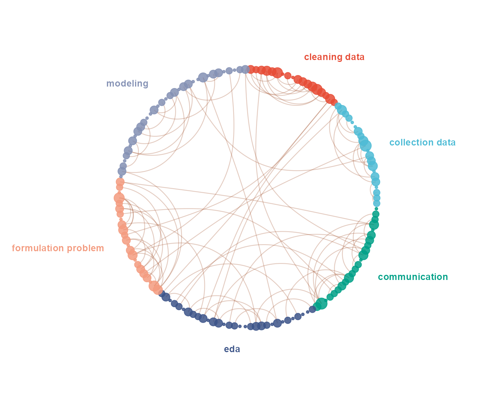
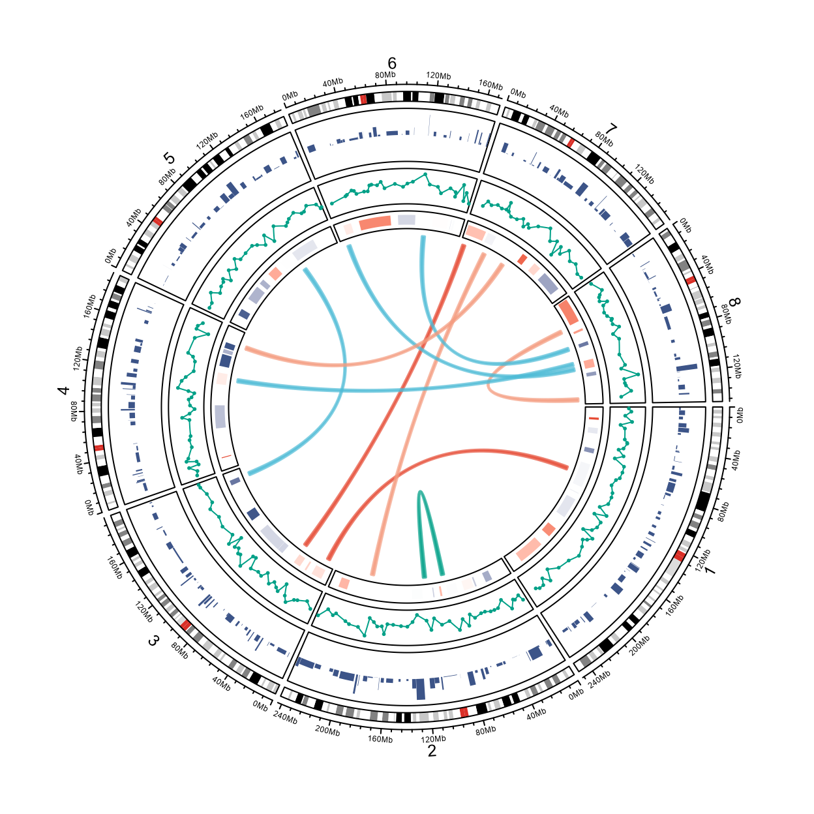
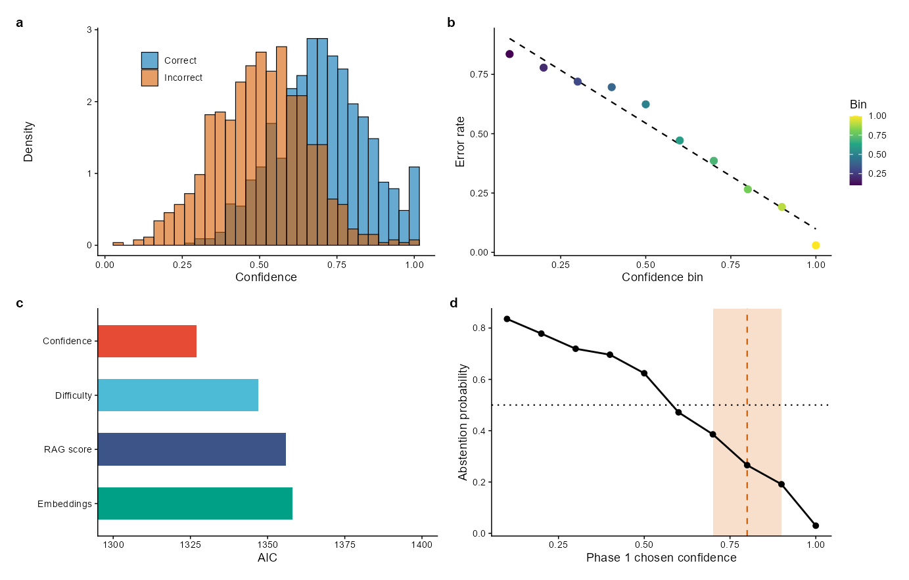
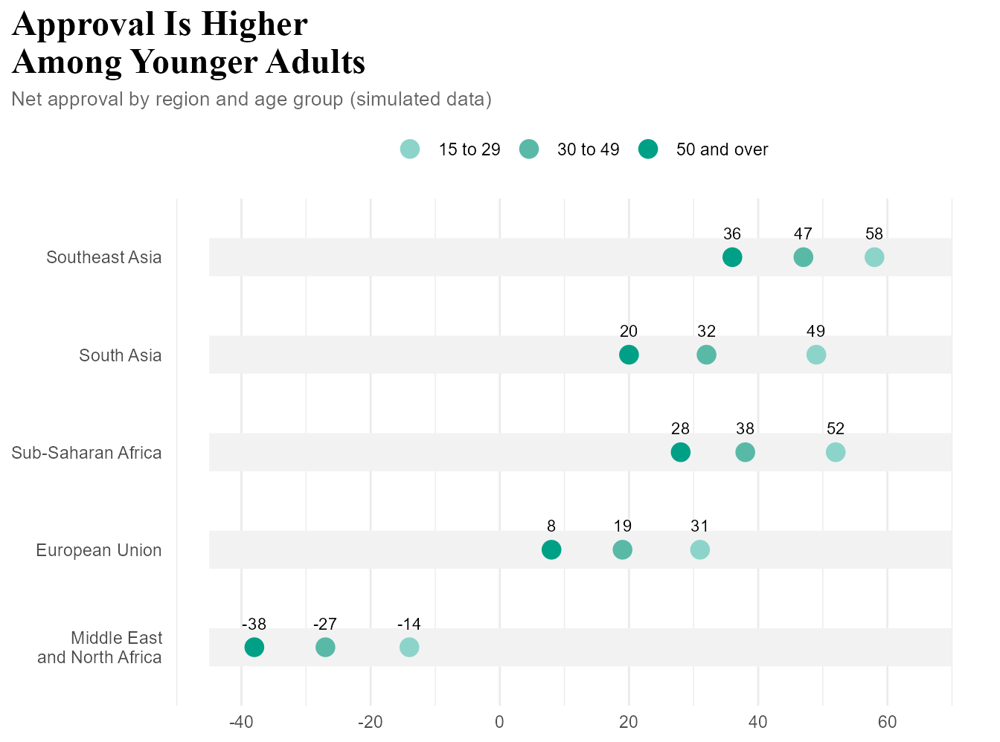

A Gallery of Figure Types
================

- [Overview](#overview)
- [1. A Circular Network](#1-a-circular-network)
- [2. A Circos Plot](#2-a-circos-plot)
- [3. A Figure of Four Panels](#3-a-figure-of-four-panels)
- [4. A Grouped Dot Plot](#4-a-grouped-dot-plot)
- [5. Packages and Credits](#5-packages-and-credits)
- [Summary](#summary)

``` r
library(ggplot2)
library(themeset)

# The packages of the first three figures are suggested, not required: without
# one of them its chunk is shown but not run.
has_network <- requireNamespace("igraph", quietly = TRUE) && requireNamespace("ggraph", quietly = TRUE)
has_circos <- requireNamespace("circlize", quietly = TRUE)
has_patchwork <- requireNamespace("patchwork", quietly = TRUE)
```

## Overview

Not every figure is a plot of one variable against another. This article
draws four kinds that papers and reports use often, and styles each of
them with `themeset`:

- a **circular network**, with
  [ggraph](https://ggraph.data-imaginist.com/)
- a **circos plot** of genomic tracks, with
  [circlize](https://jokergoo.github.io/circlize_book/book/)
- a **four-panel figure** for print, with
  [patchwork](https://patchwork.data-imaginist.com/)
- a **grouped dot plot**, with ggplot2

All the data are simulated, and the numbers in the figures mean nothing.
The packages for the first three figures are only suggested by
`themeset`; if one is not installed, the code of its figure is shown but
not run.

What `themeset` brings is the same in each: the palettes, by name with
`scale_color_set()` or as colors with `journal_colors()`, the theme of a
journal with `journal_theme()`, and shades of one color for ordered
groups with `journal_ramp()`.

------------------------------------------------------------------------

## 1. A Circular Network

A network of 150 nodes in six groups, drawn on a circle. The nodes of a
group sit side by side, which makes the blocks of the circle. The arcs
inside the circle are the edges, and most of them join two nodes of one
group. The size of a node is its degree, the number of edges that end in
it.

``` r
library(ggraph)

set.seed(42)
steps <- c("communication", "formulation problem", "collection data",
           "cleaning data", "eda", "modeling")
nodes <- data.frame(
  id = 1:150,
  group = sample(steps, 150, replace = TRUE, prob = c(0.2, 0.1, 0.15, 0.15, 0.15, 0.25))
)
nodes <- nodes[order(nodes$group), ]   # the blocks of the circle follow the groups

# 100 edges: 75 join two nodes of one group, 25 join any two nodes
from <- sample(nodes$id, 100, replace = TRUE)
to <- sample(nodes$id, 100, replace = TRUE)
for (i in 1:75) {
  members <- nodes$id[nodes$group == nodes$group[nodes$id == from[i]]]
  to[i] <- members[sample.int(length(members), 1)]
}

graph <- igraph::graph_from_data_frame(data.frame(from, to), vertices = nodes, directed = FALSE)
igraph::V(graph)$degree <- igraph::degree(graph)
layout <- create_layout(graph, layout = "linear", circular = TRUE)

# a label for each group, outside the circle, at the middle of its block
angle <- tapply(seq_len(nrow(layout)), layout$group, function(i) {
  atan2(mean(layout$y[i]), mean(layout$x[i]))
})
group_labels <- data.frame(group = names(angle), x = 1.18 * cos(angle), y = 1.18 * sin(angle))
group_labels$hjust <- ifelse(group_labels$x > 0.15, 0, ifelse(group_labels$x < -0.15, 1, 0.5))

ggraph(layout) +
  geom_edge_arc(edge_colour = "sienna", edge_alpha = 0.3, edge_width = 0.4) +
  geom_node_point(aes(color = group, size = degree), alpha = 0.85) +
  geom_text(data = group_labels, aes(x, y, label = group, color = group, hjust = hjust),
            fontface = "bold", size = 3.4, show.legend = FALSE) +
  scale_color_set("npg") +
  scale_size_continuous(range = c(1, 5)) +
  coord_fixed(xlim = c(-1.75, 1.75), ylim = c(-1.35, 1.35), clip = "off") +
  theme_void() +
  theme(legend.position = "none")
```



_A circular network of 150 nodes in six groups, with arcs for the edges._

- `layout = "linear", circular = TRUE` places the nodes on a circle in
  the order of the data, so sorting `nodes` by group is what makes the
  blocks.
- The labels are computed from the positions of the nodes, at the middle
  of each block, so they follow the data when the groups change.
- The colors come from `scale_color_set("npg")`. The nodes and the
  labels share the color aesthetic, so another name from
  `list_color_scales()` recolors both.

------------------------------------------------------------------------

## 2. A Circos Plot

A circos plot lays tracks of genomic data around a circle. This one has
the first eight human chromosomes, whose ideogram comes with circlize,
and three tracks: bars, a line with points, and blocks that run from a
loss to a gain. Ten links cross the circle, as translocations do.

circlize draws with base graphics, so a ggplot2 theme does not apply to
it. The colors can still come from `themeset`, which keeps the figure in
step with the others of a paper.

``` r
library(circlize)

set.seed(7)
chromosomes <- paste0("chr", 1:8)
nature_colors <- journal_colors("nature")

circos.clear()
circos.par(track.height = 0.1, cell.padding = c(0.02, 0, 0.02, 0))
circos.initializeWithIdeogram(species = "hg19", chromosome.index = chromosomes)

# Track 1: gene density, as bars
gene_density <- generateRandomBed(nr = 500)
circos.genomicTrack(gene_density, numeric.column = 4, panel.fun = function(region, value, ...) {
  circos.genomicRect(region, abs(value), ytop.column = 1, ybottom = 0,
                     col = nature_colors[4], border = NA, ...)
}, track.height = 0.15)

# Track 2: mutation frequency, as a line with points
circos.genomicTrack(gene_density, numeric.column = 4, panel.fun = function(region, value, ...) {
  circos.genomicLines(region, value, type = "l", col = nature_colors[3], ...)
  circos.genomicPoints(region, value, cex = 0.4, pch = 16, col = nature_colors[3], ...)
}, track.height = 0.1)

# Track 3: copy number, from a loss to a gain, through white
copy_number <- generateRandomBed(nr = 100)
gain_loss <- colorRamp2(c(-1, 0, 1), c(nature_colors[4], "white", nature_colors[1]))
circos.genomicTrack(copy_number, numeric.column = 4, panel.fun = function(region, value, ...) {
  circos.genomicRect(region, value, col = gain_loss(pmax(pmin(value[[1]], 1), -1)),
                     border = NA, ...)
}, track.height = 0.05)

# Links: ten regions joined to ten others, all on chromosomes 1 to 8
chromosome_length <- read.chromInfo(species = "hg19")$chr.len[chromosomes]
random_regions <- function(n, width = 4e6) {
  chr <- sample(chromosomes, n, replace = TRUE)
  start <- vapply(chr, function(chr) sample.int(chromosome_length[[chr]] - width, 1), numeric(1))
  data.frame(chr = chr, start = start, end = start + width)
}
link_colors <- adjustcolor(nature_colors[c(1, 2, 3, 5, 6)][sample(5, 10, replace = TRUE)], alpha.f = 0.7)
circos.genomicLink(random_regions(10), random_regions(10), col = link_colors, lwd = 2)
```



_A circos plot of eight chromosomes with three data tracks and ten links._

``` r

circos.clear()
```

- circlize keeps its settings in global state: `circos.clear()` before a
  plot and after it, so that the next one starts clean.
- `generateRandomBed()` makes the simulated regions. They are drawn at
  random over the whole genome, and only the eight chromosomes of the
  ideogram show. The links are made by hand for that reason: a link
  needs both of its ends on a chromosome that is drawn.
- `journal_colors("nature")` gives the palette as colors. The gain and
  loss track runs between two of them, through white, so its two ends
  are the colors of the other tracks.

------------------------------------------------------------------------

## 3. A Figure of Four Panels

A figure for print: four panels with tags, assembled with patchwork.
Every panel has the theme of Nature, `journal_theme("nature")`, so the
text is 7 pt, and the figure is 183 mm wide, the double column of the
journal.

The colors of the correct and the incorrect group are two Okabe-Ito
colors, which readers with color-vision deficiency can tell apart. A red
and a green would not be safe for them.

``` r
library(patchwork)

set.seed(123)
confidence <- data.frame(
  Confidence = pmin(pmax(c(rnorm(1000, 0.7, 0.15), rnorm(800, 0.5, 0.15)), 0), 1),
  Status = factor(rep(c("Correct", "Incorrect"), c(1000, 800)))
)
bins <- data.frame(
  Confidence_bin = seq(0.1, 1, by = 0.1),
  Error_rate = seq(0.9, 0.1, length.out = 10) + rnorm(10, 0, 0.05)
)
models <- data.frame(
  Feature = c("Confidence", "Difficulty", "RAG score", "Embeddings"),
  AIC = c(1327, 1347, 1356, 1358)
)

okabe_ito <- journal_colors("cell")
status <- c(Correct = okabe_ito[5], Incorrect = okabe_ito[6])
nature_theme <- journal_theme("nature")

# a: two overlapping histograms
panel_a <- ggplot(confidence, aes(Confidence, fill = Status)) +
  geom_histogram(aes(y = after_stat(density)), position = "identity", bins = 30,
                 alpha = 0.6, colour = "black", linewidth = 0.2) +
  scale_fill_manual(values = status) +
  labs(x = "Confidence", y = "Density") +
  nature_theme +
  theme(legend.position = "inside", legend.position.inside = c(0.22, 0.82),
        legend.title = element_blank())

# b: points that follow a fitted line, colored by their position
panel_b <- ggplot(bins, aes(Confidence_bin, Error_rate)) +
  geom_smooth(method = "lm", formula = y ~ x, colour = "black", linetype = "dashed",
              linewidth = 0.4, se = FALSE) +
  geom_point(aes(colour = Confidence_bin), size = 1.8) +
  scale_colour_viridis_c(guide = guide_colourbar(barheight = unit(14, "mm"),
                                                 barwidth = unit(2.5, "mm"))) +
  labs(x = "Confidence bin", y = "Error rate", colour = "Bin") +
  nature_theme

# c: horizontal bars, on an axis that starts at 1300
panel_c <- ggplot(models, aes(AIC, reorder(Feature, -AIC), fill = Feature)) +
  geom_col(orientation = "y", width = 0.6) +
  coord_cartesian(xlim = c(1300, 1400)) +
  scale_fill_set("npg") +
  labs(x = "AIC", y = NULL) +
  nature_theme +
  theme(legend.position = "none")

# d: a line, with a shaded interval and two reference lines
panel_d <- ggplot(bins, aes(Confidence_bin, Error_rate)) +
  annotate("rect", xmin = 0.7, xmax = 0.9, ymin = -Inf, ymax = Inf, alpha = 0.2, fill = okabe_ito[6]) +
  geom_vline(xintercept = 0.8, linetype = "dashed", colour = okabe_ito[6], linewidth = 0.4) +
  geom_hline(yintercept = 0.5, linetype = "dotted", linewidth = 0.4) +
  geom_line(linewidth = 0.5) +
  geom_point(size = 1.4) +
  labs(x = "Phase 1 chosen confidence", y = "Abstention probability") +
  nature_theme

(panel_a | panel_b) / (panel_c | panel_d) +
  plot_annotation(tag_levels = list(journal_tags("nature", 4)))
```



_A four-panel figure in the theme of Nature: overlapping histograms, a
scatter plot with a fitted line, horizontal bars and a line with a
marked interval._

The panels are separate ggplots, so `journal_check()` can read them. It
is given the list of the four, with the double column and the height of
the figure:

``` r
journal_check(list(panel_a, panel_b, panel_c, panel_d), "nature", column = "double", height = 117)
#> Check against Nature: pass
#> check          status  value      limit       note
#> width          info    183 mm                 double column
#> height         pass    117 mm     <= 170 mm   
#> smallest text  pass    5.6 pt     >= 5 pt     axis.text.x
#> largest text   pass    7.0 pt     <= 7 pt     axis.title.x
#> thinnest line  pass    0.57 pt    >= 0.25 pt  layer 1 (GeomBar)
#> colors         info    16 colors              a gradient or many colors: not compared
```

- Each panel carries the theme of the journal, and patchwork draws the
  tags with the `plot.tag` element of it: bold, 8 pt, in lowercase for
  Nature. `journal_tags("science", 4)` would give capitals.
- The axis of panel **c** starts at 1300, so the lengths of the bars do
  not start at zero. That is a choice that a figure has to state in its
  legend.
- The four panels draw 16 colors between them, among them the gradient
  of panel **b**, so the check does not compare them, as its note says.
- [A Multi-Panel Figure](multi-panel-figure.md) assembles panels with
  cowplot instead, and restyles the whole figure by changing the name of
  a set.

------------------------------------------------------------------------

## 4. A Grouped Dot Plot

One row for each region, with a dot for each of three age groups, on a
grey strip, and the value above each dot. The age groups have an order,
so their colors are three shades of one color, from light to dark.
`journal_ramp()` makes them from a color of a journal palette.

``` r
regions <- c("Southeast Asia", "South Asia", "Sub-Saharan Africa", "European Union",
             "Middle East\nand North Africa")
ages <- c("15 to 29", "30 to 49", "50 and over")

approval <- data.frame(
  Region = factor(rep(regions, times = 3), levels = rev(regions)),
  Age_Group = factor(rep(ages, each = 5), levels = ages),
  Net_Approval = c(58, 49, 52, 31, -14,    # 15 to 29
                   47, 32, 38, 19, -27,    # 30 to 49
                   36, 20, 28, 8, -38)     # 50 and over
)
strips <- data.frame(Region = factor(regions, levels = rev(regions)))

ggplot(approval, aes(Net_Approval, Region)) +
  # the grey strips: one for each region, not one for each dot
  geom_linerange(data = strips, aes(y = Region, xmin = -45, xmax = 70), inherit.aes = FALSE,
                 colour = "grey95", linewidth = 9) +
  geom_point(aes(colour = Age_Group), size = 4) +
  geom_text(aes(label = Net_Approval), vjust = -1.5, size = 3) +
  scale_colour_manual(values = journal_ramp("nature", 3, color = 3, light = 0.55)) +
  scale_x_continuous(limits = c(-45, 70), breaks = seq(-40, 60, 20)) +
  labs(title = "Approval Is Higher\nAmong Younger Adults",
       subtitle = "Net approval by region and age group (simulated data)",
       x = NULL, y = NULL) +
  theme_minimal() +
  theme(
    legend.position = "top",
    legend.title = element_blank(),
    panel.grid.major.y = element_blank(),
    plot.title = element_text(size = 18, face = "bold", family = "serif"),
    plot.title.position = "plot",
    plot.subtitle = element_text(size = 10, colour = "grey40")
  )
```



_A grouped dot plot of net approval by region and age group, in three
shades of one color._

- `journal_ramp("nature", 3, color = 3, light = 0.55)` shades the third
  color of the Nature palette. `light` is the share of white in the
  lightest shade; a smaller number gives darker dots on the grey strips.
- The strips come from their own data frame, with `inherit.aes = FALSE`.
  Drawn from the data of the dots they would be drawn three times each.
- The title has a line break (`\n`) and a serif face.
  `plot.title.position = "plot"` aligns the title and the subtitle with
  the whole plot, not with the panel.

------------------------------------------------------------------------

## 5. Packages and Credits

`themeset` calls these packages by name, and the work is theirs. They
are suggested, so `themeset` works without them.

| Package | What it draws here | Authors |
|----|----|----|
| ggraph | the circular network | Thomas Lin Pedersen |
| igraph | the graph of the network | Gábor Csárdi, Tamás Nepusz, Vincent Traag, Szabolcs Horvát, Fabio Zanini, Daniel Noom, Kirill Müller, David Schoch and Maëlle Salmon |
| circlize | the circos plot and its ideogram | Zuguang Gu |
| patchwork | the four-panel figure | Thomas Lin Pedersen |

The palettes are those of ggsci (`npg`) and, for the Okabe-Ito colors,
of base R; see [Comparing Figures Across Journals](journal-figures.md)
for their credits.

------------------------------------------------------------------------

## Summary

| To draw | Use |
|----|----|
| A circular network | `ggraph(layout)` with `create_layout(graph, "linear", circular = TRUE)`, `geom_edge_arc()` and `geom_node_point()` |
| A circos plot | `circos.initializeWithIdeogram()` and `circos.genomicTrack()` of circlize, with colors from `journal_colors()` |
| A figure of several panels | patchwork, with `journal_theme()` on each panel and tags from `journal_tags()` |
| Check the panels | `journal_check(list(a, b, c, d), "nature", column = "double")` |
| Colors for ordered groups | `journal_ramp("nature", 3)` |
| A palette by name | `scale_color_set("npg")` |
