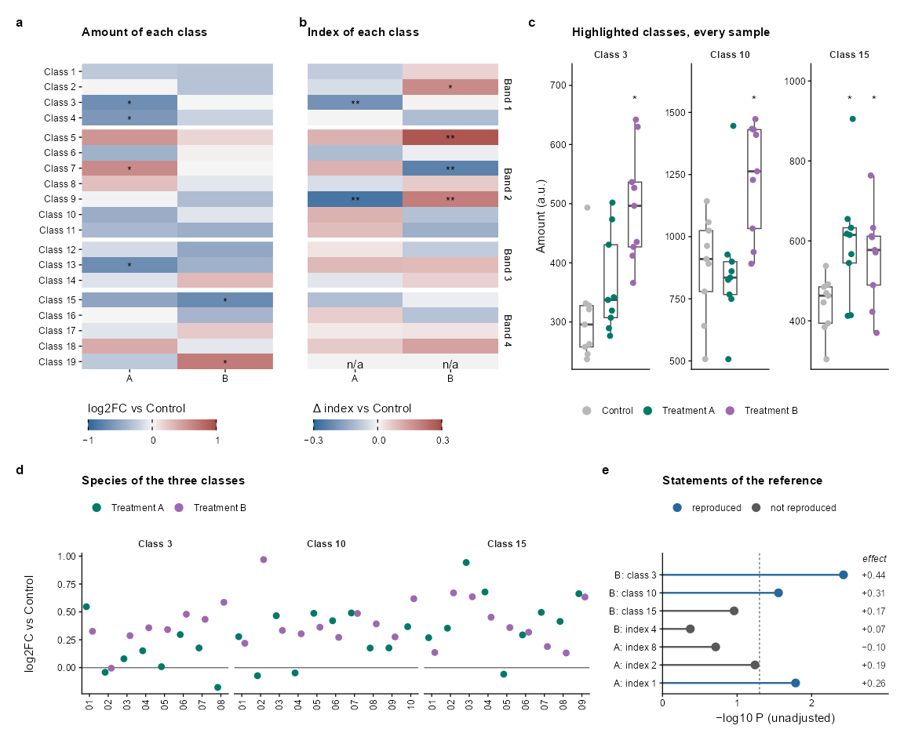
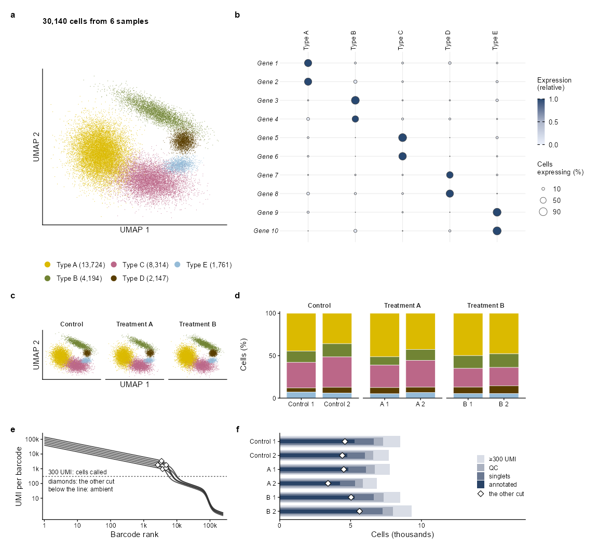
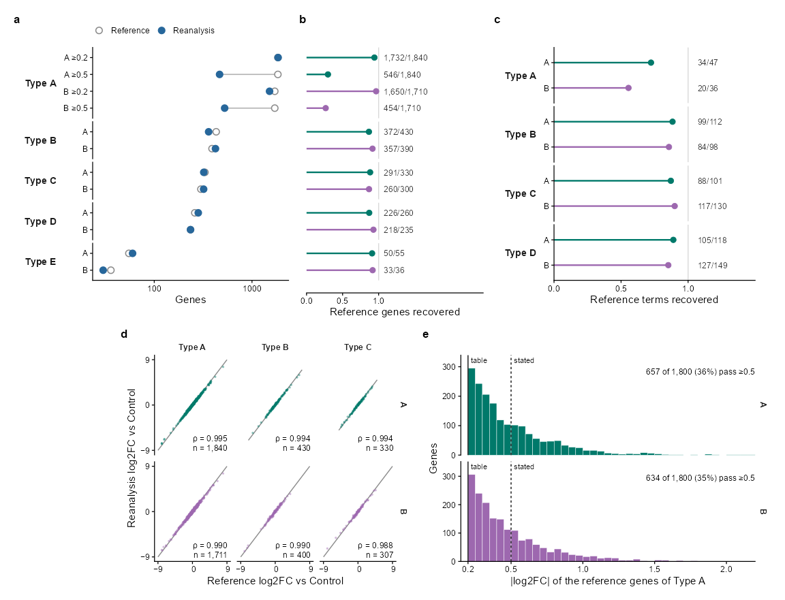
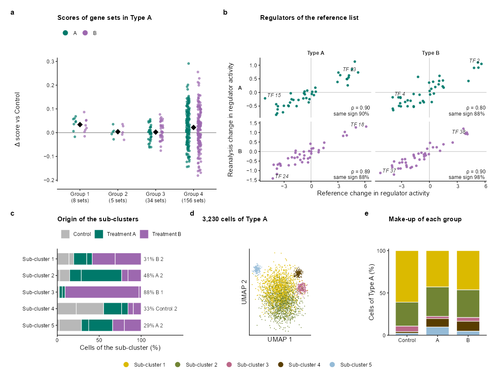
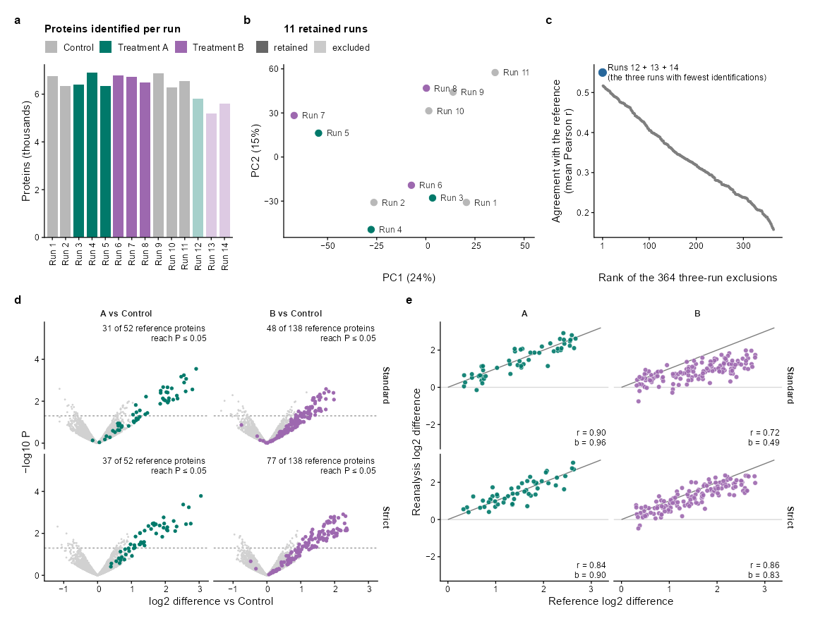
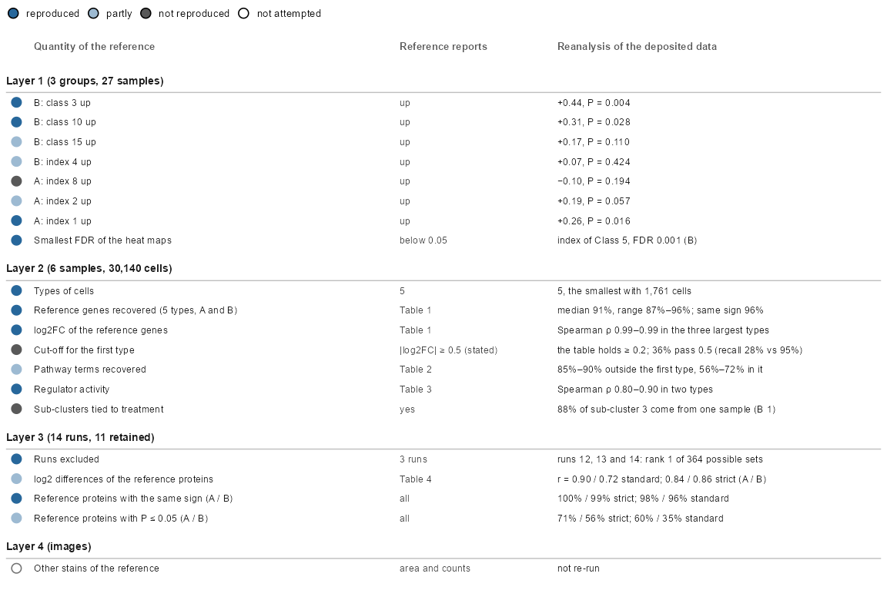
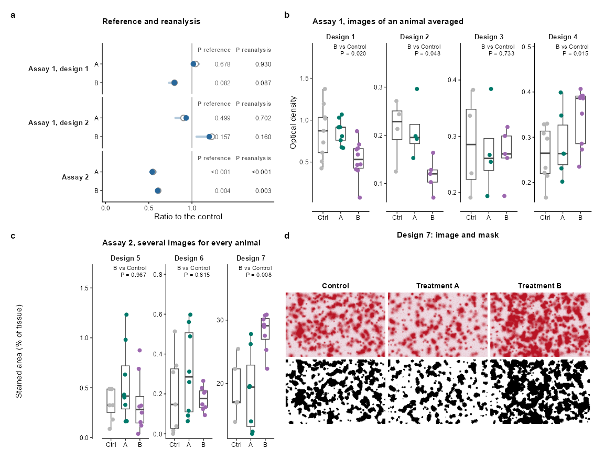

A Figure Set for a Reanalysis
================

- [Overview](#overview)
- [1. The Color Contract](#1-the-color-contract)
- [2. Figure 1: Heat Maps, Samples and
  Statements](#2-figure-1-heat-maps-samples-and-statements)
- [3. Figure 2: An Atlas of Cells](#3-figure-2-an-atlas-of-cells)
- [4. Figure 3: The Reference and the Reanalysis, Gene by
  Gene](#4-figure-3-the-reference-and-the-reanalysis-gene-by-gene)
- [5. Figure 4: A Mechanism](#5-figure-4-a-mechanism)
- [6. Figure 5: Quality Control and
  Proteins](#6-figure-5-quality-control-and-proteins)
- [7. Figure 6: A Scorecard](#7-figure-6-a-scorecard)
- [8. Figure 7: Images](#8-figure-7-images)
- [9. Checking the Set](#9-checking-the-set)
- [10. Packages and Credits](#10-packages-and-credits)
- [Summary](#summary)

``` r
library(ggplot2)
library(themeset)

# patchwork lays out the panels of every figure; without it the code is shown but not run
has_patchwork <- requireNamespace("patchwork", quietly = TRUE)
```

## Overview

A reanalysis of a published study is a hard test for a set of figures.
There are many kinds of evidence, each with a figure of its own: tables
of effects, an atlas of cells, a comparison of the reference with the
reanalysis gene by gene, quality control, a scorecard, images. Yet the
figures have to read as one set: the same group has the same color in
all of them, a blue means the same thing everywhere, and the text has
one size.

This article draws seven such figures from simulated data. Nothing in
them is a result: the groups are called Control, Treatment A and
Treatment B, the genes are Gene 1 to Gene 10, and every number is made
up. What they share is a **color contract**, written down once in the
first section, and the style of a journal, `journal_theme("nature")`:
183 mm wide, 7 pt text, 5.6 pt tick labels, panels tagged a, b, c. At
the end `journal_audit()` checks the whole set: each figure against the
limits of the journal, and the figures against each other. A second set,
for a study of reports of drugs and events, is in [A Figure Set for a
Reporting Study](reporting-study.md).

------------------------------------------------------------------------

## 1. The Color Contract

Every figure of the set takes its colors from this section.

- **Group**: Control is a light grey, Treatment A a deep teal and
  Treatment B an orchid, two colors that readers with color-vision
  deficiency can tell apart.
- **Verdict**: a result of the reanalysis is *reproduced*, in a steel
  blue, or *not reproduced*, in dark grey.
- **Direction**: down is a steel blue and up is a brick red, on a ramp
  that passes through white at zero. No group is blue or red, so a heat
  map is never read as a group.
- **Categories** that belong to no group, the types of cells and their
  sub-clusters, take five colors of other hues: a gold, an olive, a
  rose, a brown and a light steel.
- **Ordered quantities**, the steps of the cells that are kept and the
  relative expression of a gene, are steps of one cool slate.

``` r
library(patchwork)

# the colors are made with hcl() of base R, from a hue, a chroma and a lightness
groups <- c("Control", "Treatment A", "Treatment B")
group_colors <- c(Control = grey(0.72), `Treatment A` = hcl(176, 46, 44), `Treatment B` = hcl(296, 54, 52))

# a ramp from white to a deep end: the chroma grows and the lightness falls together
from_white <- function(hue, chroma, lightness, n = 6) {
  s <- seq(0, 1, length.out = n)^0.9
  hcl(hue, chroma * s, 97 - (97 - lightness) * s)
}
direction <- c(rev(from_white(245, 54, 42)), from_white(14, 68, 44)[-1])     # down is blue, white at zero, up is red
verdict_colors <- c(reproduced = hcl(245, 54, 42), `not reproduced` = grey(0.35))
free_colors <- hcl(c(70, 100, 348, 54, 234), c(88, 48, 53, 37, 34), c(76, 52, 54, 28, 74))   # gold, olive, rose, brown, light steel
slate <- function(chroma, lightness) hcl(250, chroma, lightness)         # the cool neutral of ordered quantities

# one theme for every panel, and the sizes that the panels share
figure_theme <- journal_theme("nature") +
  theme(plot.background = element_rect(fill = "white", colour = NA))   # no outline: it is a stroked path that crosses text where panels meet
small_text <- 5.5 / .pt                       # annotations are 5.5 pt (geom_text sizes are in mm)
strip_text <- theme(strip.background = element_blank(), strip.text = element_text(face = "bold"))
tag_theme <- theme(plot.tag = element_text(size = 8, face = "bold"))

# the panels of a figure sit on a grid of columns: each row lists its panels and their widths
design_rows <- function(rows) {
  paste(vapply(rows, function(row) {
    paste0(vapply(names(row), function(id) strrep(id, row[[id]]), ""), collapse = "")
  }, ""), collapse = "\n")
}
tag_panels <- function(figure, n) {
  figure + plot_annotation(tag_levels = list(journal_tags("nature", n)), theme = tag_theme)
}
minus <- function(x) sub("-", "\u2212", x, fixed = TRUE)      # a real minus sign
p_text <- function(p) ifelse(p < 0.001, "<0.001", sprintf("%.3f", p))
```

------------------------------------------------------------------------

## 2. Figure 1: Heat Maps, Samples and Statements

Two heat maps on the same rows, the change of the amount of 19 classes
and the change of an index of each, show what moved. A star marks P \<
0.05 and two stars a false discovery rate below 0.05. The samples behind
three of the classes come next, then the species of those classes, and
last the statements of the reference, each with the P value of the
reanalysis.

``` r
set.seed(11)
bands <- c("Band 1", "Band 2", "Band 3", "Band 4")
classes <- sprintf("Class %d", 1:19)
class_band <- rep(bands, times = c(4, 7, 3, 5))
comparisons <- c("Treatment A", "Treatment B")

effects <- function(sd_effect, se) {
  d <- expand.grid(class = classes, comparison = comparisons, stringsAsFactors = FALSE)
  d$effect <- rnorm(nrow(d), 0, sd_effect)
  d$p <- 2 * pnorm(-abs(d$effect) / se)
  d$fdr <- ave(d$p, d$comparison, FUN = function(p) p.adjust(p, "BH"))
  d$mark <- ifelse(d$fdr < 0.05, "**", ifelse(d$p < 0.05, "*", ""))
  d$band <- factor(class_band[match(d$class, classes)], bands)
  d$class <- factor(d$class, classes)
  d$comparison <- factor(d$comparison, comparisons)
  d
}
amount_change <- effects(0.45, 0.28)
index_change <- effects(0.12, 0.07)
index_change$effect[index_change$class == "Class 19"] <- NA      # a class that cannot be tested
index_change$mark[index_change$class == "Class 19"] <- "n/a"

# a, b: two heat maps on the same rows; the second names the bands, the first the classes
heat_map <- function(d, limit, title, fill_title, classes_named) {
  p <- ggplot(d, aes(comparison, class, fill = effect)) +
    geom_tile(colour = NA) +
    geom_text(aes(label = mark), size = 7 / .pt, vjust = 0.75) +
    facet_grid(rows = vars(band), scales = "free_y", space = "free_y") +
    scale_y_discrete(limits = rev, expand = c(0, 0)) +
    scale_x_discrete(expand = c(0, 0), labels = c("A", "B")) +
    scale_fill_gradientn(colours = direction,
                         limits = c(-limit, limit), oob = scales::squish, na.value = "grey95",
                         breaks = c(-limit, 0, limit), labels = function(x) minus(format(x)), name = fill_title,
                         guide = guide_colourbar(theme = theme(
                           legend.key.width = unit(26, "mm"), legend.key.height = unit(2.2, "mm"),
                           legend.title.position = "top", legend.ticks = element_line(colour = "black", linewidth = 0.25),
                           legend.frame = element_blank()))) +
    labs(x = NULL, y = NULL, title = title) +
    figure_theme + strip_text +
    theme(legend.position = "bottom", legend.justification = "left", axis.line = element_blank(), panel.spacing.y = unit(0.8, "mm"))
  if (classes_named) {
    p + theme(strip.text.y = element_blank())
  } else {
    p + theme(axis.text.y = element_blank(), axis.ticks.y = element_blank(), strip.text.y.right = element_text(angle = 270),
              plot.margin = margin(1, 1, 1, 4, "mm"))
  }
}

# c: every sample of three classes
highlight <- c("Class 3", "Class 10", "Class 15")
shifts <- list(c(0, 0.25, 0.45), c(0, 0.05, 0.3), c(0, 0.15, 0.05))
amounts <- do.call(rbind, lapply(seq_along(highlight), function(k) {
  data.frame(class = highlight[k], group = factor(rep(groups, each = 9), groups),
             amount = c(300, 800, 500)[k] * exp(rnorm(27, rep(shifts[[k]], each = 9), 0.22)))
}))
amounts$class <- factor(amounts$class, highlight)
starred <- do.call(rbind, lapply(highlight, function(k) {
  d <- amounts[amounts$class == k, ]
  p <- sapply(groups[2:3], function(g) t.test(d$amount[d$group == g], d$amount[d$group == "Control"])$p.value)
  data.frame(class = factor(k, highlight), group = factor(groups[2:3][p < 0.05], groups), y = max(d$amount))
}))

# d: the species of the three classes
n_species <- c(8, 10, 9)
species <- do.call(rbind, lapply(seq_along(highlight), function(k) {
  d <- expand.grid(number = sprintf("%02d", seq_len(n_species[k])), comparison = comparisons, stringsAsFactors = FALSE)
  d$class <- highlight[k]
  d$log2fc <- rnorm(nrow(d), rep(c(0.1, 0.3), each = n_species[k]) + 0.05 * k, 0.25)
  d
}))
species$class <- factor(species$class, highlight)
species$comparison <- factor(species$comparison, comparisons)

# e: the statements of the reference, and what the reanalysis finds
statements <- data.frame(
  label = c("B: class 3", "B: class 10", "B: class 15", "B: index 4", "A: index 8", "A: index 2", "A: index 1"),
  effect = c(0.44, 0.31, 0.17, 0.07, -0.10, 0.19, 0.26),
  z = c(2.9, 2.2, 1.6, 0.8, 1.3, 1.9, 2.4)             # the effect over its standard error
)
statements$nlp <- -log10(2 * pnorm(-statements$z))
statements$verdict <- factor(ifelse(statements$nlp > -log10(0.05) & statements$effect > 0, "reproduced", "not reproduced"),
                             names(verdict_colors))
statements$label <- factor(statements$label, rev(statements$label))
statements$effect_text <- minus(sprintf("%+.2f", statements$effect))
x_max <- 3

panels_1 <- list(
  A = heat_map(amount_change, 1, "Amount of each class", "log2FC vs Control", classes_named = TRUE),
  B = heat_map(index_change, 0.3, "Index of each class", "\u0394 index vs Control", classes_named = FALSE),
  C = ggplot(amounts, aes(group, amount)) +
    geom_boxplot(fill = NA, colour = "grey30", width = 0.55, outlier.shape = NA, linewidth = 0.3) +
    geom_point(aes(fill = group), shape = 21, colour = "transparent", size = 1.5,
               position = position_jitter(width = 0.13, height = 0, seed = 1)) +
    geom_text(data = starred, aes(y = y * 1.04, label = "*"), size = 7 / .pt, fontface = "bold", vjust = 0) +
    facet_wrap(vars(class), nrow = 1, scales = "free_y") +
    scale_fill_manual(values = group_colors, name = NULL, guide = guide_legend(nrow = 1, override.aes = list(size = 2.2))) +
    scale_y_continuous(expand = expansion(mult = c(0.04, 0.16))) +
    labs(x = NULL, y = "Amount (a.u.)", title = "Highlighted classes, every sample") +
    figure_theme + strip_text +
    theme(axis.text.x = element_blank(), axis.ticks.x = element_blank(), panel.spacing.x = unit(3, "mm"),
          legend.position = "bottom", legend.justification = "left"),
  D = ggplot(species, aes(number, log2fc, fill = comparison)) +
    geom_hline(yintercept = 0, linewidth = 0.3, colour = "grey45") +
    geom_point(shape = 21, colour = "transparent", size = 1.7, position = position_dodge(width = 0.65)) +
    facet_grid(cols = vars(class), scales = "free_x", space = "free_x") +
    scale_fill_manual(values = group_colors[comparisons], name = NULL,
                      guide = guide_legend(nrow = 1, override.aes = list(size = 2.2))) +
    scale_x_discrete(expand = expansion(add = 0.4)) +
    scale_y_continuous(labels = function(x) minus(format(x))) +
    labs(x = NULL, y = "log2FC vs Control", title = "Species of the three classes") +
    figure_theme + strip_text +
    theme(axis.text.x = element_text(angle = 90, hjust = 1, vjust = 0.5), legend.position = "top",
          legend.justification = "left", panel.spacing.x = unit(1.2, "mm")),
  E = ggplot(statements, aes(nlp, label)) +
    geom_vline(xintercept = -log10(0.05), linetype = "22", linewidth = 0.3, colour = "grey45") +
    geom_segment(aes(x = 0, xend = nlp, yend = label, colour = verdict), linewidth = 0.5) +
    geom_point(aes(fill = verdict), shape = 21, colour = "transparent", size = 2.2) +
    geom_text(aes(x = x_max, label = effect_text), hjust = 1, size = small_text, colour = "grey20") +
    annotate("text", x = x_max, y = nrow(statements) + 0.7, label = "effect", hjust = 1, vjust = 0,
             size = small_text, fontface = "italic") +
    scale_colour_manual(values = verdict_colors, guide = "none") +
    scale_fill_manual(values = verdict_colors, name = NULL) +
    scale_x_continuous(limits = c(0, x_max), breaks = 0:2, expand = expansion(mult = c(0, 0.01))) +
    scale_y_discrete(expand = expansion(add = c(0.6, 1.2))) +
    labs(x = "\u2212log10 P (unadjusted)", y = NULL, title = "Statements of the reference") +
    figure_theme +
    theme(legend.position = "top", legend.justification = "left", panel.grid = element_blank())
)
tag_panels(wrap_plots(panels_1, design = design_rows(list(c(A = 11, B = 11, C = 14), c(D = 23, E = 13))),
                      heights = c(1, 0.46)), 5)
```



_Figure 1. Two heat maps on shared rows, the samples of three classes,
the species of those classes, and the statements of the reference
against the reanalysis._

- The two heat maps share one color ramp, centered on zero, and a
  colorbar each, with its title above the bar. The second has the names
  of the bands in place of the names of the classes, so the rows are
  read once.
- A tile that cannot be tested is grey and says “n/a” in place of a
  value.
- The panels sit on a grid of 36 columns that `design_rows()` writes
  out, so that the top and the bottom row never share a column boundary:
  patchwork would otherwise pad one panel to match the axis labels of
  the other.

------------------------------------------------------------------------

## 3. Figure 2: An Atlas of Cells

An atlas of 6 samples, two for each group. The embedding colored by type
opens the figure, with the number of cells in the legend. The marker
genes of each type come next, as a dot plot: the size of a dot is the
share of cells that express the gene, the color the mean expression
relative to the highest of the gene. Below are the same embedding by
group, the make-up of every sample, the barcode-rank curves that show
where the cells were called, and how many cells are left after each
step.

``` r
set.seed(21)
types <- paste("Type", LETTERS[1:5])
type_colors <- setNames(free_colors, types)
sample_names <- c("Control 1", "Control 2", "A 1", "A 2", "B 1", "B 2")
sample_group <- factor(rep(groups, each = 2), groups)

# five types of cells, as clouds on a plane; the second is stretched, the third bent
shape <- data.frame(
  x = c(-3, 2.2, 1.6, 4.6, 4.2), y = c(-0.5, 3.2, -3, 0.6, -1.6),
  sx = c(1.2, 1.9, 0.9, 0.5, 0.7), sy = c(1.4, 0.45, 1.6, 0.5, 0.35),
  angle = c(25, -25, 80, 0, 10) * pi / 180
)
base_share <- c(0.45, 0.14, 0.27, 0.08, 0.06)
cells <- do.call(rbind, lapply(seq_along(sample_names), function(s) {
  share <- base_share * exp(rnorm(5, 0, 0.18))
  n_type <- as.vector(rmultinom(1, round(runif(1, 4200, 5800)), share / sum(share)))
  do.call(rbind, lapply(seq_along(types), function(k) {
    u <- rnorm(n_type[k], 0, shape$sx[k])
    v <- rnorm(n_type[k], 0, shape$sy[k]) + 0.12 * u^2 * (k == 3)
    data.frame(sample = sample_names[s], group = sample_group[s], type = types[k],
               UMAP1 = shape$x[k] + u * cos(shape$angle[k]) - v * sin(shape$angle[k]),
               UMAP2 = shape$y[k] + u * sin(shape$angle[k]) + v * cos(shape$angle[k]))
  }))
}))
cells$type <- factor(cells$type, types)
cells$sample <- factor(cells$sample, sample_names)
cells <- cells[sample(nrow(cells)), ]            # a random order, so that no type hides another
type_labels <- setNames(sprintf("%s (%s)", types, format(as.integer(table(cells$type)), big.mark = ",", trim = TRUE)), types)
umap_theme <- theme(axis.text = element_blank(), axis.ticks = element_blank())

# b: the marker genes, two for each type
genes <- sprintf("Gene %d", 1:10)
dots <- expand.grid(gene = genes, type = types, stringsAsFactors = FALSE)
dots$own <- rep(types, each = 2)[match(dots$gene, genes)] == dots$type
dots$share <- ifelse(dots$own, runif(nrow(dots), 0.6, 0.97), rbeta(nrow(dots), 0.7, 14))
dots$expression <- ifelse(dots$own, runif(nrow(dots), 2.2, 3.4), runif(nrow(dots), 0.02, 0.5)) * (0.5 + dots$share)
dots$relative <- ave(dots$expression, dots$gene, FUN = function(x) x / max(x))
dots$gene <- factor(dots$gene, rev(genes))
dots$type <- factor(dots$type, types)

# d: the make-up of each sample
make_up <- as.data.frame(prop.table(table(cells$sample, cells$type), 1) * 100)
names(make_up) <- c("sample", "type", "percent")
make_up$group <- sample_group[match(make_up$sample, sample_names)]

# e: barcode-rank curves, from the cells to the empty droplets
barcode <- 10^seq(0, 5.4, length.out = 250)
rank_curve <- function(knee, top) {
  lr <- log10(barcode)
  y <- top - 0.45 * lr
  y <- y - (top - 0.45 * log10(knee) - 2.3) * plogis((lr - log10(knee)) / 0.07)
  10^(y - 0.3 * pmax(lr - log10(knee), 0) - 1.2 * plogis((lr - 4.95) / 0.06))
}
knees <- runif(6, 4500, 10500)
tops <- sample(seq(4.6, 5.15, length.out = 6))
curves <- do.call(rbind, lapply(1:6, function(s) data.frame(sample = sample_names[s], barcode = barcode, umi = rank_curve(knees[s], tops[s]))))
other_cut <- data.frame(sample = sample_names, barcode = knees * 0.55)
other_cut$umi <- mapply(function(r, k, t) 10^approx(log10(barcode), log10(rank_curve(k, t)), log10(r))$y, other_cut$barcode, knees, tops)

# f: the cells left after each step
steps <- c(called = "\u2265300 UMI", qc = "QC", singlets = "singlets", annotated = "annotated")
annotated <- as.vector(table(cells$sample))
flow <- data.frame(sample = factor(rep(sample_names, 4), rev(sample_names)), step = factor(rep(names(steps), each = 6), names(steps)),
                   n = c(annotated / 0.62, annotated / 0.62 * 0.86, annotated / 0.62 * 0.78, annotated) / 1000)
flow_cut <- data.frame(sample = factor(sample_names, rev(sample_names)), n = annotated / 0.62 * runif(6, 0.45, 0.7) / 1000)
greys <- setNames(slate(c(8, 14, 24, 32), c(88, 72, 50, 28)), names(steps))

panels_2 <- list(
  A = ggplot(cells, aes(UMAP1, UMAP2, colour = type)) +
    geom_point(size = 0.1, shape = 16) +
    scale_colour_manual(values = type_colors, labels = type_labels, name = NULL,
                        guide = guide_legend(override.aes = list(size = 2.2), ncol = 3, byrow = FALSE)) +
    coord_fixed() +
    labs(x = "UMAP 1", y = "UMAP 2", title = sprintf("%s cells from 6 samples", format(nrow(cells), big.mark = ","))) +
    figure_theme + umap_theme +
    theme(legend.position = "bottom", legend.key.size = unit(3, "mm"), legend.justification = "left",
          legend.text = element_text(size = 6), legend.margin = margin(0, 0, 0, 0)),
  B = ggplot(dots, aes(type, gene)) +
    geom_point(aes(size = share * 100, fill = relative), shape = 21, colour = "grey25", stroke = 0.25) +
    scale_fill_gradientn(colours = slate(c(10, 18, 38), c(95, 74, 30)), limits = c(0, 1), breaks = c(0, 0.5, 1),
                         name = "Expression\n(relative)",
                         guide = guide_colourbar(order = 1, theme = theme(
                           legend.key.width = unit(2.2, "mm"), legend.key.height = unit(14, "mm"),
                           legend.ticks = element_line(colour = "black", linewidth = 0.25)))) +
    scale_size_area(max_size = 3.2, name = "Cells\nexpressing (%)", breaks = c(10, 50, 90), limits = c(0, 100),
                    guide = guide_legend(order = 2)) +
    scale_x_discrete(position = "top") +
    labs(x = NULL, y = NULL) +
    figure_theme +
    theme(axis.text.x = element_text(angle = 90, hjust = 0, vjust = 0.5), axis.text.y = element_text(face = "italic"),
          axis.line = element_blank(), axis.ticks = element_blank(), panel.grid.major = element_line(colour = "grey92", linewidth = 0.25),
          legend.title = element_text(size = 6, margin = margin(b = 2.5, unit = "mm")), legend.text = element_text(size = 6),
          legend.key.height = unit(3.5, "mm"), plot.margin = margin(1, 1, 1, 1, "mm")),
  C = ggplot(cells, aes(UMAP1, UMAP2, colour = type)) +
    geom_point(size = 0.08, shape = 16) +
    facet_wrap(vars(group), nrow = 1) +
    scale_colour_manual(values = type_colors, guide = "none") +
    coord_fixed() +
    labs(x = "UMAP 1", y = "UMAP 2") +
    figure_theme + umap_theme + strip_text + theme(panel.spacing.x = unit(1.5, "mm")),
  D = ggplot(make_up, aes(sample, percent, fill = type)) +
    geom_col(width = 0.82, colour = "white", linewidth = 0.15) +
    facet_grid(cols = vars(group), scales = "free_x", space = "free_x") +
    scale_fill_manual(values = type_colors, guide = "none") +
    scale_y_continuous(expand = expansion(mult = c(0, 0.02)), breaks = c(0, 50, 100)) +
    labs(x = NULL, y = "Cells (%)") +
    figure_theme + strip_text + theme(panel.spacing.x = unit(1.4, "mm")),
  E = ggplot(curves, aes(barcode, umi, group = sample)) +
    geom_hline(yintercept = 300, linetype = "22", linewidth = 0.3, colour = "grey35") +
    geom_line(linewidth = 0.4, colour = "grey20", alpha = 0.85) +
    geom_point(data = other_cut, shape = 23, size = 1.5, fill = "white", colour = "black", stroke = 0.3) +
    annotate("text", x = 1.3, y = 420, label = "300 UMI: cells called", hjust = 0, vjust = 0, size = small_text) +
    annotate("text", x = 1.3, y = 58, label = "below the line: ambient", hjust = 0, vjust = 1, size = small_text) +
    annotate("text", x = 1.3, y = 200, label = "diamonds: the other cut", hjust = 0, vjust = 1, size = small_text) +
    scale_x_log10(breaks = 10^(0:5), labels = c("1", "10", "100", "1k", "10k", "100k"), expand = expansion(mult = c(0.01, 0.02))) +
    scale_y_log10(breaks = 10^(1:5), labels = c("10", "100", "1k", "10k", "100k")) +
    labs(x = "Barcode rank", y = "UMI per barcode") +
    figure_theme,
  F = ggplot(flow, aes(n, sample)) +
    geom_col(data = flow[flow$step == "called", ], aes(fill = step), width = 0.8) +
    geom_col(data = flow[flow$step == "qc", ], aes(fill = step), width = 0.62) +
    geom_col(data = flow[flow$step == "singlets", ], aes(fill = step), width = 0.44) +
    geom_col(data = flow[flow$step == "annotated", ], aes(fill = step), width = 0.26) +
    geom_point(data = flow_cut, aes(shape = "the other cut"), size = 1.7, fill = "white", colour = "black", stroke = 0.35) +
    scale_fill_manual(values = greys, labels = steps, name = NULL, guide = guide_legend(order = 1)) +
    scale_shape_manual(values = c("the other cut" = 23), name = NULL, guide = guide_legend(order = 2)) +
    scale_x_continuous(expand = expansion(mult = c(0, 0.02)), limits = c(0, 17), breaks = c(0, 5, 10)) +
    labs(x = "Cells (thousands)", y = NULL) +
    figure_theme +
    theme(legend.position = "inside", legend.position.inside = c(0.995, 0.5), legend.justification = c(1, 0.5),
          legend.text = element_text(size = 5.5), legend.key.size = unit(2.6, "mm"), legend.margin = margin(0, 0, 0, 0),
          legend.spacing.y = unit(0.2, "mm"))
)
tag_panels(wrap_plots(panels_2, design = design_rows(list(c(A = 9, B = 12), c(C = 9, D = 12), c(E = 9, F = 12))),
                      heights = c(88, 40, 40)), 6)
```



_Figure 2. An atlas of five types of cells in six samples: the embedding,
marker genes, the embedding by group, the make-up of each sample,
barcode-rank curves and the cells left after each step._

- The cells are drawn in a random order, so that no type hides another,
  and as points of 0.1 mm: this figure has more than 30,000 of them.
- A type is also named in the legend, and in panel **b**: color is never
  the only way to tell the types apart.
- The legend of panel **f** sits inside the panel, in the empty space on
  the right of the bars. The bars are stacked from the widest, the cells
  called, to the narrowest, the cells annotated.

------------------------------------------------------------------------

## 4. Figure 3: The Reference and the Reanalysis, Gene by Gene

How well does the reanalysis recover the lists of the reference? The
counts of genes come first, as a dumbbell: an open dot for the reference
and a filled one for the reanalysis, joined by a line. Then the share of
the reference genes that the reanalysis finds again, the share of the
pathway terms, the log2 fold change of each gene in both, and the sizes
of the changes against the two cut-offs of the reference.

``` r
set.seed(31)
types <- paste("Type", LETTERS[1:5])
comparisons <- c("Treatment A", "Treatment B")
cut_table <- "\u22650.2"; cut_stated <- "\u22650.5"

# the first type is listed with two cut-offs: the one of the table, and a stricter one that the text names
rows <- data.frame(
  type = rep(types, times = c(4, 2, 2, 2, 2)),
  comparison = c(rep(comparisons, each = 2), rep(comparisons, 4)),
  cut = c(rep(c(cut_table, cut_stated), 2), rep("", 8)),
  reference = c(1840, 1840, 1710, 1710, 430, 390, 330, 300, 260, 235, 55, 36),
  stringsAsFactors = FALSE
)
strict <- rows$cut == cut_stated
rows$recovered <- round(rows$reference * ifelse(strict, runif(nrow(rows), 0.24, 0.3), runif(nrow(rows), 0.85, 0.99)))
rows$reanalysis <- round(rows$reference * ifelse(strict, runif(nrow(rows), 0.25, 0.32), runif(nrow(rows), 0.82, 1.18)))
rows$recovery <- rows$recovered / rows$reference
label <- trimws(paste(sub("Treatment ", "", rows$comparison), rows$cut))
rows$row <- factor(label, rev(unique(label)))
rows$type <- factor(rows$type, types)
rows$comparison <- factor(rows$comparison, comparisons)
rows$counts <- sprintf("%s/%s", formatC(rows$recovered, big.mark = ",", format = "d"), formatC(rows$reference, big.mark = ",", format = "d"))

strip_left <- theme(strip.placement = "outside", strip.background = element_blank(),
                    strip.text.y.left = element_text(angle = 0, hjust = 1, face = "bold", size = 6.5), panel.spacing.y = unit(0.8, "mm"))
lollipop <- function(d, x, text, limit) {
  ggplot(d, aes(.data[[x]], row)) +
    geom_vline(xintercept = 1, colour = "grey85", linewidth = 0.3) +
    geom_segment(aes(x = 0, xend = .data[[x]], yend = row, colour = comparison), linewidth = 0.5) +
    geom_point(aes(colour = comparison), size = 1.6) +
    geom_text(aes(x = 1.07, label = text), hjust = 0, size = small_text, colour = "grey20") +
    scale_colour_manual(values = group_colors[comparisons], guide = "none") +
    scale_x_continuous(limits = c(0, limit), breaks = c(0, 0.5, 1), expand = expansion(mult = c(0, 0)))
}

# a: how many genes, in the reference and in the reanalysis
counts <- rbind(data.frame(rows[c("type", "row")], source = "Reference", n = rows$reference),
                data.frame(rows[c("type", "row")], source = "Reanalysis", n = rows$reanalysis))
counts$source <- factor(counts$source, c("Reference", "Reanalysis"))

# c: how many of the reference pathway terms
terms <- data.frame(type = factor(rep(types[1:4], each = 2), types), comparison = factor(rep(comparisons, 4), comparisons),
                    reference = c(47, 36, 112, 98, 101, 130, 118, 149))
terms$recovered <- round(terms$reference * c(0.72, 0.55, 0.88, 0.86, 0.87, 0.9, 0.89, 0.85))
terms$recovery <- terms$recovered / terms$reference
terms$row <- factor(sub("Treatment ", "", terms$comparison), c("B", "A"))
terms$counts <- sprintf("%d/%d", terms$recovered, terms$reference)

# d: the log2 fold changes of the reference genes, in the reference and in the reanalysis
n_genes <- c("Type A" = 1840, "Type B" = 430, "Type C" = 330)
agreement <- do.call(rbind, lapply(names(n_genes), function(k) do.call(rbind, lapply(comparisons, function(cmp) {
  n <- round(n_genes[[k]] * ifelse(cmp == comparisons[1], 1, 0.93))
  reference <- pmax(pmin(rt(round(n / 3), 3) * 1.1, 8), -8)          # a third of the genes are plenty to see the agreement
  data.frame(type = k, comparison = cmp, n_genes = n, reference = reference,
             reanalysis = reference * 0.96 + rnorm(length(reference), 0, 0.12 + 0.05 * (cmp == comparisons[2])))
}))))
agreement$type <- factor(agreement$type, names(n_genes))
agreement$comparison <- factor(agreement$comparison, comparisons)
rho <- do.call(rbind, lapply(split(agreement, list(agreement$type, agreement$comparison)), function(d) {
  data.frame(type = d$type[1], comparison = d$comparison[1], n = d$n_genes[1], rho = cor(d$reference, d$reanalysis, method = "spearman"),
             limit = ceiling(max(abs(c(d$reference, d$reanalysis))) * 1.04))
}))
rho$label <- sprintf("\u03C1 = %.3f\nn = %s", rho$rho, formatC(rho$n, big.mark = ",", format = "d"))
corners <- rbind(transform(rho, reference = -limit, reanalysis = -limit), transform(rho, reference = limit, reanalysis = limit))
symmetric <- function(limits) { m <- max(1, floor(max(abs(limits)))); c(-m, 0, m) }

# e: the sizes of the changes of the first type
changes <- do.call(rbind, lapply(comparisons, function(cmp) data.frame(comparison = cmp, change = 0.2 + rexp(1800, 1 / 0.29))))
changes$comparison <- factor(changes$comparison, comparisons)
pass <- do.call(rbind, lapply(comparisons, function(cmp) {
  d <- changes[changes$comparison == cmp, ]
  data.frame(comparison = factor(cmp, comparisons),
             text = sprintf("%s of %s (%.0f%%) pass \u22650.5", format(sum(d$change >= 0.5), big.mark = ","), format(nrow(d), big.mark = ","), 100 * mean(d$change >= 0.5)))
}))
ab <- c("Treatment A" = "A", "Treatment B" = "B")

panels_3 <- list(
  A = ggplot(counts, aes(n, row)) +
    geom_line(aes(group = row), colour = "grey70", linewidth = 0.35) +
    geom_point(aes(colour = source, fill = source), shape = 21, size = 1.7, stroke = 0.5) +
    facet_grid(rows = vars(type), scales = "free_y", space = "free_y", switch = "y") +
    scale_colour_manual(values = c(Reference = "grey55", Reanalysis = verdict_colors[["reproduced"]]), name = NULL) +
    scale_fill_manual(values = c(Reference = "white", Reanalysis = verdict_colors[["reproduced"]]), name = NULL) +
    scale_x_log10(breaks = c(10, 100, 1000), labels = c("10", "100", "1000"), expand = expansion(mult = c(0.06, 0.06))) +
    labs(x = "Genes", y = NULL) +
    figure_theme + strip_left +
    theme(legend.position = "top", legend.justification = "left", legend.margin = margin(0, 0, 0, 0), legend.key.size = unit(3, "mm")),
  B = lollipop(rows, "recovery", rows$counts, 2.45) +
    facet_grid(rows = vars(type), scales = "free_y", space = "free_y") +
    labs(x = "Reference genes recovered", y = NULL) +
    figure_theme +
    theme(axis.text.y = element_blank(), axis.ticks.y = element_blank(), axis.line.y = element_blank(),
          strip.text = element_blank(), strip.background = element_blank(), panel.spacing.y = unit(0.8, "mm")),
  C = lollipop(terms, "recovery", terms$counts, 1.5) +
    facet_grid(rows = vars(type), scales = "free_y", space = "free_y", switch = "y") +
    labs(x = "Reference terms recovered", y = NULL) +
    figure_theme + strip_left,
  D = ggplot(agreement, aes(reference, reanalysis, fill = comparison)) +
    geom_line(data = corners, aes(group = interaction(type, comparison)), colour = "grey55", linewidth = 0.3) +
    geom_point(size = 0.55, shape = 21, colour = "transparent") +
    geom_text(data = rho, aes(x = Inf, y = -Inf, label = label), inherit.aes = FALSE, hjust = 1.08, vjust = -0.25,
              size = small_text, lineheight = 0.95) +
    facet_grid(rows = vars(comparison), cols = vars(type), scales = "free", labeller = labeller(comparison = ab)) +
    scale_fill_manual(values = scales::alpha(group_colors[comparisons], 0.45), guide = "none") +
    scale_x_continuous(breaks = symmetric, labels = function(x) minus(format(x))) +
    scale_y_continuous(breaks = symmetric, labels = function(x) minus(format(x))) +
    labs(x = "Reference log2FC vs Control", y = "Reanalysis log2FC vs Control") +
    figure_theme + strip_text + theme(panel.spacing = unit(1.6, "mm")),
  E = ggplot(changes, aes(change, fill = comparison)) +
    geom_histogram(binwidth = 0.05, boundary = 0.2, colour = "white", linewidth = 0.1) +
    geom_vline(xintercept = 0.5, linetype = "22", linewidth = 0.35, colour = "grey20") +
    geom_vline(xintercept = 0.2, linewidth = 0.35, colour = "grey20") +
    geom_text(data = pass, aes(x = 2.2, y = Inf, label = text), inherit.aes = FALSE, hjust = 1, vjust = 3.2, size = small_text) +
    annotate("text", x = 0.22, y = Inf, label = "table", hjust = 0, vjust = 1.4, size = 5 / .pt) +
    annotate("text", x = 0.52, y = Inf, label = "stated", hjust = 0, vjust = 1.4, size = 5 / .pt) +
    facet_grid(rows = vars(comparison), scales = "free_y", labeller = labeller(comparison = ab)) +
    scale_fill_manual(values = group_colors[comparisons], guide = "none") +
    scale_x_continuous(breaks = c(0.2, 0.5, 1, 1.5, 2), expand = expansion(mult = c(0, 0))) +
    scale_y_continuous(expand = expansion(mult = c(0, 0.15))) +
    coord_cartesian(xlim = c(0.15, 2.2)) +
    labs(x = "|log2FC| of the reference genes of Type A", y = "Genes") +
    figure_theme + strip_text + theme(panel.spacing.y = unit(1.5, "mm"))
)
design <- paste(design_rows(list(c(A = 7, B = 5, C = 9))), paste0("#", design_rows(list(c(D = 10, E = 10)))), sep = "\n")
tag_panels(wrap_plots(panels_3, design = design, heights = c(70, 62)), 5)
```



_Figure 3. The reference and the reanalysis: counts of genes, the share
recovered, the share of pathway terms recovered, agreement of the log2
fold changes, and the sizes of the changes against two cut-offs._

- Panels **a** and **b** have the same rows, so the counts and the
  shares line up across the page: the strips of **a** name the types,
  and **b** has none.
- The row of a dumbbell is the same as the row of its lollipop, with the
  same group color as everywhere in the set: A is teal, B is orchid.
- The identity line of each scatter plot is drawn corner to corner with
  `geom_line()`, not with `geom_abline()`, which runs past the edge of
  the panel in a free scale.
- The empty column on the left of the second row (`#`) keeps panel **d**
  off the wide left margin of **a**, where the strips and the labels
  are.

------------------------------------------------------------------------

## 5. Figure 4: A Mechanism

The scores of gene sets, one dot for every set; the activity of
regulators in the reference and in the reanalysis, with the most extreme
ones named; where the cells of each sub-cluster come from, by sample,
and the sub-clusters themselves, in an embedding and by group. The five
sub-clusters have the colors that the groups do not take.

``` r
set.seed(41)
comparisons <- c("Treatment A", "Treatment B")
clusters <- paste("Sub-cluster", 1:5)
cluster_colors <- setNames(free_colors, clusters)

# a: the change of the scores of gene sets, one dot for every set
set_groups <- c("Group 1\n(8 sets)", "Group 2\n(5 sets)", "Group 3\n(34 sets)", "Group 4\n(156 sets)")
n_sets <- c(8, 5, 34, 156)
scores <- do.call(rbind, lapply(seq_along(n_sets), function(k) do.call(rbind, lapply(comparisons, function(cmp) {
  data.frame(set_group = set_groups[k], comparison = cmp,
             change = rnorm(n_sets[k], c(0.03, -0.01, 0, 0.025)[k] * ifelse(cmp == comparisons[1], 1, 0.7), c(0.03, 0.02, 0.035, 0.08)[k]))
}))))
scores$set_group <- factor(scores$set_group, set_groups)
scores$comparison <- factor(scores$comparison, comparisons)

# b: the activity of 40 regulators, in the reference and in the reanalysis
regulators <- do.call(rbind, lapply(c("Type A", "Type B"), function(type) do.call(rbind, lapply(comparisons, function(cmp) {
  reference <- c(runif(20, -5.5, 6.2), runif(20, -4, 0.5))[sample(40)]
  data.frame(type = type, comparison = cmp, reference = reference, label = paste("TF", 1:40),
             reanalysis = reference * runif(1, 0.14, 0.24) + rnorm(40, 0, 0.22))
}))))
regulators$type <- factor(regulators$type, c("Type A", "Type B"))
regulators$comparison <- factor(regulators$comparison, comparisons)
by_panel <- split(regulators, list(regulators$type, regulators$comparison))
panel_stats <- do.call(rbind, lapply(by_panel, function(d) {
  data.frame(type = d$type[1], comparison = d$comparison[1],
             label = sprintf("\u03C1 = %.2f\nsame sign %.0f%%", cor(d$reference, d$reanalysis, method = "spearman"),
                             100 * mean(sign(d$reference) == sign(d$reanalysis))))
}))
# the regulator with the largest change in each direction is named, on the free side of its point
named <- do.call(rbind, lapply(by_panel, function(d) d[c(which.max(d$reference), which.min(d$reference)), ]))
named$side <- ifelse(named$reference > 0, 1.15, -0.15)

# c: where the cells of a sub-cluster come from
sample_names <- c("Control 1", "Control 2", "A 1", "A 2", "B 1", "B 2")
origin_share <- t(sapply(seq_along(clusters), function(k) {
  g <- rgamma(6, 3)
  if (k == 3) g[5] <- g[5] * 30                      # one sample makes up a sub-cluster
  g / sum(g)
}))
origin <- data.frame(cluster = factor(rep(clusters, 6), rev(clusters)), sample = factor(rep(sample_names, each = 5), rev(sample_names)),
                     group = factor(rep(groups, each = 10), groups), share = as.vector(origin_share) * 100)
largest <- do.call(rbind, lapply(split(origin, origin$cluster), function(d) {
  m <- d[which.max(d$share), ]
  data.frame(cluster = m$cluster, text = sprintf("%.0f%% %s", m$share, m$sample))
}))

# d, e: the sub-clusters in an embedding, and in each group
centers <- data.frame(x = c(0, 0.5, 4, 3.4, -4), y = c(0, -2.5, 0.2, 2.8, 3.6), s = c(1.6, 1.5, 0.45, 0.35, 0.4), n = c(1500, 1250, 220, 140, 120))
embedding <- do.call(rbind, lapply(seq_along(clusters), function(k) {
  data.frame(cluster = clusters[k], UMAP1 = rnorm(centers$n[k], centers$x[k], centers$s[k]),
             UMAP2 = rnorm(centers$n[k], centers$y[k], centers$s[k] * 1.2))
}))
embedding$cluster <- factor(embedding$cluster, clusters)
embedding <- embedding[sample(nrow(embedding)), ]
group_makeup <- expand.grid(group = groups, cluster = clusters)
group_makeup$percent <- as.vector(t(apply(matrix(rgamma(15, rep(c(28, 18, 4, 3, 2), each = 3)), 3), 1, function(x) 100 * x / sum(x))))
group_makeup$group <- factor(group_makeup$group, groups)
group_makeup$cluster <- factor(group_makeup$cluster, clusters)

dodge <- 0.6
legend_clusters <- cowplot::get_legend(
  ggplot(embedding, aes(UMAP1, UMAP2, colour = cluster)) + geom_point() +
    scale_colour_manual(values = cluster_colors, name = NULL, guide = guide_legend(nrow = 1, override.aes = list(size = 2.2))) +
    figure_theme + theme(legend.position = "bottom")
)
panels_4 <- list(
  A = ggplot(scores, aes(set_group, change, colour = comparison)) +
    geom_hline(yintercept = 0, colour = "grey55", linewidth = 0.3) +
    geom_point(size = 0.9, alpha = 0.65, position = position_jitterdodge(jitter.width = 0.18, dodge.width = dodge, seed = 1)) +
    stat_summary(fun = mean, geom = "point", shape = 23, size = 2.2, fill = "black", colour = "white", stroke = 0.4,
                 position = position_dodge(width = dodge)) +
    scale_colour_manual(values = group_colors[comparisons], labels = c("A", "B"), name = NULL,
                        guide = guide_legend(nrow = 1, override.aes = list(size = 2.2, alpha = 1))) +
    scale_y_continuous(labels = function(x) minus(format(x))) +
    labs(x = NULL, y = "\u0394 score vs Control", title = "Scores of gene sets in Type A") +
    figure_theme +
    theme(legend.position = "top", legend.justification = "left", axis.text.x = element_text(lineheight = 0.95)),
  B = ggplot(regulators, aes(reference, reanalysis, colour = comparison)) +
    geom_vline(xintercept = 0, colour = "grey80", linewidth = 0.3) + geom_hline(yintercept = 0, colour = "grey80", linewidth = 0.3) +
    geom_point(size = 0.9, alpha = 0.9) +
    geom_text(data = named, aes(label = label, hjust = side), size = small_text, fontface = "italic", colour = "grey15",
              nudge_y = 0.12) +
    geom_text(data = panel_stats, aes(x = Inf, y = -Inf, label = label), inherit.aes = FALSE, hjust = 1.05, vjust = -0.2,
              size = small_text, lineheight = 0.95) +
    facet_grid(rows = vars(comparison), cols = vars(type), scales = "free", switch = "y",
               labeller = labeller(comparison = c("Treatment A" = "A", "Treatment B" = "B"))) +
    scale_colour_manual(values = group_colors[comparisons], guide = "none") +
    scale_x_continuous(labels = function(x) minus(format(x))) + scale_y_continuous(labels = function(x) minus(format(x))) +
    labs(x = "Reference change in regulator activity", y = "Reanalysis change in regulator activity",
         title = "Regulators of the reference list") +
    figure_theme + strip_text +
    theme(panel.spacing = unit(1.5, "mm"), strip.placement = "outside", strip.text.y.left = element_text(angle = 0)),
  C = ggplot(origin, aes(share, cluster)) +
    geom_col(aes(fill = group, group = sample), width = 0.72, colour = "white", linewidth = 0.25) +
    geom_text(data = largest, aes(x = 103, label = text), hjust = 0, size = small_text, colour = "grey20") +
    scale_fill_manual(values = group_colors, name = NULL, guide = guide_legend(nrow = 1, override.aes = list(size = 2.2))) +
    scale_x_continuous(limits = c(0, 150), breaks = c(0, 50, 100), expand = expansion(mult = c(0, 0))) +
    labs(x = "Cells of the sub-cluster (%)", y = NULL, title = "Origin of the sub-clusters") +
    figure_theme + theme(legend.position = "top", legend.justification = "left"),
  D = ggplot(embedding, aes(UMAP1, UMAP2, colour = cluster)) +
    geom_point(size = 0.25, shape = 16) +
    scale_colour_manual(values = cluster_colors, guide = "none") +
    coord_fixed() +
    labs(x = "UMAP 1", y = "UMAP 2", title = sprintf("%s cells of Type A", format(nrow(embedding), big.mark = ","))) +
    figure_theme + theme(axis.text = element_blank(), axis.ticks = element_blank()),
  E = ggplot(group_makeup, aes(group, percent, fill = cluster)) +
    geom_col(width = 0.75, colour = "white", linewidth = 0.25) +
    scale_fill_manual(values = cluster_colors, guide = "none") +
    scale_x_discrete(labels = c("Control", "A", "B")) +
    scale_y_continuous(expand = expansion(mult = c(0, 0.02)), breaks = c(0, 50, 100)) +
    labs(x = NULL, y = "Cells of Type A (%)", title = "Make-up of each group") +
    figure_theme
)
tag_panels(wrap_plots(c(panels_4, list(L = wrap_elements(full = legend_clusters, ignore_tag = TRUE))),
                      design = design_rows(list(c(A = 10, B = 14), c(C = 9, D = 8, E = 7), c(L = 24))),
                      heights = c(100, 70, 8)), 5)
```



_Figure 4. A mechanism: scores of gene sets, regulators in the reference
and in the reanalysis, the origin of the cells of each sub-cluster, an
embedding of the sub-clusters and the make-up of each group._

- The legend of the five sub-clusters is made once, from the embedding,
  and sits under panels **d** and **e**, which have none of their own.
- In panel **c** the white lines cut each bar into its samples: the bars
  are `geom_col()` with `group = sample`, and a color for each group.

------------------------------------------------------------------------

## 6. Figure 5: Quality Control and Proteins

The runs of a proteomics experiment, and what the reanalysis does with
them. Three of the 14 runs have the fewest identifications and are left
out; they are drawn in a paler color. The first principal components of
the others come next, then the ranking of all the 364 ways to leave out
three runs by how well each agrees with the reference. The last two
panels compare the reference proteins in the reanalysis, with a standard
filter and with a strict one: volcano plots, and the reference
difference against the reanalysis.

``` r
set.seed(51)
comparisons <- c("Treatment A", "Treatment B")

# a: 14 runs, of which the last three are left out
runs <- data.frame(
  run = factor(sprintf("Run %d", 1:14), sprintf("Run %d", 1:14)),
  group = factor(c("Control", "Control", "Treatment A", "Treatment A", "Treatment A", "Treatment B", "Treatment B", "Treatment B",
                   "Control", "Control", "Control", "Treatment A", "Treatment B", "Treatment B"), groups),
  identified = c(runif(11, 6.2, 6.9), 5.8, 5.2, 5.6),
  status = factor(rep(c("retained", "excluded"), c(11, 3)), c("retained", "excluded"))
)

# b: the principal components of the runs that are kept
components <- data.frame(runs[1:11, c("run", "group")], PC1 = rnorm(11, 0, 40), PC2 = rnorm(11, 0, 35))

# c: every way of leaving out three runs, from the best agreement down
leave_out <- data.frame(rank = 1:364)
leave_out$agreement <- sort(0.15 + 0.38 * plogis(rnorm(364, 0, 1.3)) + rnorm(364, 0, 0.01), decreasing = TRUE)
leave_out$agreement[1] <- 0.55

# d, e: the reference proteins in the reanalysis, with a standard filter and with a strict one
variants <- c("Standard", "Strict")
n_reference <- c("Treatment A" = 52, "Treatment B" = 138)
slope <- list(`Treatment A` = c(0.9, 1.0), `Treatment B` = c(0.55, 0.8))
proteins <- do.call(rbind, lapply(comparisons, function(cmp) do.call(rbind, lapply(1:2, function(v) {
  n <- 3000
  reference <- runif(n_reference[[cmp]], 0.3, 2.8)
  d <- data.frame(
    difference = c(rnorm(n, 0, 0.32), reference * slope[[cmp]][v] + rnorm(length(reference), 0, 0.35)),
    se = c(runif(n, 0.2, 0.6), runif(length(reference), 0.3, 0.55)),
    reference = rep(c(FALSE, TRUE), c(n, length(reference))), published = c(rep(NA, n), reference)
  )
  d$nlp <- -log10(2 * pt(-abs(d$difference / d$se), df = 5))
  d$comparison <- cmp
  d$variant <- variants[v]
  d
}))))
proteins$comparison <- factor(proteins$comparison, comparisons)
proteins$variant <- factor(proteins$variant, variants)
listed <- proteins[proteins$reference, ]
reach <- do.call(rbind, lapply(split(listed, list(listed$comparison, listed$variant)), function(d) {
  data.frame(comparison = d$comparison[1], variant = d$variant[1],
             text = sprintf("%d of %d reference proteins\nreach P \u2264 0.05", sum(d$nlp >= -log10(0.05)), nrow(d)))
}))
fit <- do.call(rbind, lapply(split(listed, list(listed$comparison, listed$variant)), function(d) {
  data.frame(comparison = d$comparison[1], variant = d$variant[1],
             text = sprintf("r = %.2f\nb = %.2f", cor(d$published, d$difference), unname(coef(lm(difference ~ published, d))[2])))
}))

panels_5 <- list(
  A = ggplot(runs, aes(run, identified, fill = group, alpha = status)) +
    geom_col(width = 0.8) +
    scale_fill_manual(values = group_colors, name = NULL, guide = guide_legend(order = 1, override.aes = list(alpha = 1))) +
    scale_alpha_manual(values = c(retained = 1, excluded = 0.35), name = NULL,
                       guide = guide_legend(order = 2, override.aes = list(fill = "grey40", alpha = c(1, 0.35)))) +
    scale_y_continuous(expand = expansion(mult = c(0, 0.05))) +
    labs(x = NULL, y = "Proteins (thousands)", title = "Proteins identified per run") +
    figure_theme +
    theme(axis.text.x = element_text(angle = 90, hjust = 1, vjust = 0.5), legend.position = "top", legend.justification = "left",
          legend.text = element_text(size = 6), legend.key.size = unit(3, "mm"), legend.margin = margin(0, 0, 0, 0)),
  B = ggplot(components, aes(PC1, PC2, fill = group)) +
    geom_point(shape = 21, colour = "white", size = 2.2, stroke = 0.3) +
    geom_text(aes(label = run), size = small_text, colour = "grey20", hjust = 0, nudge_x = 4, check_overlap = TRUE) +
    scale_fill_manual(values = group_colors, guide = "none") +
    scale_x_continuous(labels = function(x) minus(format(x)), expand = expansion(mult = c(0.05, 0.15))) +
    scale_y_continuous(labels = function(x) minus(format(x))) +
    labs(x = "PC1 (24%)", y = "PC2 (15%)", title = "11 retained runs") +
    figure_theme,
  C = ggplot(leave_out, aes(rank, agreement)) +
    geom_point(size = 0.5, colour = "grey50") +
    geom_point(data = leave_out[1, ], size = 2.2, colour = verdict_colors[["reproduced"]]) +
    annotate("text", x = 12, y = 0.55, label = "Runs 12 + 13 + 14\n(the three runs with fewest identifications)",
             hjust = 0, size = small_text, lineheight = 0.95) +
    scale_x_continuous(breaks = c(1, 100, 200, 300)) +
    labs(x = "Rank of the 364 three-run exclusions", y = "Agreement with the reference\n(mean Pearson r)") +
    figure_theme,
  D = ggplot(proteins, aes(difference, nlp)) +
    geom_hline(yintercept = -log10(0.05), linetype = "22", linewidth = 0.3, colour = "grey60") +
    geom_point(data = proteins[!proteins$reference, ], size = 0.25, colour = "grey82") +
    geom_point(data = listed, aes(colour = comparison), size = 0.8) +
    geom_text(data = reach, aes(x = Inf, y = Inf, label = text), inherit.aes = FALSE, hjust = 1.03, vjust = 1.2,
              size = small_text, lineheight = 0.95) +
    facet_grid(rows = vars(variant), cols = vars(comparison),
               labeller = labeller(comparison = c("Treatment A" = "A vs Control", "Treatment B" = "B vs Control"))) +
    scale_colour_manual(values = group_colors[comparisons], guide = "none") +
    scale_x_continuous(labels = function(x) minus(format(x))) +
    coord_cartesian(ylim = c(0, 5.5)) +
    labs(x = "log2 difference vs Control", y = "\u2212log10 P") +
    figure_theme + strip_text + theme(panel.spacing = unit(1.2, "mm"), strip.text.y.right = element_text(angle = 270)),
  E = ggplot(listed, aes(published, difference, fill = comparison)) +
    geom_hline(yintercept = 0, colour = "grey85", linewidth = 0.3) +
    annotate("segment", x = 0, y = 0, xend = 3.2, yend = 3.2, colour = "grey50", linewidth = 0.3) +
    geom_point(shape = 21, colour = "white", stroke = 0.15, size = 1.3, alpha = 0.9) +
    geom_text(data = fit, aes(x = Inf, y = -Inf, label = text), inherit.aes = FALSE, hjust = 1.08, vjust = -0.2,
              size = small_text, lineheight = 0.95) +
    facet_grid(rows = vars(variant), cols = vars(comparison), labeller = labeller(comparison = c("Treatment A" = "A", "Treatment B" = "B"))) +
    scale_fill_manual(values = group_colors[comparisons], guide = "none") +
    scale_y_continuous(labels = function(x) minus(format(x))) +
    coord_cartesian(xlim = c(0, 3.2), ylim = c(-3, 3.2)) +
    labs(x = "Reference log2 difference", y = "Reanalysis log2 difference") +
    figure_theme + strip_text + theme(panel.spacing = unit(1.2, "mm"), strip.text.y.right = element_text(angle = 270))
)
tag_panels(wrap_plots(panels_5, design = paste(design_rows(list(c(A = 12, B = 12, C = 12))), design_rows(list(c(D = 18, E = 18))), sep = "\n"),
                      heights = c(0.8, 1.2)), 5)
```



_Figure 5. Quality control and proteins: the identifications of every
run, the principal components of the runs kept, the ranking of the
exclusions, volcano plots, and the reference difference against the
reanalysis._

- The runs that are left out stay in the bars, in a paler color, so that
  the reader sees what was dropped. Color gives the group and
  transparency the status, and the legend has a key for each.
- The point at the top left of panel **c** is the exclusion that was
  made, and it is blue because it is the one result that the reanalysis
  reproduced.
- The labels of panel **b** sit to the right of their points, with room
  for them on the axis: with simulated points that never touch,
  `check_overlap = TRUE` is enough, but a figure of real data may want
  the ggrepel package.

------------------------------------------------------------------------

## 7. Figure 6: A Scorecard

What the reanalysis reproduces, in one table: a row for each quantity of
the reference, what the reference reports, what the reanalysis gives,
and a dot for the verdict. The verdict colors are the ones of the
contract: blue for reproduced, dark grey for not reproduced, a paler
blue for reproduced in part, an open circle for not attempted. Nothing
else is colored.

``` r
verdicts <- c("reproduced", "partly", "not reproduced", "not attempted")
partly <- grDevices::rgb(grDevices::colorRamp(c(verdict_colors[["reproduced"]], "white"))(0.55), maxColorValue = 255)   # a paler blue
verdict_fill <- c(reproduced = verdict_colors[["reproduced"]], partly = partly, `not reproduced` = verdict_colors[["not reproduced"]], `not attempted` = "white")
verdict_edge <- c(reproduced = verdict_colors[["reproduced"]], partly = partly, `not reproduced` = verdict_colors[["not reproduced"]], `not attempted` = "grey45")

# every number of the scorecard is read from the data of the figures above, so that the
# scorecard cannot disagree with them
pct <- function(x) sprintf("%.0f%%", 100 * x)
card_rows <- list()
add <- function(layer, what, reference, reanalysis, verdict) {
  card_rows[[length(card_rows) + 1]] <<- data.frame(layer = layer, what = what, reference = reference, reanalysis = reanalysis, verdict = verdict)
}

# layer 1: the statements of Figure 1, and the smallest FDR of its heat maps
layer_1 <- "Layer 1 (3 groups, 27 samples)"
for (i in seq_len(nrow(statements))) {
  s <- statements[i, ]
  add(layer_1, paste(s$label, "up"), "up", sprintf("%s, P = %s", s$effect_text, p_text(10^-s$nlp)),
      if (s$verdict == "reproduced") "reproduced" else if (s$effect > 0) "partly" else "not reproduced")
}
tested <- rbind(transform(amount_change, kind = "amount"), transform(index_change, kind = "index"))
tested <- tested[!is.na(tested$effect), ]
best <- tested[which.min(tested$fdr), ]
add(layer_1, "Smallest FDR of the heat maps", "below 0.05",
    sprintf("%s of %s, FDR %.3f (%s)", best$kind, best$class, best$fdr, sub("Treatment ", "", best$comparison)),
    if (best$fdr < 0.05) "reproduced" else if (best$p < 0.05) "partly" else "not reproduced")

# layer 2: Figures 2 to 4
layer_2 <- sprintf("Layer 2 (6 samples, %s cells)", format(nrow(cells), big.mark = ","))
at_table <- rows[rows$cut != cut_stated, ]                 # the reference genes of every type, at the cut-off of the table
first_type <- rows[rows$type == "Type A", ]
recall_stated <- mean(first_type$recovery[first_type$cut == cut_stated])
recall_table <- mean(first_type$recovery[first_type$cut == cut_table])
outside <- terms$recovery[terms$type != "Type A"]
inside <- terms$recovery[terms$type == "Type A"]
regulator_rho <- sapply(by_panel, function(d) cor(d$reference, d$reanalysis, method = "spearman"))
per_type <- table(cells$type)
top <- origin[which.max(origin$share), ]                   # the sub-cluster with the largest share from one sample
add(layer_2, "Types of cells", "5", sprintf("%d, the smallest with %s cells", length(per_type), format(min(per_type), big.mark = ",")),
    if (length(per_type) >= 5) "reproduced" else "partly")
add(layer_2, "Reference genes recovered (5 types, A and B)", "Table 1",
    sprintf("median %s, range %s\u2013%s; same sign %s", pct(median(at_table$recovery)), pct(min(at_table$recovery)), pct(max(at_table$recovery)),
            pct(mean(sign(agreement$reference) == sign(agreement$reanalysis)))),
    if (median(at_table$recovery) >= 0.8) "reproduced" else "partly")
add(layer_2, "log2FC of the reference genes", "Table 1",
    sprintf("Spearman \u03C1 %.2f\u2013%.2f in the three largest types", min(rho$rho), max(rho$rho)),
    if (min(rho$rho) >= 0.95) "reproduced" else "partly")
add(layer_2, "Cut-off for the first type", "|log2FC| \u2265 0.5 (stated)",
    sprintf("the table holds \u2265 0.2; %s pass 0.5 (recall %s vs %s)", pct(mean(changes$change >= 0.5)), pct(recall_stated), pct(recall_table)),
    if (recall_stated >= 0.8) "reproduced" else "not reproduced")
add(layer_2, "Pathway terms recovered", "Table 2",
    sprintf("%s\u2013%s outside the first type, %s\u2013%s in it", pct(min(outside)), pct(max(outside)), pct(min(inside)), pct(max(inside))),
    if (min(c(outside, inside)) >= 0.8) "reproduced" else "partly")
add(layer_2, "Regulator activity", "Table 3",
    sprintf("Spearman \u03C1 %.2f\u2013%.2f in two types", min(regulator_rho), max(regulator_rho)),
    if (min(regulator_rho) >= 0.7) "reproduced" else "partly")
add(layer_2, "Sub-clusters tied to treatment", "yes",
    sprintf("%s of sub-cluster %s come from one sample (%s)", pct(top$share / 100), sub("Sub-cluster ", "", as.character(top$cluster)), top$sample),
    if (top$share < 50) "reproduced" else "not reproduced")

# layer 3: Figure 5
layer_3 <- sprintf("Layer 3 (%d runs, %d retained)", nrow(runs), sum(runs$status == "retained"))
dropped <- gsub("Run ", "", as.character(runs$run[runs$status == "excluded"]))
made_rank <- which.max(leave_out$agreement)                # the exclusion that was made has the best agreement
agreement_r <- function(cmp, v) {
  d <- listed[listed$comparison == cmp & listed$variant == v, ]
  cor(d$published, d$difference)
}
reached <- function(v) sapply(comparisons, function(cmp) mean(listed$nlp[listed$comparison == cmp & listed$variant == v] >= -log10(0.05)))
same_sign <- function(v) sapply(comparisons, function(cmp) {
  d <- listed[listed$comparison == cmp & listed$variant == v, ]
  mean(sign(d$difference) == sign(d$published))
})
r <- sapply(variants, function(v) sapply(comparisons, agreement_r, v = v))
add(layer_3, "Runs excluded", "3 runs",
    sprintf("runs %s and %s: rank %d of %d possible sets", paste(dropped[-length(dropped)], collapse = ", "), dropped[length(dropped)], made_rank, nrow(leave_out)),
    if (made_rank <= 5) "reproduced" else "partly")
add(layer_3, "log2 differences of the reference proteins", "Table 4",
    sprintf("r = %.2f / %.2f standard; %.2f / %.2f strict (A / B)", r[1, 1], r[2, 1], r[1, 2], r[2, 2]),
    if (all(r >= 0.9)) "reproduced" else if (all(r[, 2] >= 0.7)) "partly" else "not reproduced")
add(layer_3, "Reference proteins with the same sign (A / B)", "all",
    sprintf("%s / %s strict; %s / %s standard", pct(same_sign(variants[2])[1]), pct(same_sign(variants[2])[2]),
            pct(same_sign(variants[1])[1]), pct(same_sign(variants[1])[2])),
    if (all(same_sign(variants[2]) >= 0.95)) "reproduced" else if (all(same_sign(variants[2]) >= 0.8)) "partly" else "not reproduced")
add(layer_3, "Reference proteins with P \u2264 0.05 (A / B)", "all",
    sprintf("%s / %s strict; %s / %s standard", pct(reached(variants[2])[1]), pct(reached(variants[2])[2]),
            pct(reached(variants[1])[1]), pct(reached(variants[1])[2])),
    if (all(reached(variants[2]) >= 0.8)) "reproduced" else if (all(reached(variants[2]) >= 0.5)) "partly" else "not reproduced")

# layer 4: a quantity that the reanalysis does not attempt, the one row that is written by hand
layer_4 <- "Layer 4 (images)"
add(layer_4, "Other stains of the reference", "area and counts", "not re-run", "not attempted")

card <- do.call(rbind, card_rows)
card$layer <- factor(card$layer, c(layer_1, layer_2, layer_3, layer_4))
card$verdict <- factor(card$verdict, verdicts)

# the header of each layer is a row of its own, above the rows of the layer
y <- 0
card$y <- NA_real_
headers <- data.frame(layer = levels(card$layer), y = NA_real_)
for (k in seq_len(nlevels(card$layer))) {
  y <- y - 1.55
  headers$y[k] <- y
  for (i in which(card$layer == levels(card$layer)[k])) { y <- y - 1; card$y[i] <- y }
}
x <- c(dot = 1.2, what = 3.2, reference = 45, reanalysis = 63)
column_title <- function(column, text) annotate("text", x = x[[column]], y = 0.3, label = text, hjust = 0, size = 6 / .pt, fontface = "bold", colour = "grey35")

ggplot() +
  geom_segment(data = headers, aes(x = 0, xend = 100, y = y - 0.5, yend = y - 0.5), colour = "grey75", linewidth = 0.3) +
  geom_text(data = headers, aes(x = 0, y = y, label = layer), hjust = 0, vjust = 0.2, size = 6.3 / .pt, fontface = "bold", colour = "grey10") +
  geom_point(data = card, aes(x = x[["dot"]], y = y, fill = verdict, colour = verdict), shape = 21, size = 2.3, stroke = 0.5) +
  geom_text(data = card, aes(x = x[["what"]], y = y, label = what), hjust = 0, size = 5.8 / .pt, colour = "grey10") +
  geom_text(data = card, aes(x = x[["reference"]], y = y, label = reference), hjust = 0, size = 5.8 / .pt, colour = "grey25") +
  geom_text(data = card, aes(x = x[["reanalysis"]], y = y, label = reanalysis), hjust = 0, size = 5.8 / .pt, colour = "grey10") +
  column_title("what", "Quantity of the reference") +
  column_title("reference", "Reference reports") +
  column_title("reanalysis", "Reanalysis of the deposited data") +
  scale_fill_manual(values = verdict_fill, name = NULL, drop = FALSE) +
  scale_colour_manual(values = verdict_edge, name = NULL, drop = FALSE) +
  guides(fill = guide_legend(nrow = 1, override.aes = list(size = 2.4)), colour = "none") +
  scale_x_continuous(limits = c(0, 100), expand = expansion(mult = c(0, 0))) +
  scale_y_continuous(limits = c(min(card$y) - 0.8, 1), expand = expansion(mult = c(0, 0))) +
  figure_theme +
  theme(axis.line = element_blank(), axis.text = element_blank(), axis.ticks = element_blank(), axis.title = element_blank(),
        panel.grid = element_blank(), legend.position = "top", legend.justification = "left", legend.margin = margin(0, 0, 0, 0),
        legend.text = element_text(size = 6.2), legend.key.size = unit(3, "mm"))
```



_Figure 6. A scorecard: for every quantity of the reference, what it
reports, what the reanalysis gives, and the verdict._

- The numbers are not typed in. Each is computed from the data of the
  figures above: the P values from the statements of Figure 1, the
  shares of genes from Figure 3, the correlations of the regulators from
  Figure 4, and the proteins from Figure 5. A verdict follows from a
  rule on the number, for example “reproduced” when the median recovery
  of the reference genes is at least 80%; only the open circle, for a
  quantity that was not attempted, is written by hand. If a figure
  changes, the scorecard changes with it.
- A table is a plot with no axes: every cell is a `geom_text()` at a
  position that the script computes, in a plane of 100 by the number of
  rows. The height of the figure comes from the number of rows.
- The header of a block is a row of its own with a rule under it, so
  that the blocks need no facets, no lines of a table and no second
  plot.

------------------------------------------------------------------------

## 8. Figure 7: Images

An effect of the reanalysis as the ratio to the control, with the P
value of the reference and of the reanalysis next to it; the measures of
every animal in four designs and in three; and, last, example images
with the mask that counts the stained area. The images are simulated
too: blobs on a pale background, and the mask is where the stain is
stronger than a threshold.

``` r
set.seed(71)
comparisons <- c("Treatment A", "Treatment B")

# a: three experiments of the reference, each measured again; the ratio to the control, and Welch's P
experiments <- c("Assay 1, design 1", "Assay 1, design 2", "Assay 2")
sizes <- list(c(9, 9, 10), c(8, 6, 9), c(7, 8, 8))
true_ratio <- list(c(1, 0.92, 0.58), c(1, 1.05, 1.15), c(1, 0.6, 0.65))
effects <- do.call(rbind, lapply(seq_along(experiments), function(k) do.call(rbind, lapply(1:2, function(g) {
  control <- rlnorm(sizes[[k]][1], log(1), 0.25)
  group <- rlnorm(sizes[[k]][g + 1], log(true_ratio[[k]][g + 1]), 0.25)
  # the reanalysis measures the same animals again, on a threshold that it can vary
  again <- function(x, spread) x * rlnorm(length(x), 0, spread)
  ratios <- sapply(c(0.04, 0.12, 0.2), function(s) mean(again(group, s)) / mean(again(control, s)))
  data.frame(experiment = experiments[k], comparison = comparisons[g], reference = mean(group) / mean(control),
             reanalysis = ratios[1], low = min(ratios), high = max(ratios),
             p_reference = t.test(group, control)$p.value, p_reanalysis = t.test(again(group, 0.04), again(control, 0.04))$p.value)
}))))
effects$experiment <- factor(effects$experiment, experiments)
effects$row <- factor(sub("Treatment ", "", effects$comparison), c("B", "A"))

# b, c: every animal, in several designs
per_animal <- function(designs, sizes, centers, spread, title, ylab, seed) {
  d <- do.call(rbind, lapply(seq_along(designs), function(k) do.call(rbind, lapply(1:3, function(g) {
    data.frame(design = designs[k], group = groups[g], value = abs(rnorm(sizes[[k]][g], centers[[k]][g], spread[k])))
  }))))
  d$design <- factor(d$design, designs)
  d$group <- factor(d$group, groups)
  tested <- do.call(rbind, lapply(designs, function(k) {
    v <- d[d$design == k, ]
    data.frame(design = factor(k, designs),
               text = sprintf("B vs Control\nP = %s", p_text(t.test(v$value[v$group == groups[3]], v$value[v$group == groups[1]])$p.value)))
  }))
  ggplot(d, aes(group, value)) +
    geom_boxplot(fill = NA, colour = "grey30", width = 0.55, outlier.shape = NA, linewidth = 0.3) +
    geom_point(aes(fill = group), shape = 21, colour = "transparent", size = 1.5, position = position_jitter(width = 0.14, height = 0, seed = seed)) +
    geom_text(data = tested, aes(x = 3.45, y = Inf, label = text), inherit.aes = FALSE, hjust = 1, vjust = 1.1, size = 5.2 / .pt, lineheight = 0.95) +
    facet_wrap(vars(design), nrow = 1, scales = "free_y") +
    scale_fill_manual(values = group_colors, guide = "none") +
    scale_x_discrete(labels = c("Ctrl", "A", "B")) +
    scale_y_continuous(expand = expansion(mult = c(0.04, 0.42))) +
    labs(x = NULL, y = ylab, title = title) +
    figure_theme + strip_text + theme(strip.text = element_text(face = "bold", size = 6), panel.spacing.x = unit(1.4, "mm"))
}

# d: a simulated image is a sum of small blobs; the mask keeps the pixels where the stain is strong
micrograph <- function(n_blobs) {
  rows <- 110; cols <- 170
  stain <- matrix(0, rows, cols)
  for (i in seq_len(n_blobs)) {
    cy <- sample.int(rows, 1); cx <- sample.int(cols, 1); r <- runif(1, 0.8, 2.8); w <- ceiling(2.5 * r)
    ys <- max(1, cy - w):min(rows, cy + w); xs <- max(1, cx - w):min(cols, cx + w)
    stain[ys, xs] <- stain[ys, xs] + runif(1, 0.6, 1) * outer((ys - cy)^2, (xs - cx)^2, function(a, b) exp(-(a + b) / (2 * r^2)))
  }
  pmin(stain + 0.06 * matrix(rnorm(rows * cols), rows, cols), 1)
}
tile <- function(stain, title = NULL, mask = FALSE) {
  if (mask) {
    image <- array(ifelse(stain > 0.4, 0, 1), c(dim(stain), 3))
  } else {
    pale <- c(0.93, 0.86, 0.89); strong <- c(0.72, 0.08, 0.14)
    image <- array(0, c(dim(stain), 3))
    for (k in 1:3) image[, , k] <- pale[k] + (strong[k] - pale[k]) * pmin(pmax(stain, 0), 1)
  }
  ggplot() +
    annotation_raster(image, 0, 1, 0, 1, interpolate = TRUE) +
    coord_fixed(ratio = dim(stain)[1] / dim(stain)[2], xlim = c(0, 1), ylim = c(0, 1), expand = FALSE) +
    labs(title = title) + theme_void() +
    theme(plot.title = element_text(face = "bold", size = 6.5, hjust = 0.5, margin = margin(b = 0.8, unit = "mm")),
          plot.margin = margin(0.4, 0.4, 0.4, 0.4, "mm"))
}
images <- lapply(c(420, 280, 640), micrograph)
tiles <- c(Map(function(stain, title) tile(stain, title), images, groups), lapply(images, tile, mask = TRUE))
image_panel <- wrap_elements(full = wrap_plots(
  ggplot() + labs(title = "Design 7: image and mask") + theme_void() +
    theme(plot.title = element_text(face = "bold", size = 7, hjust = 0.55, margin = margin(b = 0.5, unit = "mm"))),
  wrap_plots(tiles, ncol = 3), ncol = 1, heights = c(0.1, 1))) + tag_theme

panels_7 <- list(
  A = ggplot(effects, aes(y = row)) +
    geom_vline(xintercept = 1, colour = "grey60", linewidth = 0.3) +
    geom_segment(aes(x = low, xend = high, yend = row), colour = verdict_colors[["reproduced"]], linewidth = 0.9, alpha = 0.35, lineend = "round") +
    geom_segment(aes(x = reference, xend = reanalysis, yend = row), colour = "grey70", linewidth = 0.35) +
    geom_point(aes(x = reference), shape = 21, fill = "white", colour = "grey55", size = 1.9, stroke = 0.55) +
    geom_point(aes(x = reanalysis), shape = 21, fill = verdict_colors[["reproduced"]], colour = verdict_colors[["reproduced"]], size = 1.9) +
    geom_text(aes(x = 1.45, label = p_text(p_reference)), hjust = 1, size = small_text, colour = "grey30") +
    geom_text(aes(x = 1.92, label = p_text(p_reanalysis)), hjust = 1, size = small_text, colour = "grey10") +
    annotate("text", x = 1.45, y = 2.75, label = "P reference", hjust = 1, size = 5.2 / .pt, fontface = "bold", colour = "grey35") +
    annotate("text", x = 1.92, y = 2.75, label = "P reanalysis", hjust = 1, size = 5.2 / .pt, fontface = "bold", colour = "grey35") +
    facet_grid(rows = vars(experiment), switch = "y") +
    scale_x_continuous(limits = c(0, 1.95), breaks = c(0, 0.5, 1), expand = expansion(mult = c(0.02, 0))) +
    scale_y_discrete(expand = expansion(add = c(0.6, 1.1))) +
    labs(x = "Ratio to the control", y = NULL, title = "Reference and reanalysis") +
    figure_theme +
    theme(strip.placement = "outside", strip.background = element_blank(),
          strip.text.y.left = element_text(angle = 0, hjust = 1, face = "bold", size = 6.2), panel.spacing.y = unit(1, "mm")),
  B = per_animal(c("Design 1", "Design 2", "Design 3", "Design 4"), list(c(9, 9, 10), c(4, 4, 5), c(4, 4, 5), c(8, 6, 9)),
                 list(c(0.8, 0.7, 0.45), c(0.2, 0.19, 0.11), c(0.28, 0.3, 0.22), c(0.3, 0.31, 0.35)), c(0.3, 0.05, 0.07, 0.07),
                 "Assay 1, images of an animal averaged", "Optical density", 1),
  C = per_animal(c("Design 5", "Design 6", "Design 7"), list(c(7, 8, 8), c(7, 8, 8), c(5, 7, 8)),
                 list(c(0.45, 0.4, 0.3), c(0.12, 0.03, 0.15), c(22, 17, 27)), c(0.35, 0.25, 6),
                 "Assay 2, several images for every animal", "Stained area (% of tissue)", 2),
  D = image_panel
)
tag_panels(wrap_plots(panels_7, design = design_rows(list(c(A = 8, B = 13), c(C = 8, D = 13))), heights = c(62, 68)), 4)
```



_Figure 7. Images: the effects of the reference and of the reanalysis,
the measures of every animal in several designs, and example images with
the mask that counts the stained area._

- The images are drawn as raster tiles, `annotation_raster()` in a
  `theme_void()` plot, and the panel is wrapped with `wrap_elements()`
  so that it counts as one panel and gets one tag. A figure saved as a
  vector PDF keeps its text and lines as vectors and only these tiles as
  bitmaps.
- The ratio of panel **a** is the group mean over the control mean, and
  the thin bar behind the filled dot is the range that the reanalysis
  gives when its threshold changes.

------------------------------------------------------------------------

## 9. Checking the Set

A set of figures has to agree with itself, and with the journal.
`journal_audit()` takes the panels of each figure, checks every figure
with `journal_check()`, and then compares the figures:

``` r
figures <- list(
  "Figure 1" = panels_1, "Figure 2" = panels_2, "Figure 3" = panels_3, "Figure 4" = panels_4,
  "Figure 5" = panels_5, "Figure 7" = panels_7[c("A", "B", "C")]
)
journal_audit(figures, "nature", column = "double")
#> Audit of 6 figure(s) for Nature: pass
#> figure    check         status  value            limit                    note
#> Figure 1  journal       pass    all checks pass  Nature                   
#> Figure 2  journal       pass    all checks pass  Nature                   
#> Figure 3  journal       pass    all checks pass  Nature                   
#> Figure 4  journal       pass    all checks pass  Nature                   
#> Figure 5  journal       pass    all checks pass  Nature                   
#> Figure 7  journal       pass    all checks pass  Nature                   
#> all       group colors  pass    3 shared groups  one color per group      
#> all       tick labels   pass    5.6 pt           the same in all figures  
#> all       axis titles   pass    7.0 pt           the same in all figures  
#> all       font family   pass    default          the same in all figures
```

The panels of the scorecard and the images are left out of the list: a
table of text has no scales to compare, and `wrap_elements()` panels are
not ggplot objects. What the audit says is the contract at work: the
three groups and the verdicts have one color in every figure that shows
them, the text of the axes has one size, and the figures use one font.
If a panel were drawn with another group color, the table would name the
group and the colors.

------------------------------------------------------------------------

## 10. Packages and Credits

The figures are drawn with ggplot2 and laid out with patchwork (Thomas
Lin Pedersen), which `themeset` suggests, not requires. The legend of
Figure 4 is taken with cowplot (Claus O. Wilke). The colors are made
with `hcl()` of base R, which builds a color from its hue, chroma and
lightness; the two group colors and the blue were chosen for a large
distance between them in CIEDE2000 with normal vision and with the three
kinds of color-vision deficiency.

------------------------------------------------------------------------

## Summary

| To | Use |
|----|----|
| Keep one color for one meaning | name the colors once, in named vectors, and use them in every `scale_*_manual()` |
| Lay panels out on a grid | `wrap_plots(panels, design = )`, with a design string from `design_rows()` |
| Tag the panels | `plot_annotation(tag_levels = list(journal_tags("nature", n)))` |
| Put a table in a figure | `geom_text()` and `geom_point()` on a plane with no axes |
| Put an image in a figure | `annotation_raster()` in a `theme_void()` plot, wrapped with `wrap_elements()` |
| Check the whole set | `journal_audit(list("Figure 1" = panels_1, ...), "nature", column = "double")` |
