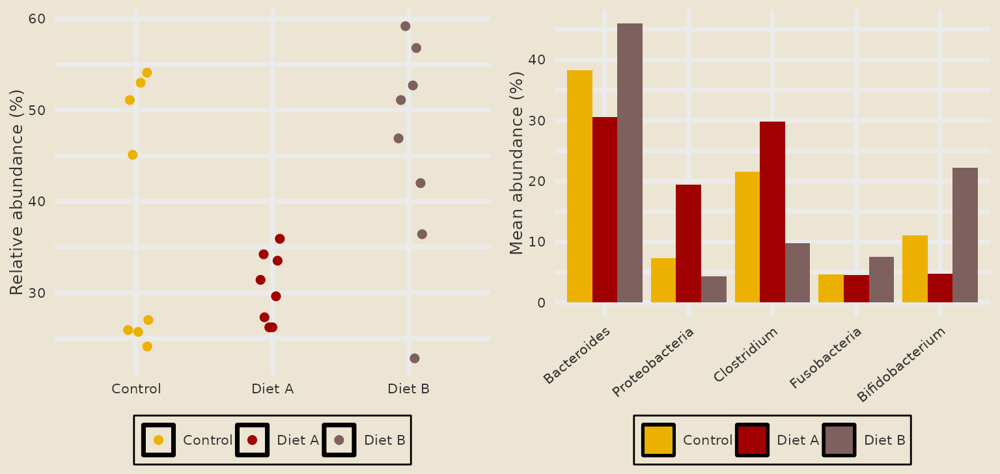
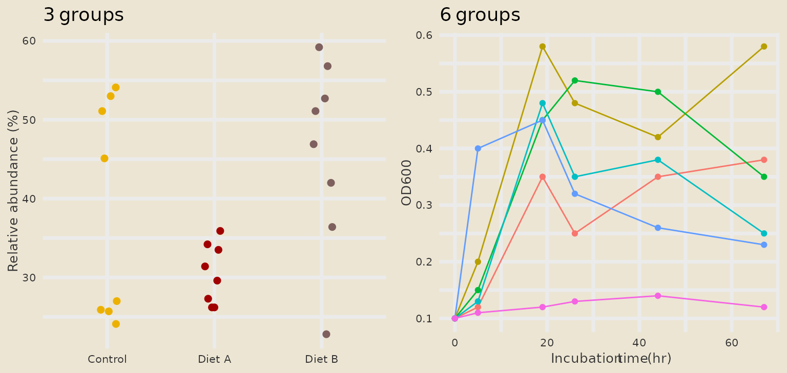
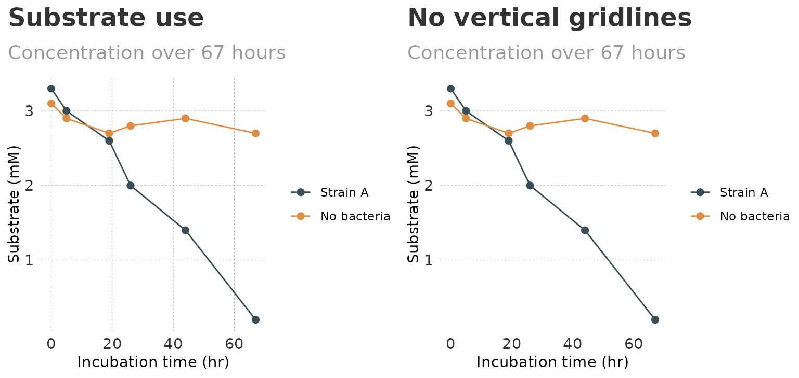
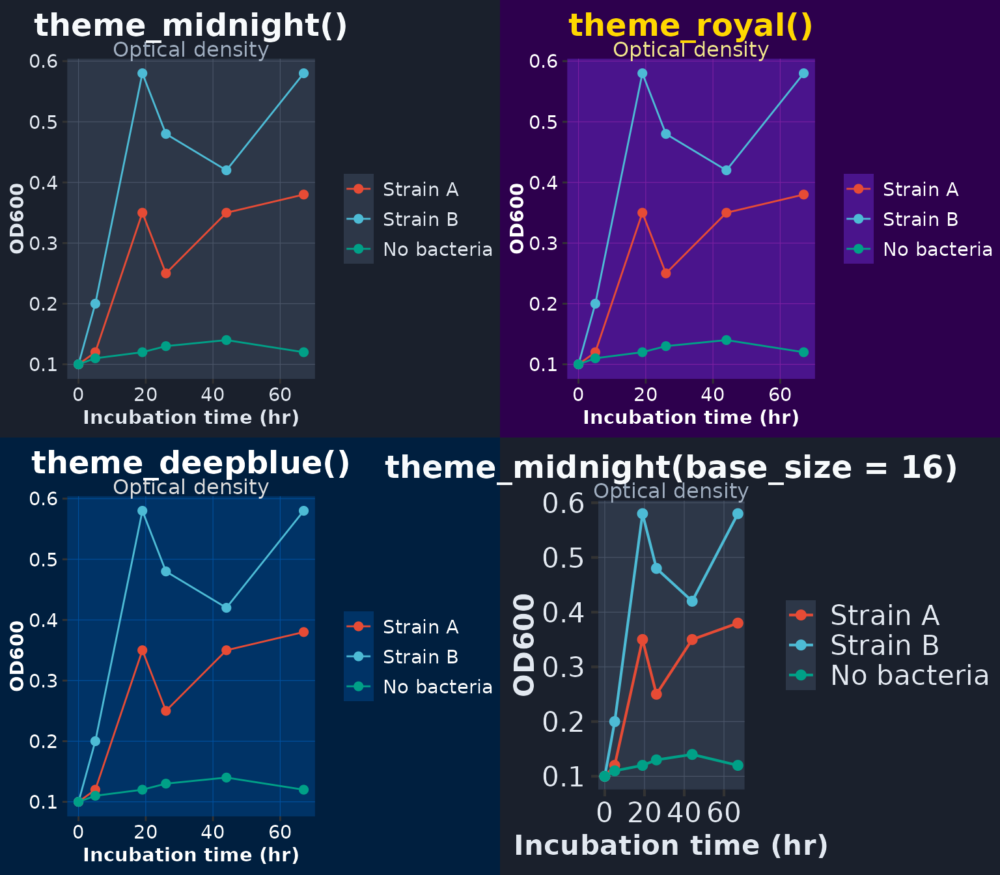
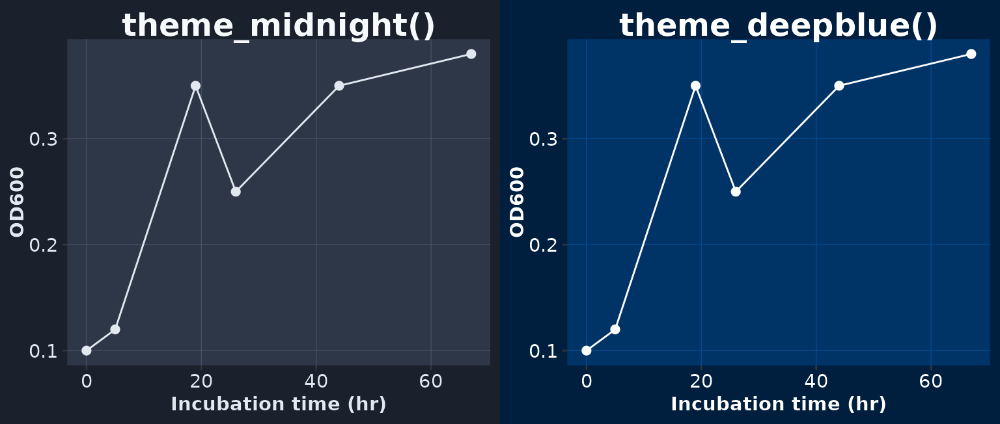

# Global and Custom Themes

``` r

library(ggplot2)
library(themeset)

growth <- example_growth()
od <- subset(growth, measure == "OD600")
taxa <- example_taxa()
```

## Overview

This article covers two things:

1.  **Global themes.**
    [`set_global_theme()`](https://vanhungtran.github.io/themeset/reference/set_global_theme.md)
    makes a set the default for every plot in the R session, so you
    choose the look once instead of on each plot.
2.  **Custom themes.**
    [`theme_nyt()`](https://vanhungtran.github.io/themeset/reference/custom_themes.md),
    [`theme_midnight()`](https://vanhungtran.github.io/themeset/reference/custom_themes.md),
    [`theme_royal()`](https://vanhungtran.github.io/themeset/reference/custom_themes.md)
    and
    [`theme_deepblue()`](https://vanhungtran.github.io/themeset/reference/custom_themes.md)
    are themes that `themeset` defines itself.

The examples use the simulated data of
[`example_growth()`](https://vanhungtran.github.io/themeset/reference/example_data.md)
and
[`example_taxa()`](https://vanhungtran.github.io/themeset/reference/example_data.md).

------------------------------------------------------------------------

## 1. Setting a Global Theme

[`set_global_theme()`](https://vanhungtran.github.io/themeset/reference/set_global_theme.md)
takes the name of a set and does two things:

1.  It calls
    [`ggplot2::theme_set()`](https://ggplot2.tidyverse.org/reference/get_theme.html)
    with the set’s theme.
2.  If the set has color and fill scales, it stores the first three
    colors of each palette as ggplot2’s default discrete colors and
    fills (the options `ggplot2.discrete.colour` and
    `ggplot2.discrete.fill`).

It prints a message and returns the set invisibly. From then on plots
need no theme and no scale of their own:

``` r

set_global_theme("avatar")
```

``` r

points <- ggplot(subset(taxa, taxon == "Bacteroides"),
                 aes(condition, abundance, color = condition)) +
  geom_point(position = position_jitter(width = 0.1, height = 0, seed = 1), size = 2) +
  labs(x = NULL, y = "Relative abundance (%)", color = NULL)

bars <- ggplot(taxa, aes(taxon, abundance, fill = condition)) +
  stat_summary(fun = mean, geom = "col", position = position_dodge()) +
  guides(x = guide_axis(angle = 40)) +
  labs(x = NULL, y = "Mean abundance (%)", fill = NULL)

cowplot::plot_grid(points, bars, ncol = 2)
```



The colors are stored in the options, where you can look at them:

``` r

getOption("ggplot2.discrete.colour")
#> [1] "#ecb100" "#a10000" "#7E605E"
getOption("ggplot2.discrete.fill")
#> [1] "#ecb100" "#a10000" "#7E605E"
```

### The Global Palette Has Three Colors

Because only three colors are stored, a plot with up to three groups
uses the set’s colors. A plot with more groups falls back to ggplot2’s
own default colors for all of its groups. The three conditions below get
the colors of the set, the six strains do not:

``` r

three <- ggplot(subset(taxa, taxon == "Bacteroides"),
                aes(condition, abundance, color = condition)) +
  geom_point(position = position_jitter(width = 0.1, height = 0, seed = 1),
             size = 2, show.legend = FALSE) +
  labs(title = "3 groups", x = NULL, y = "Relative abundance (%)")

six <- ggplot(od, aes(time, value, color = strain)) +
  geom_line(show.legend = FALSE) +
  geom_point(size = 1.5, show.legend = FALSE) +
  labs(title = "6 groups", x = "Incubation time (hr)", y = "OD600")

cowplot::plot_grid(three, six, ncol = 2)
```



For plots with many groups add a scale of your own, for example
[`scale_color_avatar()`](https://vanhungtran.github.io/themeset/reference/theme_color_scales.md),
which has eight colors.

### Switching Sets

[`set_global_theme()`](https://vanhungtran.github.io/themeset/reference/set_global_theme.md)
only touches the palette options when the new set has scales. After a
switch to a theme-only set the palette of the previous set is still in
place:

``` r

set_global_theme("minimal")
getOption("ggplot2.discrete.colour")
#> [1] "#ecb100" "#a10000" "#7E605E"
```

If that is not what you want, call
[`reset_global_theme()`](https://vanhungtran.github.io/themeset/reference/reset_global_theme.md)
between the two.

### Resetting

[`reset_global_theme()`](https://vanhungtran.github.io/themeset/reference/reset_global_theme.md)
goes back to ggplot2’s defaults:
[`theme_gray()`](https://ggplot2.tidyverse.org/reference/ggtheme.html)
and no stored palettes. It does not restore whatever theme was active
before you called
[`set_global_theme()`](https://vanhungtran.github.io/themeset/reference/set_global_theme.md).

``` r

reset_global_theme()
getOption("ggplot2.discrete.colour")
#> NULL
```

### In Scripts and Documents

Set the theme once, near the top of the script or in the setup chunk of
an R Markdown document:

``` r

library(ggplot2)
library(themeset)

set_global_theme("fivethirtyeight")

# ... every plot below uses the set ...
```

------------------------------------------------------------------------

## 2. Custom Themes

### `theme_nyt()`

A minimal theme with bold titles, a gray subtitle and dashed gridlines.
The arguments `gridline_x` and `gridline_y` switch the major gridlines
of each axis on (the default) or off:

``` r

substrate <- subset(growth, measure == "Substrate (mM)" &
                      strain %in% c("Strain A", "No bacteria"))

nyt_base <- ggplot(substrate, aes(time, value, color = strain)) +
  geom_line() +
  geom_point(size = 2) +
  scale_color_jama() +
  labs(
    title = "Substrate use",
    subtitle = "Concentration over 67 hours",
    x = "Incubation time (hr)", y = "Substrate (mM)", color = NULL
  )

cowplot::plot_grid(
  nyt_base + theme_nyt(),
  nyt_base + labs(title = "No vertical gridlines") + theme_nyt(gridline_x = FALSE),
  ncol = 2
)
```



### Dark Themes

[`theme_midnight()`](https://vanhungtran.github.io/themeset/reference/custom_themes.md),
[`theme_royal()`](https://vanhungtran.github.io/themeset/reference/custom_themes.md)
and
[`theme_deepblue()`](https://vanhungtran.github.io/themeset/reference/custom_themes.md)
color the plot background, the panel, the text and the gridlines. They
take `base_size` and `base_family`, which are passed on to
[`theme_gray()`](https://ggplot2.tidyverse.org/reference/ggtheme.html).
Dark backgrounds call for a bright palette, so these plots use
[`scale_color_npg()`](https://vanhungtran.github.io/themeset/reference/theme_color_scales.md):

``` r

dark_base <- ggplot(subset(od, strain %in% c("Strain A", "Strain B", "No bacteria")),
                    aes(time, value, color = strain)) +
  geom_line() +
  geom_point(size = 2) +
  scale_color_npg() +
  labs(subtitle = "Optical density", x = "Incubation time (hr)", y = "OD600", color = NULL)

cowplot::plot_grid(
  dark_base + ggtitle("theme_midnight()") + theme_midnight(),
  dark_base + ggtitle("theme_royal()") + theme_royal(),
  dark_base + ggtitle("theme_deepblue()") + theme_deepblue(),
  dark_base + ggtitle("theme_midnight(base_size = 16)") + theme_midnight(base_size = 16),
  ncol = 2
)
```



These four themes are ordinary ggplot2 themes, so everything that works
with
[`theme_gray()`](https://ggplot2.tidyverse.org/reference/ggtheme.html)
works with them, including adding
[`theme()`](https://ggplot2.tidyverse.org/reference/theme.html) calls
afterwards to adjust single elements.

The dark themes also set the default color of points, lines, bars and
text to a light one. A layer without a color mapping therefore shows on
the dark panel instead of drawing black on dark (this needs ggplot2 4.0
or later; older versions draw such layers black):

``` r

plain <- ggplot(subset(od, strain == "Strain A"), aes(time, value)) +
  geom_line() +
  geom_point(size = 2) +
  labs(x = "Incubation time (hr)", y = "OD600")

cowplot::plot_grid(
  plain + ggtitle("theme_midnight()") + theme_midnight(),
  plain + ggtitle("theme_deepblue()") + theme_deepblue(),
  ncol = 2
)
```



------------------------------------------------------------------------

## Summary

| To do | Use |
|----|----|
| Set the look for the whole session | `set_global_theme("<set>")` |
| Go back to ggplot2’s defaults | [`reset_global_theme()`](https://vanhungtran.github.io/themeset/reference/reset_global_theme.md) |
| Have more than three global colors | Add a `scale_color_*()` or `scale_fill_*()` to the plot |
| Light theme with dashed gridlines | [`theme_nyt()`](https://vanhungtran.github.io/themeset/reference/custom_themes.md), with `gridline_x` and `gridline_y` |
| Dark theme | [`theme_midnight()`](https://vanhungtran.github.io/themeset/reference/custom_themes.md), [`theme_royal()`](https://vanhungtran.github.io/themeset/reference/custom_themes.md) or [`theme_deepblue()`](https://vanhungtran.github.io/themeset/reference/custom_themes.md) |
