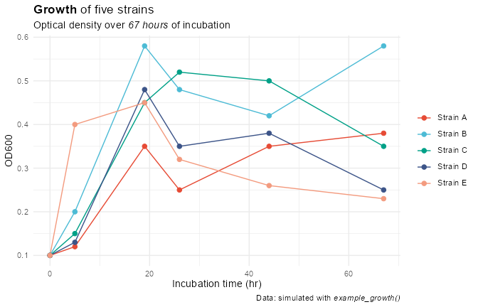
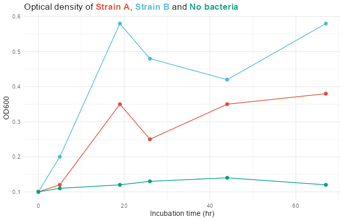
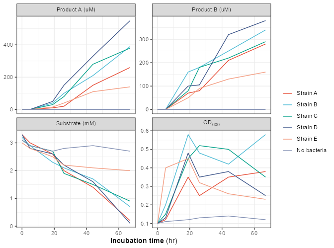
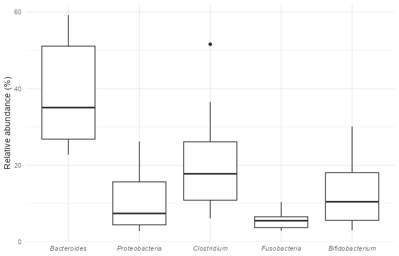
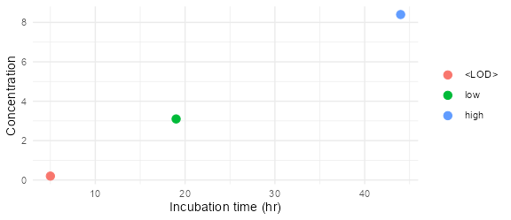
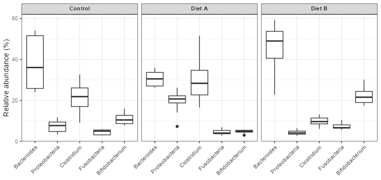
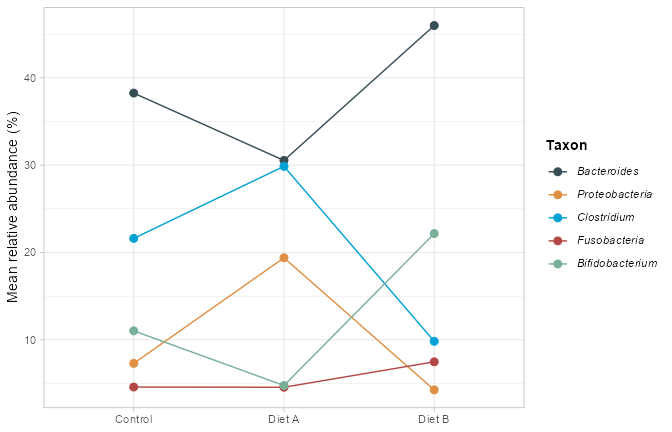
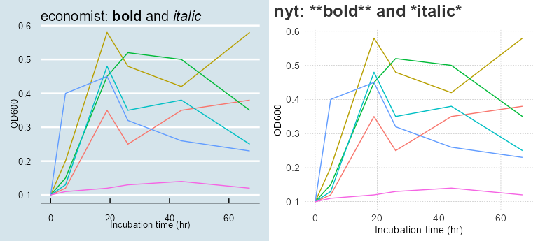

Markdown-Enabled Themes
================

- [Overview](#overview)
- [1. Emphasis in Titles](#1-emphasis-in-titles)
- [2. Colored Words Instead of a
  Legend](#2-colored-words-instead-of-a-legend)
- [3. Axis Titles, Units and
  Subscripts](#3-axis-titles-units-and-subscripts)
  - [Rotated Text](#rotated-text)
  - [Tick Labels](#tick-labels)
  - [Supported Markup](#supported-markup)
  - [Labels That Come From Your Data](#labels-that-come-from-your-data)
- [4. Facet Labels](#4-facet-labels)
- [5. Italic Legend Labels](#5-italic-legend-labels)
- [6. Theme Sets and Markdown](#6-theme-sets-and-markdown)
- [Summary](#summary)

``` r
library(ggplot2)
library(themeset)

growth <- example_growth()
od <- subset(growth, measure == "OD600")
taxa <- example_taxa()
```

## Overview

By default ggplot2 prints text exactly as you type it, so `"**bold**"`
shows its asterisks. The [ggtext](https://wilkelab.org/ggtext/) package
can render markdown, and a small part of HTML, in plot text through
`element_markdown()`. The `md_theme_*()` functions of `themeset` are the
eight base ggplot2 themes with their text elements switched over to it:

| Function                             | Wraps                          |
|--------------------------------------|--------------------------------|
| `md_theme_gray()`, `md_theme_grey()` | `theme_gray()`, `theme_grey()` |
| `md_theme_bw()`                      | `theme_bw()`                   |
| `md_theme_linedraw()`                | `theme_linedraw()`             |
| `md_theme_light()`                   | `theme_light()`                |
| `md_theme_dark()`                    | `theme_dark()`                 |
| `md_theme_minimal()`                 | `theme_minimal()`              |
| `md_theme_classic()`                 | `theme_classic()`              |

The text elements that understand markdown are the plot title, subtitle
and caption, the x axis title, the legend title and labels, and the
facet strips above the panels. Tick labels and text that the theme
rotates (the y axis title and the strips on the side of a facet grid)
stay plain text; section 3 explains why and how to switch them on for a
plot.

Only the way the text is drawn changes. Sizes, alignment, margins and
colors are those of the theme that is wrapped, and arguments are passed
on, so `md_theme_minimal(base_size = 14)` works like
`theme_minimal(base_size = 14)`. The font face is plain, even for themes
whose own titles are bold, so that emphasis comes from the markup you
add.

The examples use the simulated data of `example_growth()` and
`example_taxa()`.

------------------------------------------------------------------------

## 1. Emphasis in Titles

Use `**double asterisks**` for bold and `*single asterisks*` for
italics:

``` r
ggplot(subset(od, strain != "No bacteria"), aes(time, value, color = strain)) +
  geom_line() +
  geom_point(size = 2) +
  scale_color_npg() +
  labs(
    title    = "**Growth** of five strains",
    subtitle = "Optical density over *67 hours* of incubation",
    caption  = "Data: simulated with *example_growth()*",
    x = "Incubation time (hr)", y = "OD600", color = NULL
  ) +
  md_theme_minimal()
```

<!-- -->

------------------------------------------------------------------------

## 2. Colored Words Instead of a Legend

Inline HTML works as well. A `<span>` with a `style` can color any part
of a text, which makes it possible to let the title do the job of the
legend. Here the colors are taken from the same scale that colors the
lines, so they always match:

``` r
strains <- c("Strain A", "Strain B", "No bacteria")
npg <- substr(scale_color_npg()$palette(3), 1, 7)  # drop the alpha channel
spans <- sprintf("<span style='color:%s'>**%s**</span>", npg, strains)
title <- sprintf("Optical density of %s, %s and %s", spans[1], spans[2], spans[3])

ggplot(subset(od, strain %in% strains), aes(time, value, color = strain)) +
  geom_line() +
  geom_point(size = 2) +
  scale_color_npg() +
  labs(title = title, x = "Incubation time (hr)", y = "OD600") +
  md_theme_minimal() +
  theme(legend.position = "none")
```

<!-- -->

------------------------------------------------------------------------

## 3. Axis Titles, Units and Subscripts

The x axis title is markdown-enabled, and so are the strips above the
panels. In the figure the x title has a bold part, and the strip labels
use `<sub>` for the subscript in OD<sub>600</sub>. `<sup>` gives
exponents in the same way:

``` r
growth_labels <- as_labeller(function(x) sub("OD600", "OD<sub>600</sub>", x, fixed = TRUE))

ggplot(growth, aes(time, value, color = strain)) +
  geom_line() +
  facet_wrap(vars(measure), scales = "free_y", labeller = growth_labels) +
  scale_color_npg() +
  labs(x = "**Incubation time** (hr)", y = NULL, color = NULL) +
  md_theme_bw()
```

<!-- -->

### Rotated Text

The y axis title and the strips on the side of a facet grid are rotated.
When a plot is drawn at low resolution on the standard `png()` devices,
ggtext can drop the spaces between the words of rotated text, so that a
title reads “Milesper gallon”. The wrappers therefore leave rotated text
as plain text. The problem does not occur with the ragg device (which
`ggsave()` uses when the package is installed) or when the plot is drawn
at 192 dpi or more.

If you draw with one of those, you can use markup in the y axis title by
switching the element for the plot:
`theme(axis.title.y = ggtext::element_markdown())`.

### Tick Labels

Tick labels stay plain text on purpose. They come from your data rather
than from text you wrote, and there can be hundreds of them. Reading
each one as markdown is slower, and a label such as `<LOD>` or `***`
would be taken for markup and make the plot fail.

When you do want markup in the tick labels of one plot, switch the
element for that plot. Complete themes define the elements of the bottom
and left axes explicitly, so those are the ones to name:
`axis.text.x.bottom` and `axis.text.y.left`. Taxon names, for example,
are set in italics:

``` r
ggplot(taxa, aes(taxon, abundance)) +
  geom_boxplot() +
  scale_x_discrete(labels = paste0("*", levels(taxa$taxon), "*")) +
  labs(x = NULL, y = "Relative abundance (%)") +
  md_theme_minimal() +
  theme(axis.text.x.bottom = ggtext::element_markdown())
```

<!-- -->

### Supported Markup

ggtext renders a limited set of markdown and HTML:

| Markup | Result |
|----|----|
| `**bold**`, `*italic*` | Bold and italic text |
| `<b>`, `<i>` | The same, as HTML |
| `<span style='color:#E64B35'>` | Colored text; `font-size` works in the same way |
| `<sup>`, `<sub>` | Exponents and indices |
| `<br>` | A line break (a plain `\n` is read as a space) |
| Backticks, `~~strikethrough~~`, `<a>` links | Not supported: the plot fails to draw with the error “gridtext has encountered a tag that isn’t supported yet” |

### Labels That Come From Your Data

The legend labels and the facet labels are read as markdown as well, and
they are usually values from your data. A level that looks like markup,
such as `<LOD>` (below the limit of detection) or `*`, makes the plot
fail. Escape the characters in the scale’s `labels` with a backslash:

``` r
detection <- data.frame(
  time = c(5, 19, 44),
  value = c(0.2, 3.1, 8.4),
  level = factor(c("<LOD>", "low", "high"), levels = c("<LOD>", "low", "high"))
)

ggplot(detection, aes(time, value, color = level)) +
  geom_point(size = 3) +
  scale_color_discrete(labels = c("\\<LOD\\>", "low", "high")) +
  labs(x = "Incubation time (hr)", y = "Concentration", color = NULL) +
  md_theme_minimal()
```

<!-- -->

HTML entities work too (`&lt;LOD&gt;`). A theme without markdown, such
as `theme_minimal()`, needs no escaping at all.

------------------------------------------------------------------------

## 4. Facet Labels

The strip labels of a facet are markdown-enabled. Pass a labeller that
adds the markup:

``` r
conditions <- as_labeller(function(x) paste0("**", x, "**"))

ggplot(taxa, aes(taxon, abundance)) +
  geom_boxplot() +
  facet_wrap(vars(condition), labeller = conditions) +
  guides(x = guide_axis(angle = 45)) +
  labs(x = NULL, y = "Relative abundance (%)") +
  md_theme_bw()
```

<!-- -->

------------------------------------------------------------------------

## 5. Italic Legend Labels

Taxon names are conventionally set in italics. Labels given to a scale
go through the same markdown handling as the rest of the text:

``` r
ggplot(taxa, aes(condition, abundance, color = taxon, group = taxon)) +
  stat_summary(fun = mean, geom = "line") +
  stat_summary(fun = mean, geom = "point", size = 2.5) +
  scale_color_jama(labels = paste0("*", levels(taxa$taxon), "*")) +
  labs(x = NULL, y = "Mean relative abundance (%)", color = "**Taxon**") +
  md_theme_light()
```

<!-- -->

------------------------------------------------------------------------

## 6. Theme Sets and Markdown

Markdown is not limited to the `md_theme_*()` functions. 44 of the 49
theme sets are built from markdown-enabled themes, so
`apply_theme_set()` renders markup in titles, legends and facet strips
as well. The five exceptions are `nyt`, `midnight`, `royal`, `deepblue`
and `solid`; they show the markup characters literally:

``` r
p <- ggplot(od, aes(time, value, color = strain)) +
  geom_line() +
  labs(x = "Incubation time (hr)", y = "OD600")

cowplot::plot_grid(
  apply_theme_set(p, "economist") +
    ggtitle("economist: **bold** and *italic*") +
    theme(legend.position = "none"),
  apply_theme_set(p, "nyt") +
    ggtitle("nyt: **bold** and *italic*") +
    theme(legend.position = "none"),
  ncol = 2
)
```

<!-- -->

------------------------------------------------------------------------

## Summary

| To get | Use |
|----|----|
| Bold or italic text | `**bold**` and `*italic*` in `labs()`, scale labels or labellers |
| Colored words | `<span style='color:#E64B35'>word</span>` |
| Exponents and indices | `<sup>` and `<sub>` in a title, the x axis title or a strip label |
| Markup in the y axis title | `theme(axis.title.y = ggtext::element_markdown())`, with ragg or at 192 dpi or more |
| Markup in tick labels | `theme(axis.text.x.bottom = ggtext::element_markdown())`, or `axis.text.y.left` |
| A label that looks like markup | Escape it: `"\\<LOD\\>"` |
| A markdown-enabled base theme | `md_theme_gray()`, `md_theme_bw()`, … |
| Markdown in a theme set | any set except `nyt`, `midnight`, `royal`, `deepblue` and `solid` |
