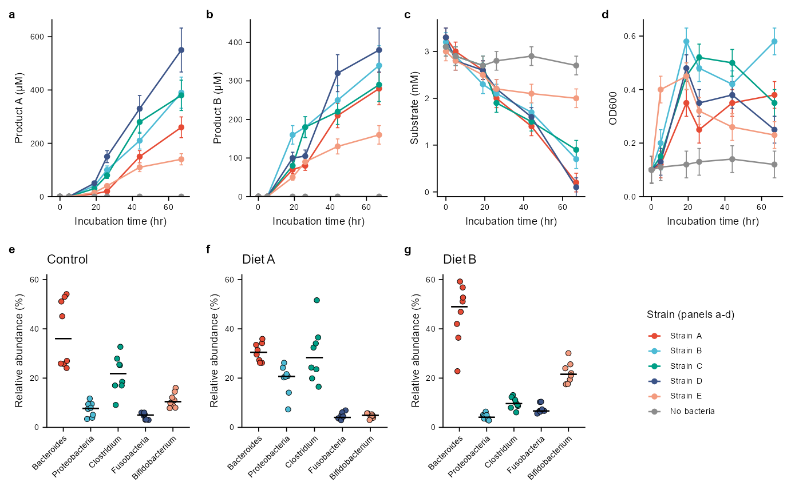
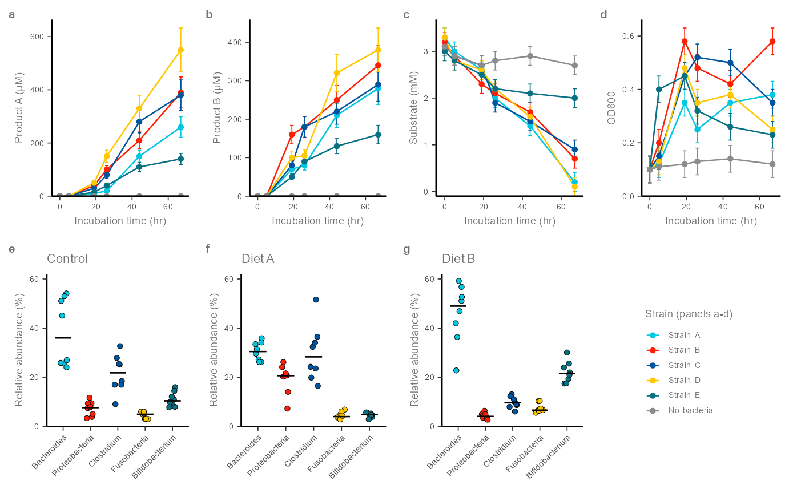
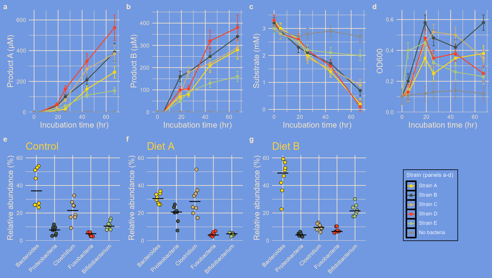
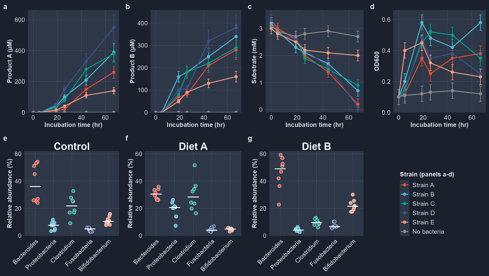

A Multi-Panel Figure
================

- [Overview](#overview)
- [1. The Panels](#1-the-panels)
- [2. Styling and Assembling](#2-styling-and-assembling)
- [3. A Figure for Print](#3-a-figure-for-print)
- [4. The Same Figure with Other
  Sets](#4-the-same-figure-with-other-sets)
- [5. Saving the Figure](#5-saving-the-figure)
- [6. Other Ways to Style a Figure](#6-other-ways-to-style-a-figure)
- [Summary](#summary)

``` r
library(ggplot2)
library(themeset)

growth <- example_growth()
taxa <- example_taxa()
strains <- levels(growth$strain)
```

## Overview

A figure for a paper is rarely a single plot. It is a grid of panels
that should share one look and one set of conventions.
`apply_theme_set()` styles one plot at a time, so for a multi-panel
figure you apply the set to each panel and then assemble the panels.

This article builds a seven-panel figure from the simulated data of
`example_growth()` and `example_taxa()`, and restyles it by changing the
name of the set. The figure follows the conventions most journals
expect:

- panels **a** to **d** show four measures of a growth experiment over
  time, one line per strain; the no-bacteria control is grey, whatever
  the palette
- panels **e** to **g** show the relative abundance of five taxa in
  three conditions; every sample is a point and the bar is the median
- one row for each kind of panel, in a grid of equal-sized panels, with
  one shared legend in a panel of its own
- bold lowercase panel tags
- sizes written for the final canvas: 183 mm wide with 7 pt text

The panels are assembled with [cowplot](https://wilkelab.org/cowplot/),
which `themeset` already depends on.

------------------------------------------------------------------------

## 1. The Panels

Start with the panels, without any theme. `k` is the width of the canvas
relative to 7.2 in (183 mm): line widths and point sizes are written for
that width and scale with it. `ink` is the color of the outlines and of
the median bars.

``` r
line_panel <- function(measure, k) {
  d <- growth[growth$measure == measure, ]
  ggplot(d, aes(time, value, color = strain)) +
    geom_errorbar(aes(ymin = value - se, ymax = value + se), width = 2,
                  linewidth = 0.3 * k) +
    geom_line(linewidth = 0.45 * k) +
    geom_point(size = 1.2 * k) +
    scale_x_continuous(breaks = seq(0, 60, 20)) +
    scale_y_continuous(expand = expansion(mult = c(0, 0.05))) +
    expand_limits(y = 0) +
    # "\U{00B5}" is the micro sign: "uM" becomes the unit micromolar
    labs(x = "Incubation time (hr)", y = sub("uM", "\U{00B5}M", measure),
         color = "Strain (panels a-d)")
}

taxa_panel <- function(condition, k, ink) {
  d <- taxa[taxa$condition == condition, ]
  ggplot(d, aes(taxon, abundance, fill = taxon)) +
    geom_point(position = position_jitter(width = 0.15, height = 0, seed = 1),
               shape = 21, size = 1.5 * k, stroke = 0.25 * k, color = ink) +
    stat_summary(fun = median, fun.min = median, fun.max = median,
                 geom = "errorbar", width = 0.6, linewidth = 0.4 * k, color = ink) +
    # one y axis for the three conditions, so that they can be compared
    scale_y_continuous(limits = c(0, 62), expand = expansion(mult = 0)) +
    guides(x = guide_axis(angle = 45)) +
    labs(title = condition, x = NULL, y = "Relative abundance (%)")
}
```

------------------------------------------------------------------------

## 2. Styling and Assembling

`figure()` builds the seven panels and puts them together:

1.  `style()` applies the set to a panel with `apply_theme_set()`, adds
    the scales you pass (a theme-only set brings none), sets the text
    size if you ask for one, and gives the panel a bold tag with
    `labs(tag = )`. Every panel goes through it, so every panel looks
    the same.
2.  `grey_reference()` keeps the five strain colors of the set and makes
    the no-bacteria control grey.
3.  The canvas color is read from the set, so that the space between the
    panels is not white on a dark set, and the outlines and medians turn
    white on a dark canvas.
4.  The legend is taken from panel **a** and set in the empty cell of
    the grid; the panels themselves have no legend.
5.  `cowplot::plot_grid()` assembles two rows of four. `align = "h"` and
    `axis = "tb"` line up the plot areas in a row.

``` r
# The fill of the set's plot background: the canvas around the panels
background <- function(plot) {
  fill <- tryCatch(calc_element("plot.background", plot$theme)$fill,
                   error = function(e) NULL)
  if (is.null(fill) || is.na(fill)) "white" else fill
}

figure <- function(set, width = 7.2, text = NULL, color = NULL, fill = NULL) {
  k <- width / 7.2

  # The set, your scales, the text size and a bold tag, the same for every panel.
  # The tag has the color of the axis titles, which is readable on every set.
  style <- function(p, tag) {
    p <- apply_theme_set(p, set) + color + fill
    if (!is.null(text)) {
      p <- p + theme(text = element_text(size = text),
                     line = element_line(linewidth = 0.3 * k))
    }
    p + labs(tag = tag) +
      theme(plot.tag = element_text(face = "bold", size = 8 * k,
                                    color = calc_element("axis.title.x", p$theme)$colour))
  }

  # The five strains keep the colors of the set; the control is grey
  grey_reference <- function(p) {
    colors <- p$scales$get_scales("colour")$palette(length(strains))
    colors[strains == "No bacteria"] <- "grey55"
    suppressMessages(p + scale_color_manual(values = setNames(colors, strains)))
  }

  hide_legend <- function(p) p + theme(legend.position = "none")

  pa <- grey_reference(style(line_panel("Product A (uM)", k), "a"))
  canvas <- background(pa)
  ink <- if (mean(grDevices::col2rgb(canvas)) < 128) "white" else "black"

  pb <- grey_reference(style(line_panel("Product B (uM)", k), "b"))
  pc <- grey_reference(style(line_panel("Substrate (mM)", k), "c"))
  pd <- grey_reference(style(line_panel("OD600", k), "d"))
  pe <- style(taxa_panel("Control", k, ink), "e")
  pf <- style(taxa_panel("Diet A", k, ink), "f")
  pg <- style(taxa_panel("Diet B", k, ink), "g")

  legend <- cowplot::get_legend(
    pa + theme(legend.position = "right", legend.key.size = unit(3.5 * k, "mm"))
  )

  top <- cowplot::plot_grid(hide_legend(pa), hide_legend(pb), hide_legend(pc),
                            hide_legend(pd), nrow = 1, align = "h", axis = "tb")
  bottom <- cowplot::plot_grid(hide_legend(pe), hide_legend(pf), hide_legend(pg),
                               legend, nrow = 1, align = "h", axis = "tb")
  cowplot::plot_grid(top, bottom, ncol = 1, rel_heights = c(1, 1.1)) +
    theme(plot.background = element_rect(fill = canvas, color = NA))
}
```

------------------------------------------------------------------------

## 3. A Figure for Print

`classic` is a theme-only set: white background, L-shaped axes, no grid.
It brings no scales, so pass a palette. `text = 7` sets the text size,
and `width` is the width of the canvas in inches: 7.2 in is 183 mm, the
double-column width of Nature journals.

``` r
figure("classic", width = 7.2, text = 7,
       color = scale_color_npg(), fill = scale_fill_npg())
```



_Simulated growth and community data. a-d, Product A, product B,
substrate and OD600 over time for five strains and a no-bacteria control
(grey). Points are means and error bars are standard errors of the mean.
e-g, Relative abundance of five taxa in the control and two diets. Each
point is one sample and bars are medians._

Click the figure to zoom. Axis tick labels are 0.8 times the text size,
5.6 pt here; journals usually ask for 5 to 7 pt text at the final size.

------------------------------------------------------------------------

## 4. The Same Figure with Other Sets

Only the set changes. `olink` is a complete set: it brings its own theme
and palette, and it follows the text size like `classic`:

``` r
figure("olink", width = 7.2, text = 7)
```



_The same figure with the olink set, at 183 mm and 7 pt._

The `simpsons` set is for slides and posters. Its text sizes are fixed,
so it needs a larger canvas, and no `text` argument:

``` r
figure("simpsons", width = 12)
```



_The same figure with the simpsons set, on a 12 in canvas._

`midnight`, a dark set, is another theme-only set, so it needs a
palette. A bright palette suits the dark background:

``` r
figure("midnight", width = 12,
       color = scale_color_npg(), fill = scale_fill_npg())
```



_The same figure with the midnight set and the npg palette._

------------------------------------------------------------------------

## 5. Saving the Figure

Save at the size you drew at. A vector PDF keeps the text sharp at any
zoom and embeds the fonts; the PNG is for previews and slides.

``` r
fig <- figure("classic", width = 7.2, text = 7,
              color = scale_color_npg(), fill = scale_fill_npg())

ggsave("figure.pdf", fig, width = 183, height = 114, units = "mm",
       device = cairo_pdf)
ggsave("figure.png", fig, width = 183, height = 114, units = "mm", dpi = 600)
```

------------------------------------------------------------------------

## 6. Other Ways to Style a Figure

- **Apply the set to the panels, not to the assembled figure.** A
  cowplot grid is itself a ggplot object, so `apply_theme_set()` accepts
  it, but it only changes the background around the panels.

- **With patchwork,** `+` adds to the last panel only, so
  `apply_theme_set(a | b | c, "simpsons")` styles panel **c** alone. Use
  the `&` operator to style every panel:

  ``` r
  library(patchwork)
  (a | b | c) & theme_nyt()
  ```

- **`set_global_theme()`** styles every panel that is drawn while it is
  active, with no per-panel call. It sets the theme and the first three
  colors only; see [Global and Custom
  Themes](global-and-custom-themes.md).

- **Text size.** `text = 7` sets the root text size of the theme. Sets
  built on relative sizes follow it: `classic`, `bw`, `minimal`, `few`,
  `tufte` and `olink`. Sets with fixed point sizes mostly ignore it
  (`simpsons`, `avatar`), and a few follow it in part (`cowplot`,
  `midnight`). Draw those on a larger canvas.

- **Palette size.** `figure()` takes six colors from the palette, one
  for each level of `strain`, and then turns the last one grey.
  `fivethirtyeight` has three, so pass a larger scale with `color =`.

------------------------------------------------------------------------

## Summary

| To | Use |
|----|----|
| Style every panel with a set | `apply_theme_set(panel, "<set>")` on each panel, then assemble |
| Use a theme-only set | Add `scale_color_*()` and `scale_fill_*()` to each panel |
| Tag the panels | `labs(tag = "a")` and `theme(plot.tag = element_text(face = "bold"))` |
| Set the text size for print | `theme(text = element_text(size = 7))`, on a set built on relative sizes |
| Match the space between panels | Read the set’s `plot.background` and use it for the canvas |
| Style a patchwork figure | The `&` operator: `<patchwork> & <theme>` |
| Style panels without calling the set on each | `set_global_theme("<set>")` before drawing |
