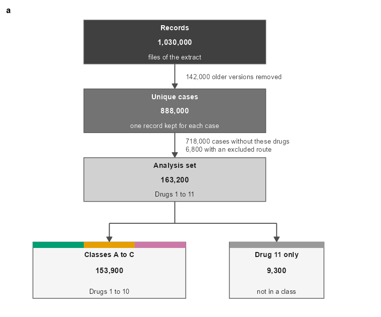
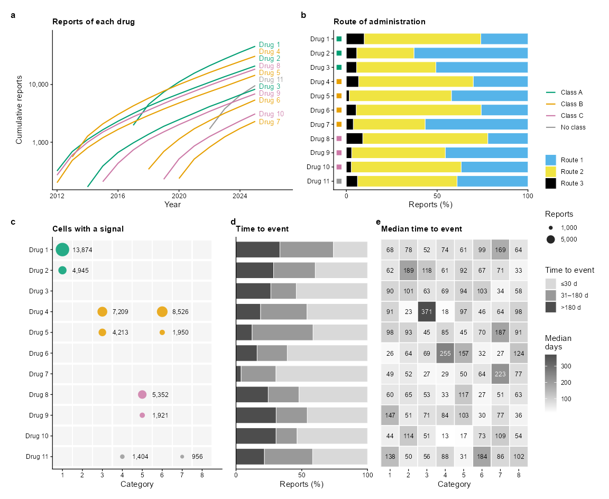
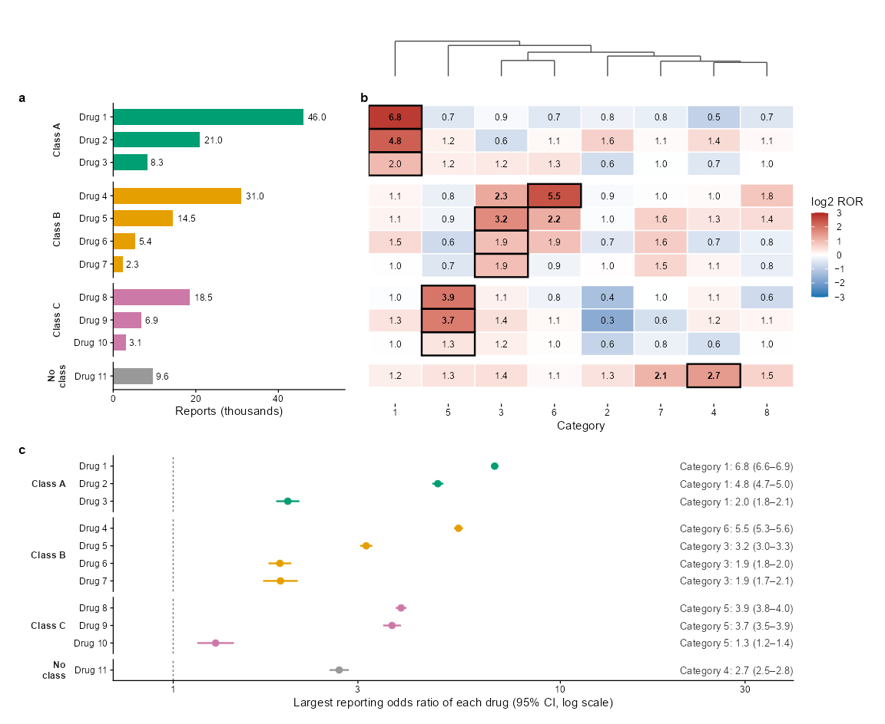
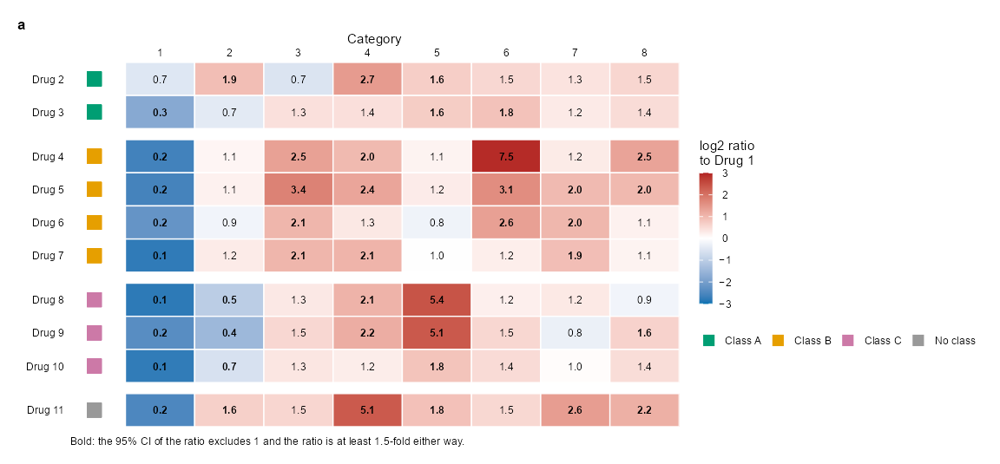
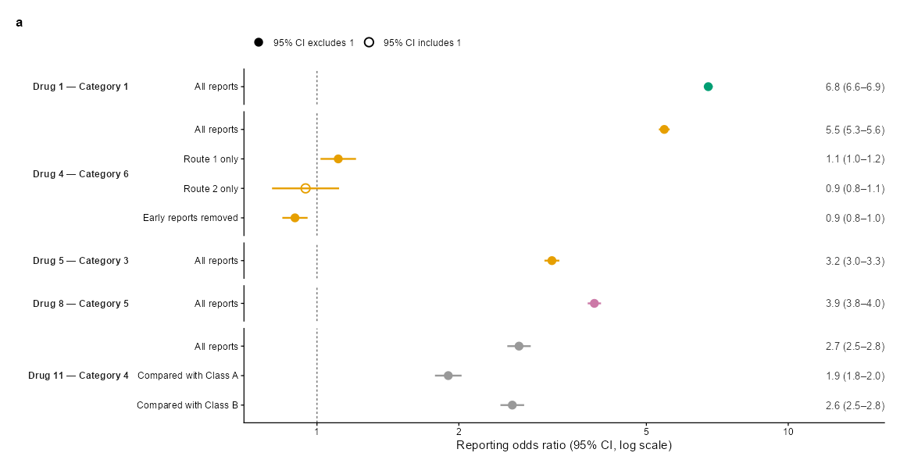

A Figure Set for a Reporting Study
================

- [Overview](#overview)
- [1. The Study and the Color
  Contract](#1-the-study-and-the-color-contract)
- [2. Figure 1: The Flow of the
  Cases](#2-figure-1-the-flow-of-the-cases)
- [3. Figure 2: Reports, Routes and
  Time](#3-figure-2-reports-routes-and-time)
- [4. Figure 3: The Profile of the
  Events](#4-figure-3-the-profile-of-the-events)
- [5. Figure 4: A Contrast with a Reference
  Drug](#5-figure-4-a-contrast-with-a-reference-drug)
- [6. Figure 5: Selected Estimates](#6-figure-5-selected-estimates)
- [7. Checking the Set](#7-checking-the-set)
- [8. Packages and Credits](#8-packages-and-credits)
- [Summary](#summary)

``` r
library(ggplot2)
library(themeset)

# patchwork lays out the panels of every figure; without it the code is shown but not run
has_patchwork <- requireNamespace("patchwork", quietly = TRUE)
```

## Overview

A study of spontaneous reports asks whether a drug is reported with an
event more often than the other drugs are. Its figures follow the same
path every time: the flow of the cases into the analysis, the reports of
each drug, the profile of the events of each drug, the contrast between
drugs, and a few estimates that are checked in other ways.

This article draws five such figures from simulated data. Nothing in
them is a result: the drugs are Drug 1 to Drug 11, the events fall in
Category 1 to Category 8, and the counts are made up. The reporting odds
ratios (ROR) are computed from the counts, as they would be from real
ones. As in [A Figure Set for a Reanalysis](figure-set.md), the
figures share a **color contract** and the style of a journal,
`journal_theme("nature")`, and `journal_audit()` checks the set at the
end. The figures here are of other kinds: a flow chart, a bubble matrix,
a heat map with a tree, and forest plots.

------------------------------------------------------------------------

## 1. The Study and the Color Contract

For one drug and one category of events, the reports make a 2 x 2 table:
*a* reports of the drug with the event and *b* without, *c* reports of
all the other drugs with the event and *d* without. The ROR is (*a* /
*b*) / (*c* / *d*), and its 95% confidence interval is exp(log ROR +/-
1.96 *s*), with *s* the square root of 1/*a* + 1/*b* + 1/*c* + 1/*d*. A
ROR above 1 means that the event is reported more often with the drug
than with the others, which is a signal, and not a risk.

Every figure takes its colors from the contract:

- **Class**: Drugs 1 to 3 are Class A, a bluish green; Drugs 4 to 7 are
  Class B, an orange; Drugs 8 to 10 are Class C, a reddish purple; Drug
  11 is in no class, a grey. The three colors are Okabe-Ito colors that
  readers with color-vision deficiency can tell apart. Every figure uses
  them.
- **Direction**: a ROR below 1 is blue and a ROR above 1 is red, on a
  ramp that passes through white at 1. No class is blue or red. Figures
  3 and 4 use it.
- **Evidence**: a filled circle when the 95% CI excludes 1, an open
  circle when it includes 1; in a heat map, bold numbers mean the same.
- **Categories of events** have no color. There are eight of them, more
  than readers with color-vision deficiency can keep apart (see Section
  7), so they are the labels of the columns and are named in the text of
  the figures. The routes of Figure 2 take the Okabe-Ito colors that
  nothing else uses, and the ordered bins of time are greys.

A group keeps its color across the figures, and no figure gives one
color two meanings.

``` r
library(patchwork)

okabe_ito <- journal_colors("cell")   # orange, sky blue, bluish green, yellow, blue, vermillion, reddish purple, black

class_levels <- c("Class A", "Class B", "Class C", "No class")
class_fill <- c(`Class A` = okabe_ito[3], `Class B` = okabe_ito[1], `Class C` = okabe_ito[7], `No class` = "grey60")
direction <- c(low = okabe_ito[5], mid = "white", high = "firebrick")       # below 1 is blue, above 1 is red

# one theme for every panel, and the sizes that the panels share
figure_theme <- journal_theme("nature") +
  theme(plot.background = element_rect(fill = "white", colour = NA))   # no outline: it is a stroked path that crosses text where panels meet
small_text <- 6 / .pt                         # direct labels and notes are 6 pt (geom_text sizes are in mm)
tile_text <- 5.5 / .pt                        # numbers inside tiles and beside marks are 5.5 pt
strip_text <- theme(strip.background = element_blank(), strip.text = element_text(face = "bold"))
tag_theme <- theme(plot.tag = element_text(size = 8, face = "bold"))

# the panels of a figure sit on a grid of columns: each row lists its panels and their widths
design_rows <- function(rows) {
  paste(vapply(rows, function(row) {
    paste0(vapply(names(row), function(id) strrep(id, row[[id]]), ""), collapse = "")
  }, ""), collapse = "\n")
}
tag_panels <- function(figure, n) {
  figure + plot_annotation(tag_levels = list(journal_tags("nature", n)), theme = tag_theme)
}
category_number <- function(x) sub("Category ", "", x)     # "Category 3" is written 3 under the axis title Category
minus <- function(x) sub("-", "\u2212", x, fixed = TRUE)      # a real minus sign
```

The theme draws the background of a plot without an outline. The themes
of ggplot2 draw a white one, which in a PDF is a stroked path that
nobody can see, and a check of the rendered file finds it wherever a
label sits across the edge of two panels.

The study itself is made of the counts of reports. Eleven drugs have
between 2,300 and 46,000 reports, and 900,000 reports of other drugs are
the comparator. Each class has a few real effects, set in `lfc`, the log
of the ratio of the odds to the comparator, and the rest is noise. Every
figure reads from the table `cells`, which has one row for each drug and
category.

``` r
set.seed(101)

drugs <- sprintf("Drug %d", 1:11)
drug_group <- factor(c(rep(class_levels[1:3], times = c(3, 4, 3)), "No class"), class_levels)
names(drug_group) <- drugs
events <- sprintf("Category %d", 1:8)

n_reports <- c(46000, 21000, 8300, 31000, 14500, 5400, 2300, 18500, 6900, 3100, 9600)   # reports of each drug
n_other <- 900000                                                                       # reports of all the other drugs
p_other <- c(0.060, 0.080, 0.115, 0.060, 0.095, 0.065, 0.050, 0.045)                     # the share of those with each category

# the log of the ratio of a drug to the comparator, for each category: noise and a few effects by class
lfc <- matrix(rnorm(11 * 8, 0, 0.28), 11, 8, dimnames = list(drugs, events))
lfc[1:3, 1] <- lfc[1:3, 1] + c(1.7, 1.2, 0.8)
lfc[4:7, c(3, 6)] <- lfc[4:7, c(3, 6)] + rep(c(1.1, 0.8, 0.6, 0.4), 2)
lfc[8:10, 5] <- lfc[8:10, 5] + c(1.2, 0.9, 0.6)
lfc[8:10, 2] <- lfc[8:10, 2] - 0.6
lfc[11, c(4, 7)] <- lfc[11, c(4, 7)] + c(1.0, 0.6)

cells <- expand.grid(drug = drugs, event = events, stringsAsFactors = FALSE)
cells$n_drug <- n_reports[match(cells$drug, drugs)]
p_cell <- pmin(p_other[match(cells$event, events)] * exp(lfc[cbind(cells$drug, cells$event)]), 0.9)
cells$a <- pmax(rbinom(nrow(cells), cells$n_drug, p_cell), 1)                  # reports of the drug with the event
cells$b <- cells$n_drug - cells$a                                              # and without
cells$c <- round(n_other * p_other[match(cells$event, events)])                # reports of the others with the event
cells$d <- n_other - cells$c                                                   # and without

# the reporting odds ratio and its 95% CI, from the four counts
from_counts <- function(a, b, c, d) {
  ror <- (a / b) / (c / d)
  se <- sqrt(1 / a + 1 / b + 1 / c + 1 / d)
  data.frame(ror = ror, se = se, lo = exp(log(ror) - 1.96 * se), hi = exp(log(ror) + 1.96 * se))
}
cells <- cbind(cells, from_counts(cells$a, cells$b, cells$c, cells$d))
cells$signal <- cells$a >= 3 & cells$lo > 1 & cells$ror >= 2                   # the rule of a signal: at least 3 reports, CI above 1, ROR of 2 or more
cells$group <- drug_group[cells$drug]
cells$drug <- factor(cells$drug, drugs)
cells$event <- factor(cells$event, events)

head(cells[cells$signal, c("drug", "event", "a", "ror", "lo", "hi")], 4)
#>      drug      event     a      ror       lo       hi
#> 1  Drug 1 Category 1 13874 6.765839 6.620409 6.914463
#> 2  Drug 2 Category 1  4945 4.825392 4.668553 4.987500
#> 26 Drug 4 Category 3  7209 2.331888 2.269464 2.396030
#> 27 Drug 5 Category 3  4213 3.151724 3.038969 3.268662
```

------------------------------------------------------------------------

## 2. Figure 1: The Flow of the Cases

A flow chart is a plot with no axes: boxes are `geom_rect()`, their text
is `geom_text()`, and the arrows are `geom_segment()` with an `arrow()`.
Everything sits on a plane of 100 by 100, so that the position of a box
is a number that can be read and changed. The counts are computed from
the study, so that the chart agrees with the figures after it.

``` r
n_set <- sum(n_reports) - 3400                          # a report with several of the drugs is counted once
n_union <- sum(n_reports[1:10]) - 3100                  # the cases of the three classes
n_only <- n_set - n_union                               # the cases of Drug 11 that are in no class
n_unique <- 888000; n_older <- 142000; n_records <- n_unique + n_older
n_local <- 6800; n_nodrug <- n_unique - n_set - n_local
big <- function(x) format(x, big.mark = ",", trim = TRUE)

# boxes on a plane of 100 by 100: where each sits, its three lines of text and its colors
boxes <- data.frame(
  xmin = c(20, 20, 20, 6, 60), xmax = c(70, 70, 70, 48, 86),
  ymin = c(84, 62, 40, 9, 9), ymax = c(98, 76, 54, 27, 27),
  head = c("Records", "Unique cases", "Analysis set", "Classes A to C", "Drug 11 only"),
  n = c(n_records, n_unique, n_set, n_union, n_only),
  note = c("files of the extract", "one record kept for each case", "Drugs 1 to 11", "Drugs 1 to 10", "not in a class"),
  stringsAsFactors = FALSE
)
boxes$fill <- c("grey25", "grey45", "grey82", "grey96", "grey96")
boxes$ink <- c("white", "white", "grey10", "grey10", "grey10")
boxes$x <- (boxes$xmin + boxes$xmax) / 2
boxes$y <- (boxes$ymin + boxes$ymax) / 2

# the arrows: down the stack, and from the analysis set into its two groups
trunk <- boxes$x[1]
down <- data.frame(x = c(trunk, trunk, boxes$x[4], boxes$x[5]), y = c(boxes$ymin[1], boxes$ymin[2], 33, 33),
                   yend = c(boxes$ymax[2], boxes$ymax[3], boxes$ymax[4], boxes$ymax[5]) + 0.2)
joint <- data.frame(x = c(trunk, boxes$x[4]), xend = c(trunk, boxes$x[5]), y = c(boxes$ymin[3], 33), yend = c(33, 33))
notes <- data.frame(
  x = trunk + 3, y = c(mean(c(boxes$ymin[1], boxes$ymax[2])), mean(c(boxes$ymin[2], boxes$ymax[3]))),
  label = c(sprintf("%s older versions removed", big(n_older)),
            sprintf("%s cases without these drugs\n%s with an excluded route", big(n_nodrug), big(n_local)))
)

# a strip of the class colors above the first group, and a grey one above the second
strips <- data.frame(xmin = c(6 + c(0, 14, 28), 60), xmax = c(6 + c(14, 28, 42), 86), ymin = 25.2, ymax = 27,
                     fill = unname(class_fill[c(1, 2, 3, 4)]))

arrowhead <- arrow(length = unit(1.6, "mm"), type = "closed")
flow <- ggplot() +
  geom_segment(data = joint, aes(x = x, xend = xend, y = y, yend = yend), linewidth = 0.4, colour = "grey30") +
  geom_segment(data = down, aes(x = x, xend = x, y = y, yend = yend), arrow = arrowhead, linewidth = 0.4, colour = "grey30") +
  geom_rect(data = boxes, aes(xmin = xmin, xmax = xmax, ymin = ymin, ymax = ymax, fill = fill), colour = "grey35", linewidth = 0.3) +
  geom_rect(data = strips, aes(xmin = xmin, xmax = xmax, ymin = ymin, ymax = ymax, fill = fill)) +
  geom_text(data = boxes, aes(x = x, y = ymax - 2.5 - 1.4 * (ymax < 30), label = head, colour = ink), size = 6.5 / .pt, fontface = "bold") +
  geom_text(data = boxes, aes(x = x, y = y, label = big(n), colour = ink), size = 7 / .pt, fontface = "bold") +
  geom_text(data = boxes, aes(x = x, y = ymin + 2.3, label = note, colour = ink), size = 6 / .pt) +
  geom_text(data = notes, aes(x = x, y = y, label = label), hjust = 0, size = small_text, colour = "grey20", lineheight = 0.95) +
  scale_fill_identity() + scale_colour_identity() +
  scale_x_continuous(limits = c(0, 100), expand = expansion(0)) + scale_y_continuous(limits = c(5, 100), expand = expansion(0)) +
  theme_void(base_size = 7) + tag_theme

tag_panels(flow, 1)
```



_Figure 1. Flow of the cases into the analysis. The records of the
extract, the unique cases, the analysis set of Drugs 1 to 11, and its
two groups, with what is removed at each step written beside its arrow.
The strips give the colors of the classes. All counts are simulated._

- The first three boxes are three steps of grey, darkest first, and the
  last two are pale. The only colors of the chart are the strips on top
  of the last two: the colors of the three classes for the box that
  holds them, the grey of “no class” for Drug 11.
- What is removed at each step is written beside its arrow, in a size
  that fits in the margin, and the number inside each box is the one
  that remains.
- Because the plot is made of data frames (`boxes`, `down`, `joint`),
  adding a step is adding a row, not moving shapes by hand.

------------------------------------------------------------------------

## 3. Figure 2: Reports, Routes and Time

The reports of each drug over the years, as one line per drug, labeled
at its end and colored by class. Next to it, the routes of
administration as 100% bars. The cells with a signal are drawn as
bubbles in a matrix of drugs and categories, sized by their reports, and
the time between the start of the drug and the event follows, as bars
and as a heat map of medians. The panels in the last row share their
rows, so that a drug is read across the three.

``` r
set.seed(21)
route_colors <- c(`Route 1` = okabe_ito[2], `Route 2` = okabe_ito[4], `Route 3` = okabe_ito[8])
bins <- c("\u226430 d", "31\u2013180 d", ">180 d")
axis_drugs <- scale_y_discrete(limits = rev(drugs))

# a: the cumulative reports of each drug, from the year of its first report
years <- 2012:2025
launch <- c(2017, 2012, 2014, 2013, 2012, 2018, 2020, 2012, 2015, 2019, 2022)
cumulative <- do.call(rbind, lapply(seq_along(drugs), function(d) {
  yr <- years[years >= launch[d]]
  w <- exp(0.2 * (yr - launch[d]))
  data.frame(drug = drugs[d], year = yr, total = cumsum(as.vector(rmultinom(1, n_reports[d], w / sum(w)))))
}))
cumulative$group <- drug_group[cumulative$drug]
ends <- cumulative[cumulative$year == max(years), ]
ends <- ends[order(ends$total), ]
ends$y <- log10(ends$total)
for (i in seq_len(nrow(ends))[-1]) ends$y[i] <- max(ends$y[i], ends$y[i - 1] + 0.12)     # labels at least 0.12 apart on the log scale

# b: the routes of each drug
p1 <- runif(11, 0.2, 0.88); p3 <- runif(11, 0.01, 0.1)
route_mix <- data.frame(drug = rep(drugs, 3), route = factor(rep(names(route_colors), each = 11), names(route_colors)),
                        share = c(p1, 1 - p1 - p3, p3))
route_mix$group <- drug_group[route_mix$drug]

# c: the cells with a signal
signal <- cells[cells$signal, ]
signal$drug <- as.character(signal$drug)

# d, e: the time to the event, in three bins and as a median
onset_share <- t(sapply(1:11, function(d) { g <- rgamma(3, c(5, 3, 2) * runif(3, 0.5, 1.6)); g / sum(g) }))
onset <- data.frame(drug = rep(drugs, 3), bin = factor(rep(bins, each = 11), bins), share = as.vector(onset_share))
median_onset <- data.frame(drug = cells$drug, event = cells$event, days = round(exp(rnorm(nrow(cells), log(60), 0.7))))

panels_2 <- list(
  A = ggplot(cumulative, aes(year, total, group = drug, colour = group)) +
    geom_line(linewidth = 0.45) +
    geom_text(data = ends, aes(x = max(years) + 0.25, y = 10^y, label = drug), hjust = 0, size = small_text, show.legend = FALSE) +
    scale_colour_manual(values = class_fill, name = NULL, drop = FALSE) +
    scale_x_continuous(breaks = seq(2012, 2024, 4), expand = expansion(add = c(0.3, 2.2))) +
    scale_y_log10(breaks = c(1e2, 1e3, 1e4), labels = c("100", "1,000", "10,000"), expand = expansion(mult = c(0.02, 0.1))) +
    labs(x = "Year", y = "Cumulative reports", title = "Reports of each drug") +
    figure_theme,
  B = ggplot(route_mix, aes(share, drug, fill = route)) +
    geom_col(width = 0.78, colour = "white", linewidth = 0.2) +
    geom_point(data = data.frame(drug = drugs, group = drug_group), aes(x = -0.04, y = drug, colour = group),
               shape = 15, size = 1.8, inherit.aes = FALSE, show.legend = FALSE) +
    scale_fill_manual(values = route_colors, name = NULL) +
    scale_colour_manual(values = class_fill, guide = "none") +
    axis_drugs + scale_x_continuous(limits = c(-0.07, 1), breaks = c(0, 0.5, 1), labels = c("0", "50", "100"), expand = expansion(0)) +
    labs(x = "Reports (%)", y = NULL, title = "Route of administration") +
    figure_theme,
  C = ggplot(signal, aes(event, drug)) +
    geom_tile(data = cells, aes(event, as.character(drug)), fill = "grey96", colour = NA, width = 0.94, height = 0.9, inherit.aes = FALSE) +
    geom_point(aes(size = a, colour = group), alpha = 0.85, shape = 16, show.legend = c(size = TRUE, colour = FALSE)) +
    geom_text(aes(label = format(a, big.mark = ",", trim = TRUE)), nudge_x = 0.5, hjust = 0, size = tile_text) +
    axis_drugs + scale_x_discrete(limits = events, labels = category_number, expand = expansion(add = c(0.5, 1))) +
    scale_size_area(max_size = 5.2, breaks = c(100, 1000, 5000), labels = c("100", "1,000", "5,000"), name = "Reports") +
    scale_colour_manual(values = class_fill, guide = "none") +
    labs(x = "Category", y = NULL, title = "Cells with a signal") +
    figure_theme,
  D = ggplot(onset, aes(share, drug, fill = bin)) +
    geom_col(width = 0.78, colour = "white", linewidth = 0.2) +
    axis_drugs + scale_x_continuous(breaks = c(0, 0.5, 1), labels = c("0", "50", "100"), expand = expansion(0)) +
    scale_fill_manual(values = setNames(grey(c(0.85, 0.6, 0.3)), bins), name = "Time to event") +
    labs(x = "Reports (%)", y = NULL, title = "Time to event") +
    figure_theme + theme(axis.text.y = element_blank(), axis.ticks.y = element_blank()),
  E = ggplot(median_onset, aes(event, drug, fill = days)) +
    geom_tile(colour = "white", linewidth = 0.3) +
    geom_text(aes(label = days, colour = days > 200), size = tile_text, show.legend = FALSE) +
    axis_drugs + scale_x_discrete(labels = category_number, expand = expansion(0)) +
    scale_colour_manual(values = c(`TRUE` = "white", `FALSE` = "black")) +
    scale_fill_gradient(low = "white", high = grey(0.3), name = "Median\ndays") +
    labs(x = "Category", y = NULL, title = "Median time to event") +
    figure_theme + theme(axis.text.y = element_blank(), axis.ticks.y = element_blank(), axis.line = element_blank())
)
tag_panels(wrap_plots(panels_2, design = design_rows(list(c(A = 20, B = 16), c(C = 15, D = 8, E = 13))), heights = c(55, 80)) +
             plot_layout(guides = "collect"), 5)
```



_Figure 2. Reports, routes and time to the event for 11 drugs. a,
Cumulative reports of each drug by year (logarithmic axis). b, Route of
administration of the reports of each drug (100% bars). c, Cells with a
signal (at least 3 reports, lower limit of the 95% CI above 1, ROR of 2
or more); the area of a dot and the number beside it are the reports. d,
Share of the reports by time to the event. e, Median time to the event
in days. ROR, reporting odds ratio. All data are simulated._

- Panels **c**, **d** and **e** have the same rows, and only **c** names
  them. The pale tiles in **c** mark the cells that are not signals, so
  that the matrix keeps the shape of the heat map beside it. The numbers
  of **c** have no grid line behind them: a line behind a number crosses
  it.
- The eight categories are written 1 to 8 under one axis title. Names
  such as “Category 3”, tilted, touch each other in columns this narrow;
  upright numbers never do.
- Each legend is made once: `plot_layout(guides = "collect")` gathers
  them on the right, and a legend that two panels would repeat is
  switched off in one of them (`show.legend`), here the class colors of
  **c**, which **a** already shows.
- The labels at the end of the lines of **a** are spaced on the
  logarithmic scale by a loop, at least 0.1 apart, so that no ggrepel
  package is needed.
- The squares of the class colors in **b** are points drawn at a
  position just left of the bars, with `show.legend = FALSE` and a scale
  without a guide.

------------------------------------------------------------------------

## 4. Figure 3: The Profile of the Events

Three views of the same table. The reports of each drug, as bars, so
that the size of the denominator is in view. The ROR of every drug and
category as a heat map, with the categories in the order of a
hierarchical clustering and the tree above them; the largest ROR of each
drug has a black frame. And, below, the largest ROR of each drug with
its 95% CI on a logarithmic axis, with the name of its category. The
drugs are in the same order, in the same classes, throughout.

``` r
cells$class_label <- factor(as.character(cells$group), class_levels, c("Class A", "Class B", "Class C", "No\nclass"))
by_class <- facet_grid(rows = vars(class_label), scales = "free_y", space = "free_y", switch = "y")
no_strip <- theme(strip.text.y = element_blank(), strip.text.y.left = element_blank())

# a: the reports of each drug, in thousands
volume <- data.frame(drug = factor(drugs, drugs), thousand = n_reports / 1000)
volume$group <- drug_group[as.character(volume$drug)]
volume$class_label <- factor(as.character(volume$group), class_levels, c("Class A", "Class B", "Class C", "No\nclass"))

# b: the categories in the order of a hierarchical clustering of their log ratios, and the tree
log_ror <- tapply(log2(cells$ror), list(cells$drug, cells$event), identity)
hc <- hclust(dist(t(log_ror)), method = "average")
tree_segments <- function(hc) {
  n <- length(hc$order)
  x <- numeric(n); x[hc$order] <- seq_len(n)                  # where each leaf sits
  node_x <- numeric(n - 1)
  at <- function(i, what) if (i < 0) c(x[-i], 0)[what] else c(node_x[i], hc$height[i])[what]
  do.call(rbind, lapply(seq_len(n - 1), function(k) {
    a <- hc$merge[k, 1]; b <- hc$merge[k, 2]
    node_x[k] <<- (at(a, 1) + at(b, 1)) / 2
    h <- hc$height[k]
    data.frame(x = c(at(a, 1), at(a, 1), at(b, 1)), xend = c(at(a, 1), at(b, 1), at(b, 1)),
               y = c(at(a, 2), h, h), yend = c(h, h, at(b, 2)))
  }))
}
tree <- tree_segments(hc)
cells$event_ordered <- factor(cells$event, events[hc$order])
top <- cells[ave(cells$ror, cells$drug, FUN = function(x) x == max(x)) == 1, ]     # the largest ROR of each drug
top$label <- sprintf("%s: %.1f (%.1f\u2013%.1f)", top$event, top$ror, top$lo, top$hi)

panels_3 <- list(
  A = ggplot(volume, aes(thousand, drug, fill = group)) +
    geom_col(width = 0.7) +
    geom_text(aes(label = sprintf("%.1f", thousand)), hjust = -0.25, size = tile_text) +
    by_class + scale_y_discrete(limits = rev) +
    scale_fill_manual(values = class_fill, guide = "none") +
    scale_x_continuous(breaks = c(0, 20, 40), expand = expansion(mult = c(0, 0.22))) +
    labs(x = "Reports (thousands)", y = NULL) +
    figure_theme + strip_text +
    theme(strip.placement = "outside", strip.text.y.left = element_text(angle = 90)),
  B = ggplot(cells, aes(event_ordered, drug)) +
    geom_tile(aes(fill = log2(ror)), colour = "white", linewidth = 0.3) +
    geom_text(aes(label = sprintf("%.1f", ror), fontface = ifelse(signal, "bold", "plain")), size = tile_text) +
    geom_tile(data = top, fill = NA, colour = "black", linewidth = 0.5) +
    by_class + scale_y_discrete(limits = rev) + scale_x_discrete(labels = category_number, expand = expansion(0)) +
    scale_fill_gradient2(low = direction[["low"]], mid = "white", high = direction[["high"]], midpoint = 0, limits = c(-3, 3), oob = scales::squish,
                         labels = function(x) minus(format(x)), name = "log2 ROR") +
    labs(x = "Category", y = NULL) +
    figure_theme + strip_text + no_strip +
    theme(axis.text.y = element_blank(), axis.ticks.y = element_blank(),
          axis.line = element_blank(), legend.position = "right", panel.spacing.y = unit(0.8, "mm")),
  C = ggplot(top, aes(ror, drug)) +
    geom_vline(xintercept = 1, linetype = "22", linewidth = 0.3, colour = "grey45") +
    geom_linerange(aes(xmin = lo, xmax = hi, colour = group), orientation = "y", linewidth = 0.5) +
    geom_point(aes(colour = group), size = 1.7) +
    geom_text(aes(x = 40, label = label), hjust = 1, size = small_text, colour = "grey20") +
    scale_colour_manual(values = class_fill, guide = "none") +
    by_class + scale_y_discrete(limits = rev) +
    scale_x_log10(limits = c(0.7, 40), breaks = c(1, 3, 10, 30), expand = expansion(0)) +
    labs(x = "Largest reporting odds ratio of each drug (95% CI, log scale)", y = NULL) +
    figure_theme + strip_text +
    theme(strip.placement = "outside", strip.text.y.left = element_text(angle = 0, hjust = 1)),
  S = plot_spacer(),
  T = ggplot(tree) +
    geom_segment(aes(x = x, xend = xend, y = y, yend = yend), linewidth = 0.3, colour = "grey30") +
    scale_x_continuous(limits = c(0.5, 8.5), expand = expansion(0)) + scale_y_continuous(expand = expansion(mult = c(0, 0.05))) +
    theme_void()
)
tag_panels(wrap_plots(panels_3, design = design_rows(list(c(S = 12, T = 22), c(A = 12, B = 22), c(C = 34))), heights = c(9, 70, 55)), 3)
```



_Figure 3. Profile of the events of each drug. a, Reports of each drug in
thousands. b, ROR of each drug and category on a log2 scale, with the
categories in the order of a hierarchical clustering (average linkage on
the log2 ROR); black frames mark the largest ROR of a drug, bold numbers
the cells with a signal. c, The largest ROR of each drug with its 95% CI
on a logarithmic axis. The ROR is (a/b)/(c/d) from the 2 x 2 table of a
drug against all the other drugs, and its 95% CI is exp(log ROR +/- 1.96
s), s = sqrt(1/a + 1/b + 1/c + 1/d). No correction for multiple
comparisons. All data are simulated._

- The tree is drawn from the result of `hclust()`: each merge is a “U”
  of three segments, and the leaves sit at 1 to 8, which are the centers
  of the eight columns of **b**. With the horizontal expansion of **b**
  set to zero, the tree and the tiles span the same width, and patchwork
  lines them up.
- The panels that are not figures of their own, the spacer `S` and the
  tree `T`, have letters after the panels that are, so that the tags a,
  b and c go to the three panels: patchwork numbers the areas of a
  design in the order of their letters.
- The black frame is a second `geom_tile()` with `fill = NA` on the
  largest cell of each row, and bold numbers are the cells that pass the
  rule of a signal.
- Panels **a** and **b** have the same facets (`by_class`) so that their
  rows agree: **a** prints the names of the classes and **b** drops them
  with `strip.text.y`. Panel **c** has the same facets again, with the
  names turned to read horizontally.

------------------------------------------------------------------------

## 5. Figure 4: A Contrast with a Reference Drug

How does each drug compare with a reference drug, Drug 1? The contrast
is the ratio of the two RORs; its standard error is the square root of
the sum of the two squared standard errors. A heat map has one row for
each of the other ten drugs and one column for each category, in a fixed
order this time; a square of the class color sits at the start of each
row. Bold numbers are ratios whose 95% CI excludes 1 and that are at
least 1.5-fold either way.

``` r
reference <- "Drug 1"
ref <- cells[cells$drug == reference, c("event", "ror", "se")]
rel <- cells[cells$drug != reference, ]
rel$drug <- factor(as.character(rel$drug), setdiff(drugs, reference))
rel$ratio <- rel$ror / ref$ror[match(rel$event, ref$event)]
rel$se_ratio <- sqrt(rel$se^2 + ref$se[match(rel$event, ref$event)]^2)
rel$lo_ratio <- exp(log(rel$ratio) - 1.96 * rel$se_ratio)
rel$hi_ratio <- exp(log(rel$ratio) + 1.96 * rel$se_ratio)
rel$firm <- (rel$lo_ratio > 1 & rel$ratio >= 1.5) | (rel$hi_ratio < 1 & rel$ratio <= 1 / 1.5)

contrast <- ggplot(rel, aes(event, drug)) +
  geom_tile(aes(fill = log2(ratio)), colour = "white", linewidth = 0.3) +
  geom_text(aes(label = sprintf("%.1f", ratio), fontface = ifelse(firm, "bold", "plain")), size = tile_text) +
  geom_point(aes(x = 0.05, colour = group), shape = 15, size = 3.4) +
  facet_grid(rows = vars(group), scales = "free_y", space = "free_y") +
  scale_y_discrete(limits = rev) + scale_x_discrete(position = "top", labels = category_number, expand = expansion(add = c(1.3, 0))) +
  scale_fill_gradient2(low = direction[["low"]], mid = "white", high = direction[["high"]], midpoint = 0, limits = c(-3, 3), oob = scales::squish,
                       labels = function(x) minus(format(x)), name = "log2 ratio\nto Drug 1",
                       guide = guide_colourbar(order = 1, theme = theme(legend.key.height = unit(24, "mm"), legend.key.width = unit(2.4, "mm")))) +
  scale_colour_manual(values = class_fill, name = NULL, guide = guide_legend(order = 2, nrow = 1, override.aes = list(size = 2.6))) +
  labs(x = "Category", y = NULL, caption = "Bold: the 95% CI of the ratio excludes 1 and the ratio is at least 1.5-fold either way.") +
  figure_theme + strip_text +
  theme(strip.text.y = element_blank(), axis.line = element_blank(), axis.ticks = element_blank(), panel.spacing.y = unit(0.8, "mm"), axis.text.y = element_text(margin = margin(r = 3)),
        legend.position = "right", plot.caption = element_text(hjust = 0, size = 5.6))

tag_panels(contrast, 1)
```



_Figure 4. Contrast of each drug with a reference drug. The ratio of the
ROR of each drug to that of Drug 1, for each category, on a log2 scale.
Bold: the 95% CI of the ratio excludes 1 and the ratio is at least
1.5-fold either way. The 95% CI of a ratio is exp(log ratio +/- 1.96 s),
with s = sqrt(s1^2 + s2^2) from the two RORs. All data are simulated._

- The class of a row is a point of `shape = 15` on the `colour`
  aesthetic, so that the `fill` of the tiles keeps its own scale and its
  own color bar: a plot has one fill scale, and the class does not need
  a second.
- The caption at the bottom says what bold means; it is part of the
  plot, so that it travels with the figure.
- The color bar and the legend of the classes are two guides with an
  `order`, which stacks them in the right margin; the length of the bar
  is set with `theme()` inside `guide_colourbar()`.

------------------------------------------------------------------------

## 6. Figure 5: Selected Estimates

A few estimates are shown with the analyses that test them, as a forest
plot. Each group is a drug and a category, with an estimate from all the
reports and from some other analyses, each of which keeps a part of the
reports and moves the odds of the event; the ROR and its 95% CI are
computed again from the counts that result. The groups are the rows of a
facet with its names on the left, the color is the class of the drug,
and the shape says whether the 95% CI excludes 1.

``` r
set.seed(51)

# an analysis keeps a part of the reports of a drug, and moves the odds of the event to a given ratio
variant <- function(cell, keep, ratio) {
  n <- round(cell$n_drug * keep)
  odds <- ratio * cell$c / cell$d
  a <- max(rbinom(1, n, odds / (1 + odds)), 1)
  from_counts(a, n - a, cell$c, cell$d)
}
analyses <- data.frame(
  drug  = c("Drug 1", "Drug 4", "Drug 4", "Drug 4", "Drug 4", "Drug 5", "Drug 8", "Drug 11", "Drug 11", "Drug 11"),
  event = c("Category 1", rep("Category 6", 4), "Category 3", "Category 5", rep("Category 4", 3)),
  analysis = c("All reports", "All reports", "Route 1 only", "Route 2 only", "Early reports removed", "All reports", "All reports",
               "All reports", "Compared with Class A", "Compared with Class B"),
  keep  = c(NA, NA, 0.25, 0.08, 0.6, NA, NA, NA, 1, 1),
  ratio = c(NA, NA, 1.15, 1.02, 0.93, NA, NA, NA, 1.9, 2.6),
  stringsAsFactors = FALSE
)
estimates <- do.call(rbind, lapply(seq_len(nrow(analyses)), function(i) {
  cell <- cells[cells$drug == analyses$drug[i] & cells$event == analyses$event[i], ]
  est <- if (is.na(analyses$keep[i])) cell[c("ror", "se", "lo", "hi")] else variant(cell, analyses$keep[i], analyses$ratio[i])
  cbind(analyses[i, c("drug", "event", "analysis")], est)
}))
estimates$group <- drug_group[estimates$drug]
estimates$header <- factor(sprintf("%s \u2014 %s", estimates$drug, estimates$event), unique(sprintf("%s \u2014 %s", estimates$drug, estimates$event)))
estimates$excludes <- factor(estimates$lo > 1 | estimates$hi < 1, c(TRUE, FALSE))
estimates$row <- factor(seq_len(nrow(estimates)), rev(seq_len(nrow(estimates))))
estimates$label <- sprintf("%.1f (%.1f\u2013%.1f)", estimates$ror, estimates$lo, estimates$hi)

forest <- ggplot(estimates, aes(ror, row)) +
  geom_vline(xintercept = 1, linetype = "22", linewidth = 0.3, colour = "grey45") +
  geom_linerange(aes(xmin = lo, xmax = hi, colour = group), orientation = "y", linewidth = 0.5) +
  geom_point(aes(colour = group, shape = excludes), size = 2, stroke = 0.6) +
  geom_text(aes(x = 16, label = label), hjust = 1, size = small_text, colour = "grey20") +
  facet_grid(rows = vars(header), scales = "free_y", space = "free_y", switch = "y") +
  scale_y_discrete(labels = function(x) estimates$analysis[match(x, estimates$row)]) +
  scale_x_log10(limits = c(0.7, 16), breaks = c(1, 2, 5, 10), expand = expansion(0)) +
  scale_colour_manual(values = class_fill, guide = "none") +
  scale_shape_manual(values = c(`TRUE` = 16, `FALSE` = 1), labels = c(`TRUE` = "95% CI excludes 1", `FALSE` = "95% CI includes 1"), name = NULL, drop = FALSE) +
  labs(x = "Reporting odds ratio (95% CI, log scale)", y = NULL) +
  figure_theme + strip_text +
  theme(strip.placement = "outside", strip.text.y.left = element_text(angle = 0, hjust = 1), panel.spacing.y = unit(1.5, "mm"),
        legend.position = "top", legend.justification = "left")

tag_panels(forest, 1)
```



_Figure 5. Selected estimates in other analyses. ROR with its 95% CI
(logarithmic axis) of five pairs of a drug and a category, in the
analysis of all the reports and in analyses that keep a part of the
reports or change the comparator. Filled circle: the 95% CI excludes 1;
open circle: it includes 1. All data are simulated._

- The names of the analyses are the labels of the rows, and the names of
  the groups are the strips of the facets, placed on the left with
  `switch = "y"` and turned to read horizontally. The height of each
  group follows its number of rows, with `space = "free_y"`.
- A filled and an open circle are the two values of the shape scale; the
  legend says what each means, and the open circle that lies near the
  dashed line at 1 is the analysis in which the signal is gone.
- The text at the right is part of the plot, so that the numbers stay
  aligned with their rows when the figure is resized. Its position is
  set in data units, on the logarithmic axis.

------------------------------------------------------------------------

## 7. Checking the Set

`journal_audit()` takes the panels of each figure and checks every
figure against the journal and the figures against each other:

``` r
figures <- list(
  "Figure 1" = list(A = flow),
  "Figure 2" = panels_2,
  "Figure 3" = panels_3[c("A", "B", "C")],
  "Figure 4" = list(A = contrast),
  "Figure 5" = list(A = forest)
)
journal_audit(figures, "nature", column = "double")
#> Audit of 5 figure(s) for Nature: pass
#> figure    check         status  value            limit                    note
#> Figure 1  journal       pass    all checks pass  Nature                   
#> Figure 2  journal       pass    all checks pass  Nature                   
#> Figure 3  journal       pass    all checks pass  Nature                   
#> Figure 4  journal       pass    all checks pass  Nature                   
#> Figure 5  journal       pass    all checks pass  Nature                   
#> all       group colors  pass    4 shared groups  one color per group      
#> all       tick labels   pass    5.6 pt           the same in all figures  
#> all       axis titles   pass    7.0 pt           the same in all figures  
#> all       font family   pass    default          the same in all figures
```

The spacer and the tree of Figure 3 are left out of the list: neither
has scales or text to check. What the audit says is the contract at
work: the classes have one color in every figure that shows them, the
text of the axes has one size, and the figures use one font. Two things
in figures of this kind are easy to miss and the audit names them: the
numbers inside the tiles of a heat map, which fit at 4.5 pt but are
below the 5 pt that Nature asks for, and a flow chart in a void theme,
whose legend title is empty but still has the 11 pt of a default theme.
A text size of 5 pt and `theme_void(base_size = 7)` are the repairs.

Why the categories have no color: eight categories need eight colors,
and the distance that the audit uses (CIEDE2000, with color-vision
deficiency simulated) says that only the eight Okabe-Ito colors keep
their closest pair 11 or more apart for every kind of vision. The
qualitative palettes of `hcl.colors()` and several of `palette.colors()`
have a closest pair of 4.3 or less for at least one kind. The Okabe-Ito
colors are taken by the classes and the direction, and a color that
means a class in one figure should not mean a category in the next, so
the categories are named, in the columns of the heat map and in the text
of the forest plot, and the audit has nothing to warn about.

What the audit cannot see: it reads the plots, not the picture. Text
that sits on a line, labels that touch each other and text that crosses
the edge of two panels are in the picture only. Save the figure as a PDF
with `save_journal_figure()` and check the file at its own size, for the
size of every glyph and for text that crosses a stroke or another text.
Such a check finds what the audit passes: tilted category names that
touch each other, grid lines behind the numbers of a bubble matrix or
behind the values of a forest plot, labels at the ends of lines that
overlap, and the white outline of a plot background that crosses text
where two panels meet. The figures above are drawn to avoid each of
them, and the last is in the theme of the set.

------------------------------------------------------------------------

## 8. Packages and Credits

The figures are drawn with ggplot2 and laid out with patchwork (Thomas
Lin Pedersen), which `themeset` suggests, not requires. The tree comes
from `hclust()` of base R. The class colors are Okabe-Ito colors, by
Masataka Okabe and Kei Ito, as they are in base R.

------------------------------------------------------------------------

## Summary

| To | Use |
|----|----|
| Draw a flow chart | `geom_rect()`, `geom_text()` and `geom_segment(arrow = )` on a plane of data frames |
| Show a matrix of counts | `geom_point(aes(size = ))` with `scale_size_area()`, on discrete axes |
| Put a tree above a heat map | `hclust()`, a function that turns its merges into segments, and the same horizontal expansion of zero |
| Keep a color for one meaning | name the colors once, and give a figure no color with two meanings |
| Show the evidence of an estimate | a filled and an open circle, or bold numbers, from one rule on the CI |
| Group the rows of a forest plot | `facet_grid(rows = , scales = "free_y", space = "free_y", switch = "y")` |
| Check the whole set | `journal_audit(list("Figure 1" = panels_1, ...), "nature", column = "double")` |
| Check what the audit cannot see | `save_journal_figure(fig, "figure.pdf", "nature", column = "double", height = 150)`, then a check of the PDF for text sizes and for text over strokes or other text |
