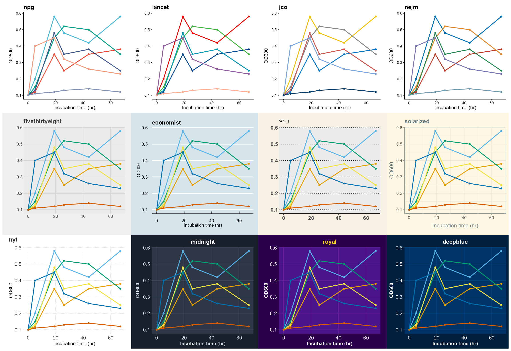
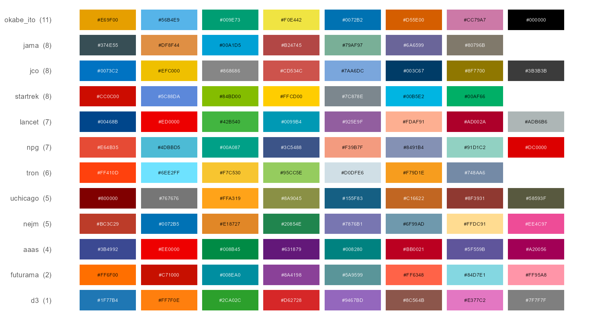
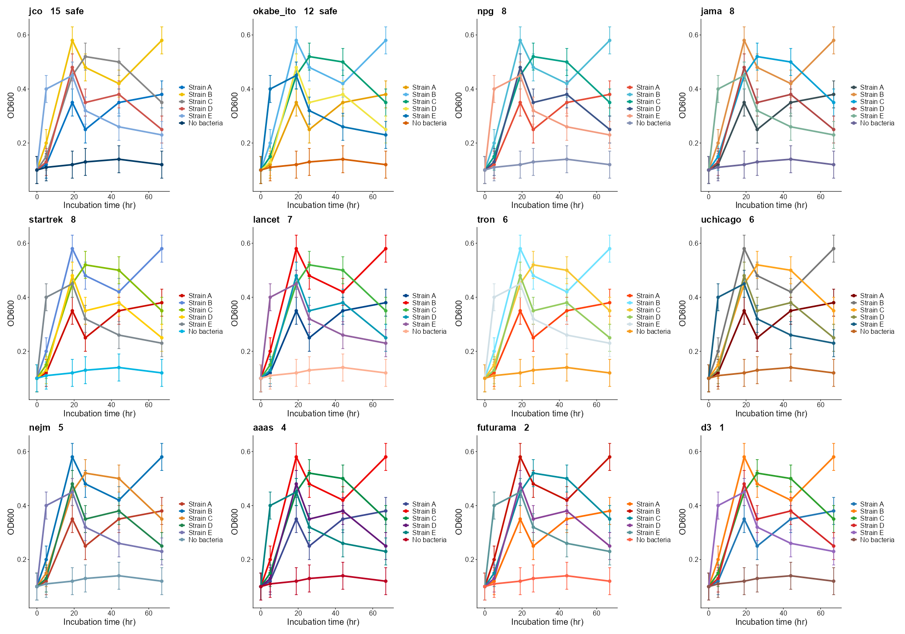
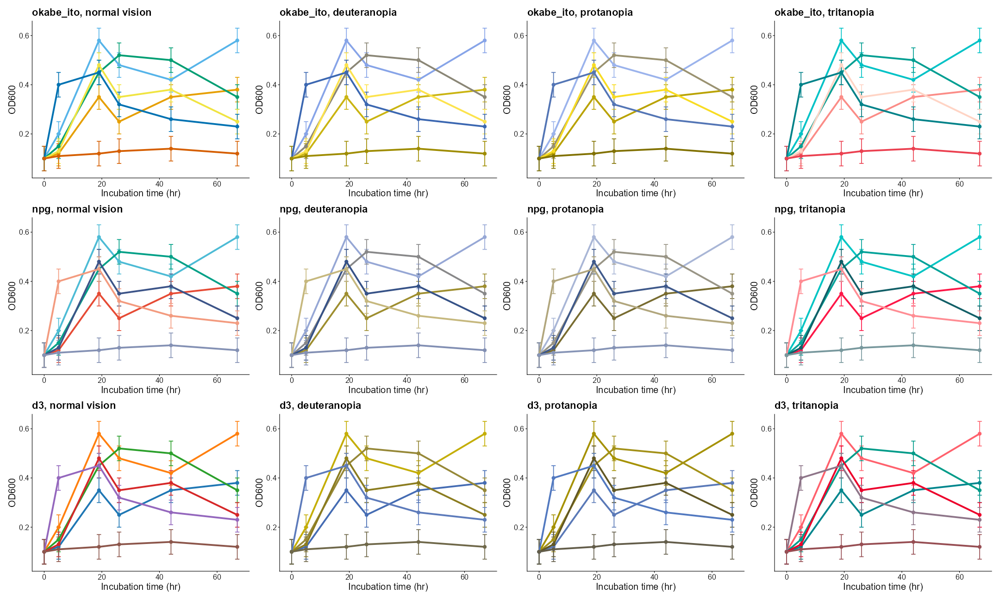
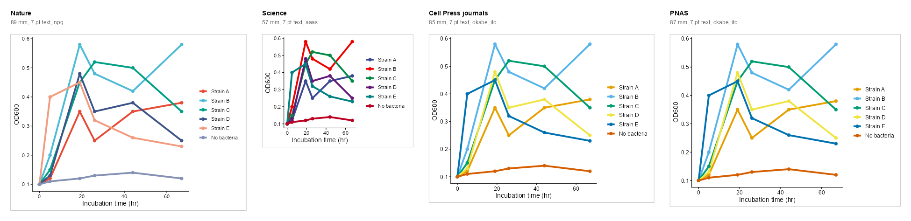

A Showcase of Themes and Colors
================

- [Twelve Theme Sets](#twelve-theme-sets)
- [Palettes for Readers with Color-Vision
  Deficiency](#palettes-for-readers-with-color-vision-deficiency)
- [One Figure, Twelve Palettes](#one-figure-twelve-palettes)
  - [As Readers with Color-Vision Deficiency See
    It](#as-readers-with-color-vision-deficiency-see-it)
- [One Plot in Four Journals](#one-plot-in-four-journals)

One plot of the simulated growth data, drawn with the theme sets, the
palettes and the journal templates of `themeset`. Each section shows the
call that makes it.

``` r
library(ggplot2)
library(themeset)

has_patchwork <- requireNamespace("patchwork", quietly = TRUE)
has_colorspace <- requireNamespace("colorspace", quietly = TRUE)

od <- subset(example_growth(), measure == "OD600")
p <- ggplot(od, aes(time, value, color = strain)) +
  geom_line(linewidth = 0.9) +
  geom_point(size = 1.4) +
  labs(x = "Incubation time (hr)", y = "OD600", color = NULL)
```

## Twelve Theme Sets

Journal styles on white, news and magazine styles with their own
background, and the three dark themes of `themeset`, which suit slides.
The journal sets bring their own palette. Most of the other sets change
only the theme, and `fivethirtyeight` has a palette of three colors, too
few for six groups, so these copies use the Okabe-Ito palette, which has
a color for each group.

``` r
with_palette <- c("npg", "lancet", "jco", "nejm")
sets <- c(with_palette, "fivethirtyeight", "economist", "wsj", "solarized",
          "nyt", "midnight", "royal", "deepblue")

panels <- lapply(sets, function(set) {
  styled <- apply_theme_set(p, set)
  if (!set %in% with_palette) styled <- styled + scale_color_set("okabe_ito")
  styled +
    labs(title = set) +
    theme(legend.position = "none", plot.title = ggtext::element_markdown(size = 13, face = "bold"))
})
patchwork::wrap_plots(panels, ncol = 4)
```



One set for one plot, or for the whole session:

``` r
apply_theme_set(p, "midnight")
set_global_theme("npg")
```

## Palettes for Readers with Color-Vision Deficiency

`compare_palettes()` gives, for each palette, the distance between its
two closest colors in CIEDE2000, with normal vision and with three
simulated deficiencies. The bars below show the worst of the four; at 10
or more the colors are easy to tell apart.

``` r
palettes <- c("okabe_ito", "npg", "aaas", "nejm", "lancet", "jama", "jco",
              "d3", "futurama", "startrek", "tron", "uchicago")
scores <- compare_palettes(palettes, n = 8)
scores <- scores[order(scores$worst), ]

swatches <- do.call(rbind, lapply(scores$set, function(set) {
  colors <- unname(scale_color_set(set)$palette(8))
  colors <- colors[!is.na(colors)][seq_len(min(8, sum(!is.na(colors))))]
  data.frame(set = set, position = seq_along(colors), color = substr(colors, 1, 7))
}))
labels <- sprintf("%s  (%.0f)", scores$set, scores$worst)
swatches$set <- factor(swatches$set, levels = scores$set, labels = labels)
light <- farver::convert_colour(farver::decode_colour(swatches$color), "rgb", "lab")[, 1] > 60

ggplot(swatches, aes(position, set, fill = color)) +
  geom_tile(width = 0.92, height = 0.8) +
  geom_text(aes(label = color), size = 2.6, color = ifelse(light, "black", "white")) +
  scale_fill_identity() +
  scale_x_continuous(breaks = NULL) +
  labs(x = NULL, y = NULL) +
  theme_minimal(base_size = 13) +
  theme(panel.grid = element_blank())
```



``` r
knitr::kable(scores[order(-scores$worst), c("set", "n", "normal", "deutan", "protan", "tritan", "worst")],
             digits = 1, row.names = FALSE)
```

| set       |   n | normal | deutan | protan | tritan | worst |
|:----------|----:|-------:|-------:|-------:|-------:|------:|
| okabe_ito |   8 |   21.7 |   11.5 |   12.3 |   11.1 |  11.1 |
| jama      |   7 |   21.7 |   11.1 |   11.8 |    7.7 |   7.7 |
| jco       |   8 |   17.9 |    7.7 |   14.3 |   14.9 |   7.7 |
| startrek  |   7 |   15.9 |    9.8 |    7.5 |    9.0 |   7.5 |
| lancet    |   8 |   17.3 |    7.1 |   12.4 |    7.5 |   7.1 |
| npg       |   8 |    9.3 |    6.9 |    9.9 |    7.9 |   6.9 |
| tron      |   7 |   14.2 |    6.0 |    6.0 |   10.4 |   6.0 |
| uchicago  |   8 |   10.3 |    5.5 |    4.8 |    9.8 |   4.8 |
| nejm      |   8 |   18.0 |    8.9 |    4.5 |    8.8 |   4.5 |
| aaas      |   8 |    7.6 |    4.8 |    4.8 |    3.6 |   3.6 |
| futurama  |   8 |    7.5 |    5.5 |    7.1 |    2.1 |   2.1 |
| d3        |   8 |   16.2 |    4.8 |    1.4 |    9.6 |   1.4 |

Any of these palettes, by name:

``` r
p + scale_color_set("okabe_ito")
```

## One Figure, Twelve Palettes

The same figure, the growth curves with their error bars in the theme of
Nature, with only the palette changed. The panels are sorted by the
distance between the two closest of the six colors that the figure uses:
the score depends on the number of groups, so a palette that ranks high
for eight colors can rank lower for six, and the other way around.

``` r
fig <- ggplot(od, aes(time, value, color = strain)) +
  geom_errorbar(aes(ymin = value - se, ymax = value + se), width = 1.5, linewidth = 0.4) +
  geom_line(linewidth = 0.9) +
  geom_point(size = 1.6) +
  scale_x_continuous(breaks = seq(0, 60, 20)) +
  labs(x = "Incubation time (hr)", y = "OD600", color = NULL) +
  journal_theme("nature") +
  theme(text = element_text(size = 10), axis.text = element_text(size = 8),
        legend.text = element_text(size = 8), legend.key.size = unit(3, "mm"))

six <- compare_palettes(palettes, n = 6)
six <- six[order(-six$worst), ]

swapped <- Map(function(set, score) {
  fig + scale_color_set(set) +
    labs(title = sprintf("%s   %.0f%s", set, score, if (score >= 10) "  safe" else "")) +
    theme(plot.title = element_text(size = 11, face = "bold"))
}, six$set, six$worst)
patchwork::wrap_plots(swapped, ncol = 4)
```



### As Readers with Color-Vision Deficiency See It

Three of the palettes, with normal vision and as simulated for
deuteranopia, protanopia and tritanopia with the colorspace package.
With d3 and npg some strains turn into the same olive or blue, and the
reader can no longer match a line to the legend; Okabe-Ito keeps the six
lines apart.

``` r
simulate <- list(
  "normal vision" = identity,
  deuteranopia = colorspace::deutan,
  protanopia = colorspace::protan,
  tritanopia = colorspace::tritan
)
seen <- list()
for (set in c("okabe_ito", "npg", "d3")) {
  colors <- unname(scale_color_set(set)$palette(6))[1:6]
  for (vision in names(simulate)) {
    seen[[length(seen) + 1]] <- fig +
      scale_color_manual(values = simulate[[vision]](colors)) +
      labs(title = paste0(set, ", ", vision)) +
      theme(plot.title = element_text(size = 11, face = "bold"), legend.position = "none")
  }
}
patchwork::wrap_plots(seen, ncol = 4)
```



To score the palettes for the number of groups of your own figure, and
to switch a figure to Okabe-Ito only when its colors are too close:

``` r
compare_palettes(c("jco", "okabe_ito", "npg", "d3"), n = 6)
journal_fix(fig + scale_color_set("d3"), "nature", fix = "colors")
```

## One Plot in Four Journals

`compare_journals()` draws the plot at the width of a single column of
each journal, with 7 pt text and the palette of the journal, side by
side and to scale. The narrow column of Science leaves the least room
for the data.

``` r
page <- compare_journals(p, c("nature", "science", "cell", "pnas"), sheet_mm = 400)
size <- attr(page, "size_mm")
```

``` r
page
```



The article [Comparing Figures Across Journals](journal-figures.md)
explains the templates, and how to check and repair a figure for a
journal.
