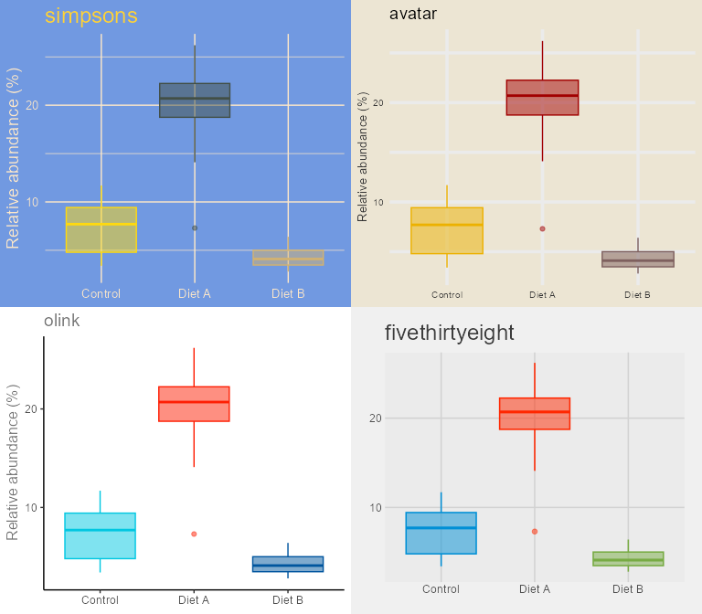
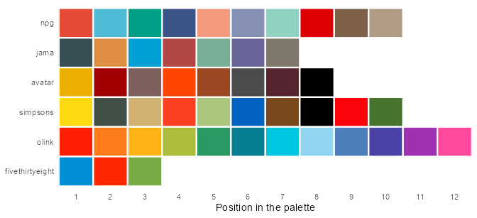
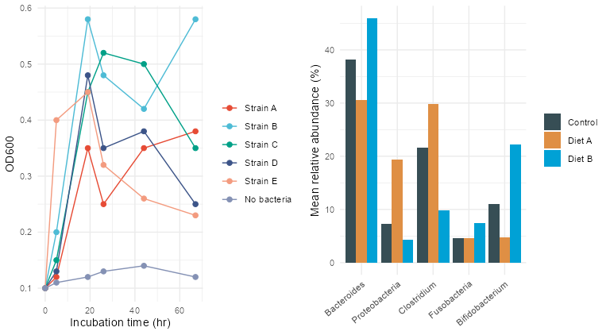
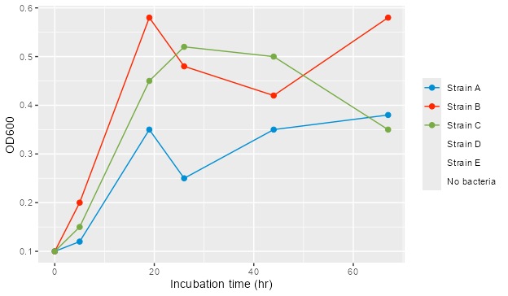
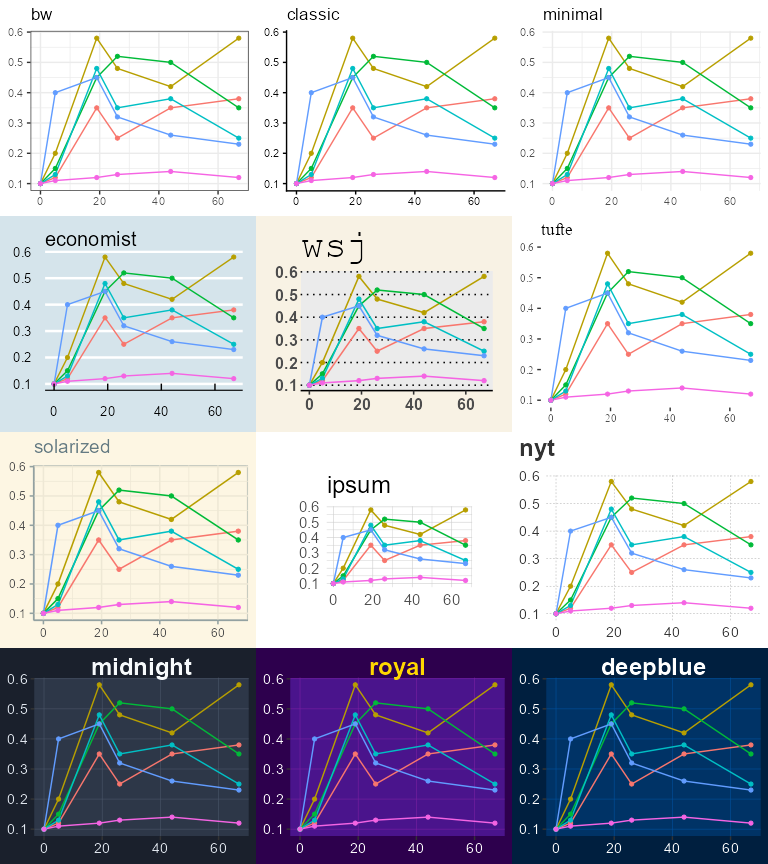
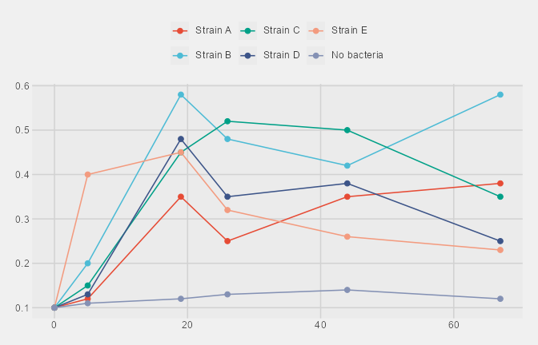

Theme Sets and Color Scales
================

- [Overview](#overview)
- [1. The Four Complete Sets](#1-the-four-complete-sets)
- [2. Color and Fill Scales](#2-color-and-fill-scales)
  - [Using a Scale With Any Theme](#using-a-scale-with-any-theme)
  - [Palette Size](#palette-size)
- [3. Theme-Only Sets](#3-theme-only-sets)
- [4. Adjusting a Set](#4-adjusting-a-set)
- [Summary](#summary)

``` r
library(ggplot2)
library(themeset)

growth <- subset(example_growth(), measure == "OD600")
taxa <- example_taxa()
```

## Overview

`apply_theme_set()` adds up to three things to a plot: a theme, a
discrete color scale and a discrete fill scale. This article looks at
each of them, using the simulated data of `example_growth()` and
`example_taxa()`:

1.  the four **complete sets**, which bring their own scales,
2.  the **color and fill scales** you can also use on their own,
3.  the 35 **theme-only sets**, and where each one comes from,
4.  how to **adjust** a set after applying it.

------------------------------------------------------------------------

## 1. The Four Complete Sets

`simpsons`, `avatar`, `olink` and `fivethirtyeight` are complete:
applying one changes the theme and also sets the colors of the `color`
and `fill` aesthetics. Boxplots use both, the outline for `color` and
the box for `fill`, so a single plot shows what a set does. The plot
compares the three conditions for one taxon:

``` r
proteo <- subset(taxa, taxon == "Proteobacteria")

base <- ggplot(proteo, aes(condition, abundance, color = condition, fill = condition)) +
  geom_boxplot(alpha = 0.5, show.legend = FALSE) +
  labs(x = NULL, y = "Relative abundance (%)")

complete <- c("simpsons", "avatar", "olink", "fivethirtyeight")
panels <- lapply(complete, function(s) apply_theme_set(base, s) + ggtitle(s))
cowplot::plot_grid(plotlist = panels, ncol = 2)
```

<!-- -->

The scales behind these sets are exported as `scale_color_simpsons()`,
`scale_color_avatar()`, `scale_color_olink()` and
`scale_color_fivethirtyeight()`, with matching `scale_fill_*()`
versions.

------------------------------------------------------------------------

## 2. Color and Fill Scales

There are six scale families. Each has a `scale_color_*()` and a
`scale_fill_*()` function:

| Family            | Colors         | Palette from |
|-------------------|----------------|--------------|
| `npg`             | 10             | ggsci        |
| `jama`            | 7              | ggsci        |
| `avatar`          | 8              | tvthemes     |
| `simpsons`        | 10             | tvthemes     |
| `olink`           | no fixed limit | OlinkAnalyze |
| `fivethirtyeight` | 3              | ggthemes     |

`olink` interpolates between its base colors, so it can serve any number
of levels. The figure shows the first 12 colors of every family, in the
order ggplot2 hands them to the levels of a factor:

``` r
families <- c("npg", "jama", "avatar", "simpsons", "olink", "fivethirtyeight")

swatches <- do.call(rbind, lapply(families, function(f) {
  cols <- suppressWarnings(match.fun(paste0("scale_color_", f))()$palette(12))
  cols <- cols[!is.na(cols)]
  data.frame(family = f, position = seq_along(cols), color = cols)
}))
swatches$family <- factor(swatches$family, levels = rev(families))

ggplot(swatches, aes(position, family, fill = color)) +
  geom_tile(color = "white", linewidth = 0.8) +
  scale_fill_identity() +
  scale_x_continuous(breaks = 1:12, expand = c(0, 0)) +
  labs(x = "Position in the palette", y = NULL) +
  theme_minimal() +
  theme(panel.grid = element_blank())
```

<!-- -->

### Using a Scale With Any Theme

The scales are plain ggplot2 scales, so they work with any theme:

``` r
lines <- ggplot(growth, aes(time, value, color = strain)) +
  geom_line() +
  geom_point(size = 2) +
  labs(x = "Incubation time (hr)", y = "OD600", color = NULL) +
  theme_minimal() +
  scale_color_npg()

bars <- ggplot(taxa, aes(taxon, abundance, fill = condition)) +
  stat_summary(fun = mean, geom = "col", position = position_dodge()) +
  labs(x = NULL, y = "Mean relative abundance (%)", fill = NULL) +
  guides(x = guide_axis(angle = 40)) +
  theme_minimal() +
  scale_fill_jama()

cowplot::plot_grid(lines, bars, ncol = 2)
```

<!-- -->

### Palette Size

A family with a fixed number of colors cannot color more levels than it
has. `fivethirtyeight` has three, so the six strains of the growth
experiment leave three of them without a color. ggplot2 warns, and the
lines and points of those strains are dropped:

``` r
ggplot(growth, aes(time, value, color = strain)) +
  geom_line() +
  geom_point(size = 2) +
  labs(x = "Incubation time (hr)", y = "OD600", color = NULL) +
  scale_color_fivethirtyeight()
#> Warning: This manual palette can handle a maximum of 3 values. You have
#> supplied 6
#> Warning: Removed 18 rows containing missing values or values outside the scale range
#> (`geom_line()`).
#> Warning: Removed 18 rows containing missing values or values outside the scale range
#> (`geom_point()`).
```

<!-- -->

For data with many groups choose a larger family such as `npg`,
`simpsons` or `olink`.

------------------------------------------------------------------------

## 3. Theme-Only Sets

The other 35 sets change the theme and leave the scales alone. Most of
them come from other packages; `themeset` wraps each one so that
`apply_theme_set()` can reach it by name.

| Source | Sets |
|----|----|
| ggplot2 | `bw`, `classic`, `dark`, `light`, `linedraw`, `minimal` |
| ggthemes | `base`, `calc`, `clean`, `economist`, `economist_white`, `excel`, `excel_new`, `few`, `foundation`, `gdocs`, `hc`, `igray`, `map_gg`, `pander`, `par`, `solarized`, `solarized_2`, `solid`, `stata`, `tufte`, `wsj` |
| hrbrthemes | `ipsum`, `ipsum_rc` |
| cowplot | `cowplot`, `minimal_grid` |
| themeset | `nyt`, `midnight`, `royal`, `deepblue` |

(`fivethirtyeight` is also a ggthemes theme; it is one of the complete
sets above because it ships with its colors.)

A selection of twelve, on the same growth curves:

``` r
gallery_sets <- c("bw", "classic", "minimal", "economist", "wsj", "tufte",
                  "solarized", "ipsum", "nyt", "midnight", "royal", "deepblue")

gallery_base <- ggplot(growth, aes(time, value, color = strain)) +
  geom_line() +
  geom_point(size = 1.2) +
  labs(x = NULL, y = NULL, color = NULL)

tiles <- lapply(gallery_sets, function(s) {
  apply_theme_set(gallery_base, s) + ggtitle(s) + theme(legend.position = "none")
})
cowplot::plot_grid(plotlist = tiles, ncol = 3)
```

<!-- -->

Two practical notes:

- `ipsum` and `ipsum_rc` ask for the fonts “Arial Narrow” and “Roboto
  Condensed”. If a font is not installed R falls back to its default
  family and the plot still draws.
- 34 of the 39 sets render markdown in their titles, legends and facet
  labels. The exceptions are `nyt`, `midnight`, `royal`, `deepblue` and
  `solid`. See [Markdown-Enabled Themes](markdown-themes.md).

------------------------------------------------------------------------

## 4. Adjusting a Set

`apply_theme_set()` returns a normal ggplot object, and anything you add
afterwards takes precedence. Adding a second scale for the same
aesthetic replaces the one from the set (ggplot2 prints a message about
it), and `theme()` changes single elements of the set’s theme:

``` r
p <- ggplot(growth, aes(time, value, color = strain)) +
  geom_line() +
  geom_point(size = 2) +
  labs(x = "Incubation time (hr)", y = "OD600", color = NULL)

apply_theme_set(p, "fivethirtyeight") +
  scale_color_npg() +
  theme(legend.position = "top")
```

<!-- -->

This keeps the look of the `fivethirtyeight` set but swaps its
three-color palette, too small for six strains, for `npg`, which has ten
colors.

------------------------------------------------------------------------

## Summary

| To get | Use |
|----|----|
| A theme with matching colors | `apply_theme_set(p, "simpsons")`, `"avatar"`, `"olink"` or `"fivethirtyeight"` |
| Only a palette | `scale_color_*()` and `scale_fill_*()` |
| Only a look | `apply_theme_set(p, "<theme-only set>")`, or call the theme directly |
| A set’s look with another palette | Add a `scale_*()` after `apply_theme_set()` |
