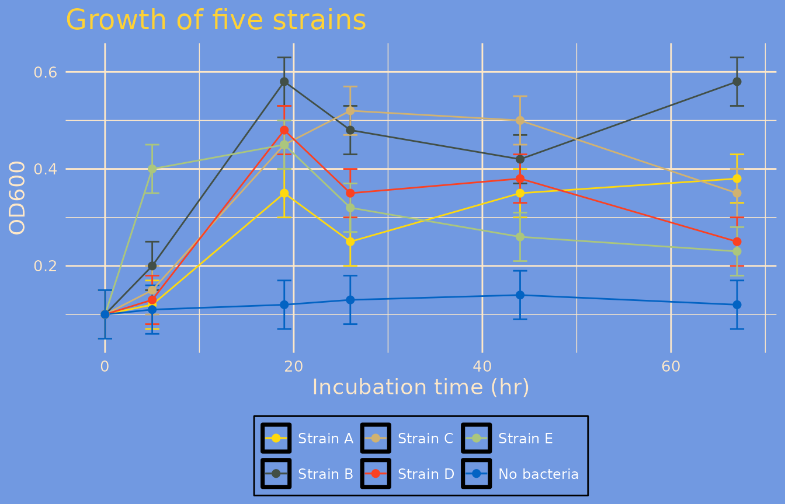
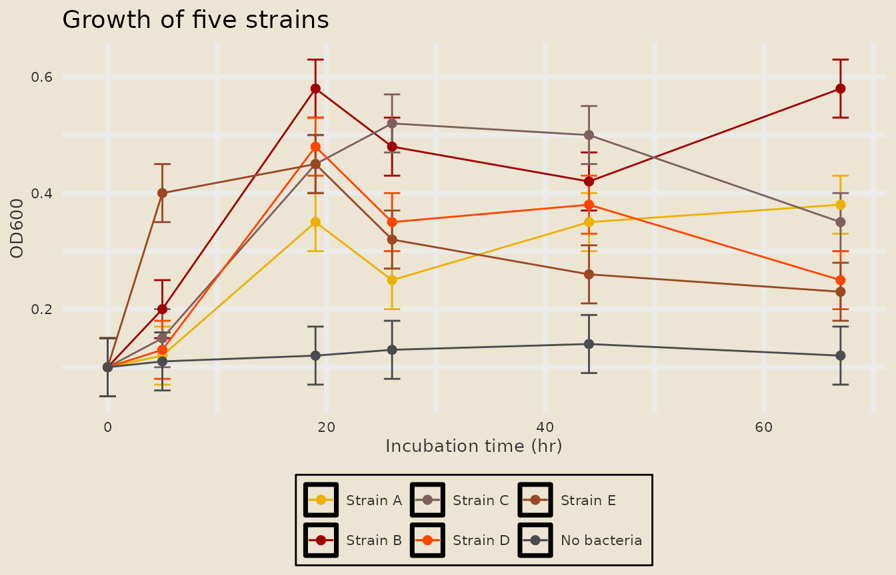
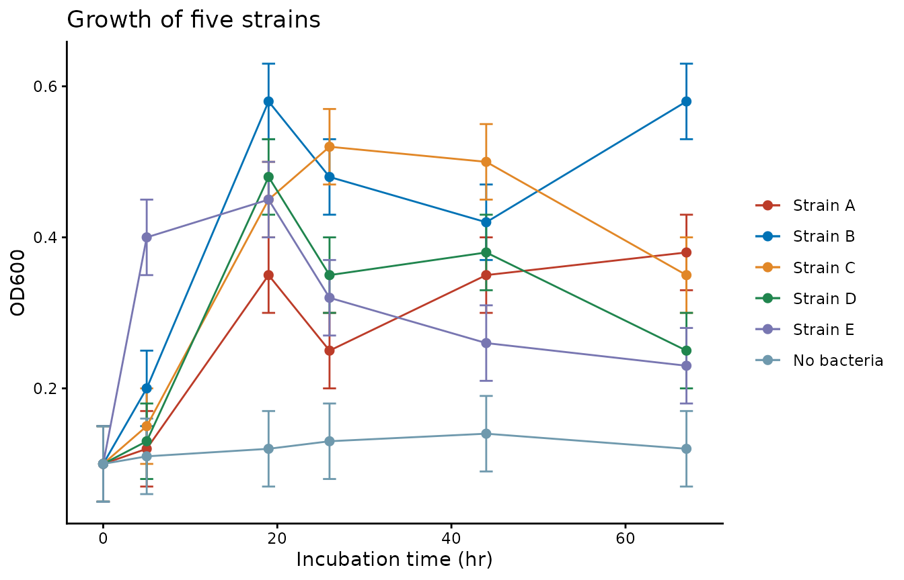
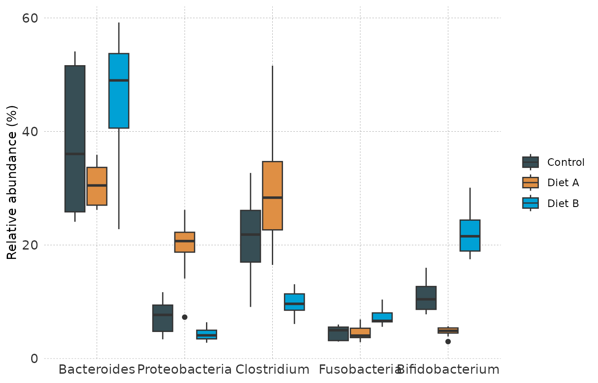
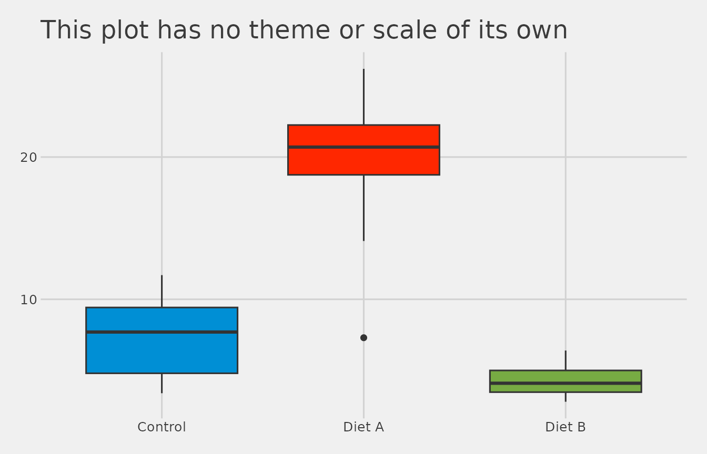

# Introduction to themeset

``` r

library(ggplot2)
library(themeset)
```

## Overview

A **theme set** is a ggplot2 theme bundled with the discrete color and
fill scales that go with it. `themeset` ships 49 of them under short
names such as `"simpsons"`, `"nejm"` or `"minimal"`, and a few functions
to apply a set to one plot or to every plot in your session.

Fourteen sets carry their own scales:

- `simpsons`, `avatar`, `olink` and `fivethirtyeight`
- eight journal sets, `npg`, `aaas`, `nejm`, `lancet`, `jama`, `jco`,
  `bmj` and `frontiers`, which pair the classic theme with a journal
  palette
- `flexoki_light` and `flexoki_dark`

The other 35 change only the theme.

The pieces are also exported on their own, so you can mix and match:

- discrete color and fill scales
  ([`scale_color_npg()`](https://vanhungtran.github.io/themeset/reference/theme_color_scales.md),
  [`scale_fill_jama()`](https://vanhungtran.github.io/themeset/reference/theme_color_scales.md),
  …), and any palette by name with `scale_color_set("nejm")`
- markdown-enabled versions of the base ggplot2 themes
  ([`md_theme_minimal()`](https://vanhungtran.github.io/themeset/reference/ggplot2_md_themes.md),
  …)
- a few custom themes
  ([`theme_nyt()`](https://vanhungtran.github.io/themeset/reference/custom_themes.md),
  [`theme_midnight()`](https://vanhungtran.github.io/themeset/reference/custom_themes.md),
  …)
- templates of journals, with their figure widths, text sizes, panel
  tags and palettes, to compare one figure in several journals
  ([`compare_journals()`](https://vanhungtran.github.io/themeset/reference/compare_journals.md))

This vignette is a short tour. The other articles go deeper: [Theme Sets
and Color
Scales](https://vanhungtran.github.io/themeset/articles/theme-sets-and-scales.md),
[Markdown-Enabled
Themes](https://vanhungtran.github.io/themeset/articles/markdown-themes.md),
[Global and Custom
Themes](https://vanhungtran.github.io/themeset/articles/global-and-custom-themes.md),
[A Multi-Panel
Figure](https://vanhungtran.github.io/themeset/articles/multi-panel-figure.md),
[Comparing Figures Across
Journals](https://vanhungtran.github.io/themeset/articles/journal-figures.md),
[A Gallery of Figure
Types](https://vanhungtran.github.io/themeset/articles/figure-gallery.md),
[A Showcase of Themes and
Colors](https://vanhungtran.github.io/themeset/articles/showcase.md), [A
Figure Set for a
Reanalysis](https://vanhungtran.github.io/themeset/articles/figure-set.md)
and [A Figure Set for a Reporting
Study](https://vanhungtran.github.io/themeset/articles/reporting-study.md).

### Example Data

The examples use two small simulated data sets that come with the
package as code, so there are no data files.
[`example_growth()`](https://vanhungtran.github.io/themeset/reference/example_data.md)
is a growth experiment: five bacterial strains and an uninoculated
control, followed over 67 hours and measured four ways.
[`example_taxa()`](https://vanhungtran.github.io/themeset/reference/example_data.md)
compares the relative abundance of five taxa in three conditions.

``` r

head(example_growth(), 3)
#>   time   strain        measure value  se
#> 1    0 Strain A Product A (uM)     0 0.0
#> 2    5 Strain A Product A (uM)     0 0.0
#> 3   19 Strain A Product A (uM)    10 1.5
head(example_taxa(), 3)
#>         taxon condition abundance
#> 1 Bacteroides   Control      51.1
#> 2 Bacteroides   Control      45.1
#> 3 Bacteroides   Control      25.7
```

### Function Reference

| Category | Function | Description |
|----|----|----|
| **Theme sets** | [`apply_theme_set()`](https://vanhungtran.github.io/themeset/reference/apply_theme_set.md) | Add a set’s theme, color scale and fill scale to one plot |
|  | [`set_global_theme()`](https://vanhungtran.github.io/themeset/reference/set_global_theme.md) | Make a set the default for every plot in the session |
|  | [`reset_global_theme()`](https://vanhungtran.github.io/themeset/reference/reset_global_theme.md) | Go back to ggplot2’s default theme and palettes |
|  | [`list_theme_sets()`](https://vanhungtran.github.io/themeset/reference/list_theme_sets.md) | Print the names of the 49 available sets |
| **Color scales** | [`scale_color_npg()`](https://vanhungtran.github.io/themeset/reference/theme_color_scales.md), [`scale_fill_npg()`](https://vanhungtran.github.io/themeset/reference/theme_color_scales.md) | Discrete scales; also `jama`, `avatar`, `simpsons`, `olink` and `fivethirtyeight` |
|  | [`scale_color_set()`](https://vanhungtran.github.io/themeset/reference/color_scale_sets.md), [`scale_fill_set()`](https://vanhungtran.github.io/themeset/reference/color_scale_sets.md) | Discrete scales picked by name, for example `"nejm"` or `"wesanderson::Darjeeling1"` |
|  | [`list_color_scales()`](https://vanhungtran.github.io/themeset/reference/list_color_scales.md) | Print the names of the color scale sets |
| **Themes** | [`md_theme_minimal()`](https://vanhungtran.github.io/themeset/reference/ggplot2_md_themes.md) and seven more | Markdown-enabled versions of the base ggplot2 themes |
|  | [`theme_nyt()`](https://vanhungtran.github.io/themeset/reference/custom_themes.md) | Minimal theme with dashed gridlines and bold titles |
|  | [`theme_midnight()`](https://vanhungtran.github.io/themeset/reference/custom_themes.md), [`theme_royal()`](https://vanhungtran.github.io/themeset/reference/custom_themes.md), [`theme_deepblue()`](https://vanhungtran.github.io/themeset/reference/custom_themes.md) | Dark themes |
| **Journal figures** | [`journal_templates()`](https://vanhungtran.github.io/themeset/reference/journal_templates.md) | The column widths, text sizes, panel tags and palettes of 13 journals |
|  | [`apply_journal()`](https://vanhungtran.github.io/themeset/reference/apply_journal.md), [`journal_theme()`](https://vanhungtran.github.io/themeset/reference/journal_theme.md) | Add the theme and the palette of a journal to a plot |
|  | [`compare_journals()`](https://vanhungtran.github.io/themeset/reference/compare_journals.md) | Draw one figure in several journals, side by side and to scale |
|  | [`journal_check()`](https://vanhungtran.github.io/themeset/reference/journal_check.md) | Check a figure against the text and line limits of a journal |
|  | [`save_journal_figure()`](https://vanhungtran.github.io/themeset/reference/save_journal_figure.md) | Save a figure at the width of a column of a journal |
|  | [`journal_colors()`](https://vanhungtran.github.io/themeset/reference/journal_colors.md), [`journal_ramp()`](https://vanhungtran.github.io/themeset/reference/journal_ramp.md), [`compare_palettes()`](https://vanhungtran.github.io/themeset/reference/compare_palettes.md) | The colors of a journal, shades for ordered groups, and how well palettes keep colors apart |
| **Example data** | [`example_growth()`](https://vanhungtran.github.io/themeset/reference/example_data.md), [`example_taxa()`](https://vanhungtran.github.io/themeset/reference/example_data.md) | Simulated growth curves and taxon abundances |

------------------------------------------------------------------------

## 1. Quick Start

[`apply_theme_set()`](https://vanhungtran.github.io/themeset/reference/apply_theme_set.md)
takes a plot and the name of a set. The plot shows the optical density
of five strains and an uninoculated control over time:

``` r

od <- subset(example_growth(), measure == "OD600")

p <- ggplot(od, aes(time, value, color = strain)) +
  geom_errorbar(aes(ymin = value - se, ymax = value + se), width = 1.5) +
  geom_line() +
  geom_point(size = 2) +
  labs(title = "Growth of five strains", x = "Incubation time (hr)", y = "OD600", color = NULL)

apply_theme_set(p, "simpsons")
```



The theme, the color scale and the fill scale of the `simpsons` set were
all added to `p`. The result is an ordinary ggplot object, so you can
keep adding layers to it or save it with
[`ggsave()`](https://ggplot2.tidyverse.org/reference/ggsave.html).

Change the name to change the whole look:

``` r

apply_theme_set(p, "avatar")
```



A journal set pairs the classic theme, which suits a paper, with the
palette of a journal:

``` r

apply_theme_set(p, "nejm")
```



An unknown name is an error that points back to the list of sets:

``` r

apply_theme_set(p, "nope")
#> Error: Set 'nope' not found. Run list_theme_sets() for available options.
```

------------------------------------------------------------------------

## 2. Browsing the Available Sets

``` r

list_theme_sets()
#> Available theme sets:
#>  [1] "simpsons"        "avatar"          "olink"           "fivethirtyeight"
#>  [5] "npg"             "aaas"            "nejm"            "lancet"         
#>  [9] "jama"            "jco"             "bmj"             "frontiers"      
#> [13] "flexoki_light"   "flexoki_dark"    "nyt"             "midnight"       
#> [17] "royal"           "deepblue"        "bw"              "classic"        
#> [21] "dark"            "light"           "linedraw"        "minimal"        
#> [25] "base"            "calc"            "clean"           "economist"      
#> [29] "economist_white" "excel"           "excel_new"       "few"            
#> [33] "foundation"      "gdocs"           "hc"              "igray"          
#> [37] "map_gg"          "pander"          "par"             "solarized"      
#> [41] "solarized_2"     "solid"           "stata"           "tufte"          
#> [45] "wsj"             "ipsum"           "ipsum_rc"        "cowplot"        
#> [49] "minimal_grid"
```

The first fourteen are the complete sets. Every other name selects a
theme only. The [Theme Sets and Color
Scales](https://vanhungtran.github.io/themeset/articles/theme-sets-and-scales.md)
article shows what they look like and which package each one comes from.

The color scales can be listed too:

``` r

list_color_scales()
#> Available color scale sets:
#> tvthemes: avatar, simpsons
#> OlinkAnalyze: olink
#> ggthemes: fivethirtyeight
#> ggsci: aaas, atlassian, bmj, cosmic, d3, flatui, frontiers, futurama, gephi,
#>     igv, iterm, jama, jco, lancet, locuszoom, nejm, npg, observable, primer,
#>     rickandmorty, startrek, tron, uchicago, ucscgb
#> flexoki: flexoki_light, flexoki_dark
#> grDevices: okabe_ito
#> wesanderson (use as wesanderson::<name>): BottleRocket1, BottleRocket2,
#>     Rushmore1, Rushmore, Royal1, Royal2, Zissou1, Darjeeling1, Darjeeling2,
#>     Chevalier1, FantasticFox1, Moonrise1, Moonrise2, Moonrise3, Cavalcanti1,
#>     GrandBudapest1, GrandBudapest2, IsleofDogs1, IsleofDogs2, FrenchDispatch,
#>     AsteroidCity1, AsteroidCity2, AsteroidCity3
#> biopalette (use as biopalette::<name>): gene_red, heat_light, three_body,
#>     lactate_steps, walter_white2, tam_pastel, bcell_atlas, cancer_mosaic,
#>     bcell_clusters, babel
#> ggpalettes (use as ggpalettes::<name>): meadow, atelier, clinical, spectrum,
#>     pastel, earth, midnight, floral, coastal, harvest
```

------------------------------------------------------------------------

## 3. Using Themes and Scales Separately

Nothing forces you to go through a set. Themes and scales are ordinary
ggplot2 components and can be combined freely:

``` r

taxa <- example_taxa()

ggplot(taxa, aes(taxon, abundance, fill = condition)) +
  geom_boxplot() +
  labs(x = NULL, y = "Relative abundance (%)", fill = NULL) +
  theme_nyt() +
  scale_fill_jama()
```



------------------------------------------------------------------------

## 4. Setting a Theme for the Whole Session

[`set_global_theme()`](https://vanhungtran.github.io/themeset/reference/set_global_theme.md)
makes a set the default. Plots created afterwards use its theme and, for
sets that have scales, its colors, without any extra code:

``` r

set_global_theme("fivethirtyeight")

ggplot(subset(taxa, taxon == "Proteobacteria"), aes(condition, abundance, fill = condition)) +
  geom_boxplot(show.legend = FALSE) +
  labs(title = "This plot has no theme or scale of its own", x = NULL, y = "Relative abundance (%)")
```



[`reset_global_theme()`](https://vanhungtran.github.io/themeset/reference/reset_global_theme.md)
returns to ggplot2’s defaults:

``` r

reset_global_theme()
```

The [Global and Custom
Themes](https://vanhungtran.github.io/themeset/articles/global-and-custom-themes.md)
article covers what exactly is changed, and the limits of the global
palettes.

------------------------------------------------------------------------

## Getting Help

``` r

?apply_theme_set
?set_global_theme
?theme_color_scales
?ggplot2_md_themes
?custom_themes
?example_data
```
